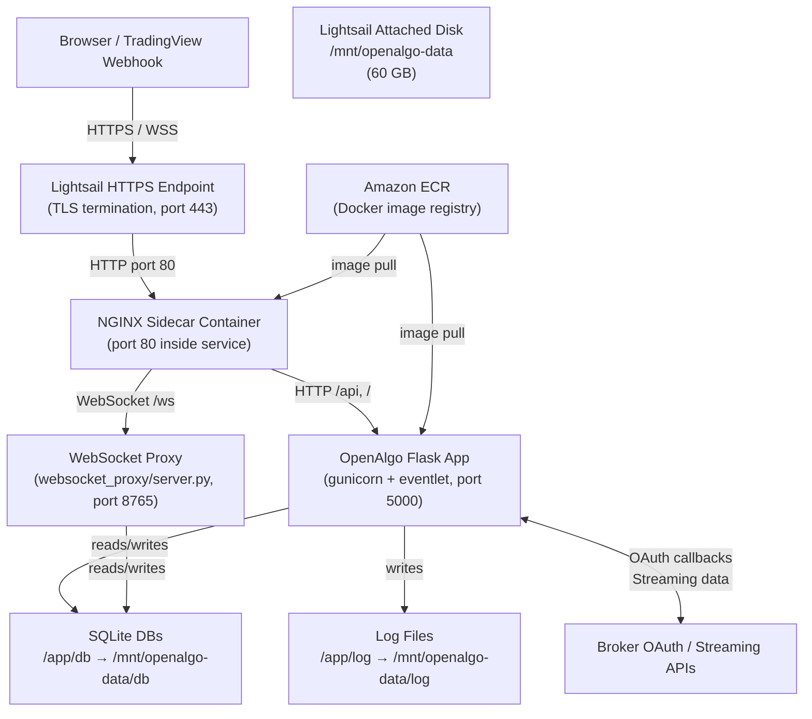

# Design Document: AWS Lightsail Deployment for OpenAlgo

## Overview

This document describes the technical design for deploying OpenAlgo on AWS Lightsail Container Service. OpenAlgo is a Flask + Flask-SocketIO (eventlet) algorithmic trading platform with a React frontend, SQLite databases, and a WebSocket proxy server. The deployment uses the existing Docker image with no application code changes required.

The target instance is a Lightsail Container Service `Medium` node (2 vCPU, 2 GB RAM) with a 60 GB attached storage disk. NGINX runs as a sidecar container to proxy both HTTP and WebSocket traffic through a single public HTTPS endpoint, since Lightsail Container Services expose only one public port.

### Key Design Decisions

- **NGINX sidecar** over multi-port exposure: Lightsail Container Services expose a single public endpoint port. NGINX proxies `/ws` to the internal WebSocket proxy (port 8765) and all other traffic to Flask (port 5000).
- **Lightsail attached disk** over EFS: EFS requires VPC peering and is not natively supported by Lightsail Container Services. A Lightsail block storage disk attached to the instance and bind-mounted into the container is the simplest persistent storage path.
- **ECR** for image registry: ECR integrates cleanly with IAM and avoids Docker Hub rate limits for production pulls.
- **`Medium` power tier** (2 vCPU / 2 GB RAM): The `Small` tier (1 vCPU / 2 GB RAM) satisfies RAM but the extra vCPU headroom on `Medium` prevents gunicorn + eventlet + numba JIT compilation from starving the WebSocket proxy under load. The user's target spec (2 vCPU / 2 GB RAM / 60 GB) maps exactly to `Medium`.

---

## Architecture



### Traffic Flow

1. All inbound traffic arrives at the Lightsail HTTPS endpoint (TLS terminated by Lightsail).
2. Lightsail forwards plain HTTP to the NGINX container on port 80 (the single exposed public port).
3. NGINX routes:
   - `GET /ws` (Upgrade: websocket) → `ws://localhost:8765`
   - All other requests → `http://localhost:5000`
4. Flask serves the React SPA, REST API, and Socket.IO endpoints.
5. The WebSocket proxy relays real-time broker streaming data to browser clients.
6. Both containers share the host filesystem via bind mounts to the attached disk.

---

## Components and Interfaces

### Component 1: OpenAlgo Application Container

- **Image**: Built from the existing `Dockerfile` (multi-stage: python-builder → frontend-builder → production)
- **Entrypoint**: `/app/start.sh`
- **Internal ports**: 5000 (Flask/gunicorn), 8765 (WebSocket proxy)
- **Environment**: All configuration injected via Lightsail environment variables; `start.sh` auto-generates `/app/.env` when `HOST_SERVER` is set
- **Volume mounts**:
  - `/app/db` → `/mnt/openalgo-data/db` (SQLite databases)
  - `/app/log` → `/mnt/openalgo-data/log` (application logs)
  - `/app/strategies` → `/mnt/openalgo-data/strategies` (user Python strategies)
  - `/app/keys` → `/mnt/openalgo-data/keys` (API key files)

### Component 2: NGINX Sidecar Container

- **Image**: `nginx:1.27-alpine` (official, minimal)
- **Internal port**: 80 (the single port exposed as the Lightsail public endpoint)
- **Role**: Reverse proxy — routes HTTP to Flask and upgrades WebSocket connections to the proxy server
- **Config**: Custom `nginx.conf` baked into a derived image or mounted via a ConfigMap-equivalent

### Component 3: Amazon ECR Repository

- **Purpose**: Stores versioned OpenAlgo Docker images
- **Naming**: `openalgo/app` (application image), `openalgo/nginx` (NGINX sidecar image)
- **Access**: Lightsail Container Service pulls images using an IAM role with `ecr:GetAuthorizationToken` and `ecr:BatchGetImage` permissions

### Component 4: Lightsail Attached Disk

- **Size**: 60 GB (matches target spec; covers OS + container layers + data)
- **Mount point on host**: `/mnt/openalgo-data`
- **Subdirectories**: `db/`, `log/`, `strategies/`, `keys/`
- **Filesystem**: ext4 (default for Lightsail disks)

> **Note on Lightsail Container Services vs. Lightsail Instances**: Lightsail *Container Services* (the managed container hosting product) do **not** support attaching block storage disks directly. Persistent storage for Container Services requires either (a) Amazon EFS via a VPC attachment, or (b) migrating to a Lightsail *Instance* (a full VM) and running Docker Compose on it. The recommended approach for this deployment — given the 60 GB storage target and simplicity requirement — is to use a **Lightsail Instance** (Ubuntu 22.04) and run the stack with Docker Compose, which gives full disk attachment support and matches the user's 2 vCPU / 2 GB / 60 GB spec exactly.

### Deployment Model: Lightsail Instance + Docker Compose

The design uses a **Lightsail Instance** (not Container Service) for the following reasons:
- Native block storage attachment (60 GB disk)
- Full Docker Compose support (NGINX sidecar + OpenAlgo in one `docker-compose.yaml`)
- Direct SSH access for debugging and log inspection
- No VPC/EFS complexity
- Matches the exact 2 vCPU / 2 GB / 60 GB hardware target

---

## Components and Interfaces — Detailed

### NGINX Configuration Interface

NGINX listens on port 80 and proxies to two upstream services on `localhost`:

```
upstream flask_app   → 127.0.0.1:5000
upstream ws_proxy    → 127.0.0.1:8765
```

Routing rules:
- `location /ws` — WebSocket upgrade proxy to `ws_proxy`
- `location /` — standard HTTP proxy to `flask_app`

### Docker Compose Service Interface

```
services:
  openalgo   (port 5000, 8765 internal)
  nginx      (port 80:80, 443:443 — public-facing)
```

Both services share the host network namespace (`network_mode: host`) or communicate via a Docker bridge network with explicit port references.

### Health Check Interface

- **Endpoint**: `GET /api/v1/ping` on port 5000
- **Expected response**: HTTP 200
- **Configured in**: Docker Compose `healthcheck` block and Lightsail instance monitoring

---

## Data Models

### Persistent Storage Layout

```
/mnt/openalgo-data/          ← Lightsail attached disk (60 GB, ext4)
├── db/
│   ├── openalgo.db          ← Main app database (users, API keys, broker tokens)
│   ├── latency.db           ← Order latency metrics
│   ├── logs.db              ← API traffic logs
│   └── sandbox.db           ← Sandbox/analyzer mode data
├── log/
│   ├── openalgo.log         ← Application log (rotated, 14-day retention)
│   └── strategies/          ← Per-strategy execution logs
├── strategies/
│   ├── scripts/             ← User-uploaded Python strategy scripts
│   └── examples/            ← Bundled example strategies
└── keys/
    └── *.pem / *.key        ← API key files (chmod 700)
```

### Environment Variable Schema

All variables are injected at container start. `start.sh` writes them to `/app/.env`.

| Variable | Required | Example Value | Notes |
|---|---|---|---|
| `HOST_SERVER` | Yes | `https://yourdomain.com` | Triggers cloud env detection in `start.sh` |
| `APP_KEY` | Yes | 64-char hex | `python -c "import secrets; print(secrets.token_hex(32))"` |
| `API_KEY_PEPPER` | Yes | 64-char hex | Different value from `APP_KEY` |
| `BROKER_API_KEY` | Yes | broker-issued | From broker developer portal |
| `BROKER_API_SECRET` | Yes | broker-issued | From broker developer portal |
| `REDIRECT_URL` | Yes | `https://<host>/<broker>/callback` | Must match broker portal registration |
| `FLASK_HOST_IP` | Yes | `0.0.0.0` | Bind to all interfaces |
| `FLASK_PORT` | Yes | `5000` | Internal Flask port |
| `FLASK_ENV` | Yes | `production` | Disables debug mode |
| `FLASK_DEBUG` | Yes | `False` | Must be False in production |
| `WEBSOCKET_HOST` | Yes | `0.0.0.0` | WebSocket proxy bind address |
| `WEBSOCKET_PORT` | Yes | `8765` | WebSocket proxy internal port |
| `WEBSOCKET_URL` | Yes | `wss://<host>/ws` | Frontend connects here (via NGINX) |
| `DATABASE_URL` | Yes | `sqlite:///db/openalgo.db` | SQLAlchemy connection string |
| `LATENCY_DATABASE_URL` | Yes | `sqlite:///db/latency.db` | |
| `LOGS_DATABASE_URL` | Yes | `sqlite:///db/logs.db` | |
| `SANDBOX_DATABASE_URL` | Yes | `sqlite:///db/sandbox.db` | |
| `NGROK_ALLOW` | Yes | `FALSE` | Disable ngrok in cloud |
| `CSP_UPGRADE_INSECURE_REQUESTS` | Yes | `TRUE` | Enforce HTTPS sub-resources |
| `CORS_ALLOWED_ORIGINS` | Yes | `https://<host>` | Match `HOST_SERVER` |
| `CSRF_ENABLED` | Yes | `TRUE` | CSRF protection |
| `CSP_ENABLED` | Yes | `TRUE` | Content Security Policy |
| `LOG_TO_FILE` | Recommended | `True` | Write logs to `/app/log` |

---

## Step-by-Step Deployment Guide

### Phase 1: Provision the Lightsail Instance

**Step 1.1 — Create the instance**

In the AWS Lightsail console (or CLI):

```bash
aws lightsail create-instances \
  --instance-names openalgo-prod \
  --availability-zone us-east-1a \
  --blueprint-id ubuntu_22_04 \
  --bundle-id medium_2_0 \
  --user-data "#!/bin/bash
apt-get update -y
apt-get install -y docker.io docker-compose-plugin awscli
systemctl enable docker
systemctl start docker
usermod -aG docker ubuntu"
```

> The `medium_2_0` bundle provides 2 vCPU, 2 GB RAM, and 60 GB SSD — matching the target spec exactly.

**Step 1.2 — Attach a storage disk**

```bash
aws lightsail create-disk \
  --disk-name openalgo-data \
  --availability-zone us-east-1a \
  --size-in-gb 60

aws lightsail attach-disk \
  --disk-name openalgo-data \
  --instance-name openalgo-prod \
  --disk-path /dev/xvdf
```

**Step 1.3 — Format and mount the disk (SSH into the instance)**

```bash
ssh -i ~/.ssh/lightsail-key.pem ubuntu@<INSTANCE_IP>

# Format (first time only — skip if disk already has data)
sudo mkfs.ext4 /dev/xvdf

# Create mount point and mount
sudo mkdir -p /mnt/openalgo-data
sudo mount /dev/xvdf /mnt/openalgo-data

# Persist mount across reboots
echo '/dev/xvdf /mnt/openalgo-data ext4 defaults,nofail 0 2' | sudo tee -a /etc/fstab

# Create subdirectories with correct ownership
sudo mkdir -p /mnt/openalgo-data/{db,log,log/strategies,strategies,strategies/scripts,strategies/examples,keys}
sudo chown -R 1000:1000 /mnt/openalgo-data
sudo chmod -R 755 /mnt/openalgo-data
sudo chmod 700 /mnt/openalgo-data/keys
```

**Step 1.4 — Configure Lightsail firewall**

```bash
# Allow only HTTP, HTTPS, and SSH
aws lightsail put-instance-public-ports \
  --instance-name openalgo-prod \
  --port-infos '[
    {"fromPort":22,"toPort":22,"protocol":"tcp"},
    {"fromPort":80,"toPort":80,"protocol":"tcp"},
    {"fromPort":443,"toPort":443,"protocol":"tcp"}
  ]'
```

---

### Phase 2: Build and Push the Docker Image

**Step 2.1 — Create ECR repository**

```bash
aws ecr create-repository --repository-name openalgo/app --region us-east-1
aws ecr create-repository --repository-name openalgo/nginx --region us-east-1
```

**Step 2.2 — Build and push the OpenAlgo image**

```bash
# Authenticate Docker to ECR
aws ecr get-login-password --region us-east-1 | \
  docker login --username AWS --password-stdin <ACCOUNT_ID>.dkr.ecr.us-east-1.amazonaws.com

# Build (from the OpenAlgo repo root)
docker build -t openalgo:latest .

# Tag and push
docker tag openalgo:latest <ACCOUNT_ID>.dkr.ecr.us-east-1.amazonaws.com/openalgo/app:latest
docker push <ACCOUNT_ID>.dkr.ecr.us-east-1.amazonaws.com/openalgo/app:latest
```

**Step 2.3 — Build and push the NGINX sidecar image**

Create `nginx/Dockerfile`:

```dockerfile
FROM nginx:1.27-alpine
COPY nginx.conf /etc/nginx/nginx.conf
```

Create `nginx/nginx.conf`:

```nginx
events {
    worker_connections 1024;
}

http {
    # Increase buffer sizes for WebSocket upgrade headers
    proxy_buffer_size          128k;
    proxy_buffers              4 256k;
    proxy_busy_buffers_size    256k;

    server {
        listen 80;
        server_name _;

        # WebSocket proxy — must come before the catch-all location
        location /ws {
            proxy_pass         http://127.0.0.1:8765;
            proxy_http_version 1.1;
            proxy_set_header   Upgrade $http_upgrade;
            proxy_set_header   Connection "upgrade";
            proxy_set_header   Host $host;
            proxy_set_header   X-Real-IP $remote_addr;
            proxy_set_header   X-Forwarded-For $proxy_add_x_forwarded_for;
            proxy_set_header   X-Forwarded-Proto $scheme;
            proxy_read_timeout 3600s;
            proxy_send_timeout 3600s;
        }

        # Flask application — all other traffic
        location / {
            proxy_pass         http://127.0.0.1:5000;
            proxy_http_version 1.1;
            proxy_set_header   Host $host;
            proxy_set_header   X-Real-IP $remote_addr;
            proxy_set_header   X-Forwarded-For $proxy_add_x_forwarded_for;
            proxy_set_header   X-Forwarded-Proto $scheme;
            proxy_set_header   X-Forwarded-Host $host;
            proxy_read_timeout 120s;
            proxy_connect_timeout 10s;
            # Required for Socket.IO long-polling fallback
            proxy_set_header   Connection "";
        }
    }
}
```

```bash
cd nginx
docker build -t openalgo-nginx:latest .
docker tag openalgo-nginx:latest <ACCOUNT_ID>.dkr.ecr.us-east-1.amazonaws.com/openalgo/nginx:latest
docker push <ACCOUNT_ID>.dkr.ecr.us-east-1.amazonaws.com/openalgo/nginx:latest
```

---

### Phase 3: Configure Environment Variables

**Step 3.1 — Generate secrets**

Run these locally and save the output securely:

```bash
python -c "import secrets; print(secrets.token_hex(32))"  # APP_KEY
python -c "import secrets; print(secrets.token_hex(32))"  # API_KEY_PEPPER
```

**Step 3.2 — Create the `.env` file on the instance**

SSH into the instance and create `/home/ubuntu/openalgo/.env`:

```bash
mkdir -p /home/ubuntu/openalgo
cat > /home/ubuntu/openalgo/.env << 'EOF'
# ── Core ──────────────────────────────────────────────────────────────────────
HOST_SERVER=https://yourdomain.com
APP_KEY=<64-char-hex-from-step-3.1>
API_KEY_PEPPER=<different-64-char-hex-from-step-3.1>

# ── Broker ────────────────────────────────────────────────────────────────────
BROKER_API_KEY=<your-broker-api-key>
BROKER_API_SECRET=<your-broker-api-secret>
REDIRECT_URL=https://yourdomain.com/<broker>/callback

# ── Flask ─────────────────────────────────────────────────────────────────────
FLASK_HOST_IP=0.0.0.0
FLASK_PORT=5000
FLASK_ENV=production
FLASK_DEBUG=False

# ── WebSocket ─────────────────────────────────────────────────────────────────
WEBSOCKET_HOST=0.0.0.0
WEBSOCKET_PORT=8765
WEBSOCKET_URL=wss://yourdomain.com/ws

# ── Databases ─────────────────────────────────────────────────────────────────
DATABASE_URL=sqlite:///db/openalgo.db
LATENCY_DATABASE_URL=sqlite:///db/latency.db
LOGS_DATABASE_URL=sqlite:///db/logs.db
SANDBOX_DATABASE_URL=sqlite:///db/sandbox.db

# ── Security ──────────────────────────────────────────────────────────────────
NGROK_ALLOW=FALSE
CSRF_ENABLED=TRUE
CSP_ENABLED=TRUE
CSP_UPGRADE_INSECURE_REQUESTS=TRUE
CORS_ENABLED=TRUE
CORS_ALLOWED_ORIGINS=https://yourdomain.com

# ── Logging ───────────────────────────────────────────────────────────────────
LOG_TO_FILE=True
LOG_LEVEL=INFO
LOG_DIR=log
LOG_RETENTION=14
EOF

chmod 600 /home/ubuntu/openalgo/.env
```

> Replace `yourdomain.com` with your actual domain or the Lightsail static IP. Replace `<broker>` with your broker name (e.g., `zerodha`).

---

### Phase 4: Deploy with Docker Compose

**Step 4.1 — Create the production `docker-compose.yaml` on the instance**

```bash
cat > /home/ubuntu/openalgo/docker-compose.yaml << 'EOF'
services:
  openalgo:
    image: <ACCOUNT_ID>.dkr.ecr.us-east-1.amazonaws.com/openalgo/app:latest
    container_name: openalgo-app
    network_mode: host
    volumes:
      - /mnt/openalgo-data/db:/app/db
      - /mnt/openalgo-data/log:/app/log
      - /mnt/openalgo-data/strategies:/app/strategies
      - /mnt/openalgo-data/keys:/app/keys
      - /home/ubuntu/openalgo/.env:/app/.env:ro
    environment:
      - FLASK_ENV=production
      - FLASK_DEBUG=False
    restart: unless-stopped
    healthcheck:
      test: ["CMD", "python", "-c", "import urllib.request; urllib.request.urlopen('http://localhost:5000/api/v1/ping')"]
      interval: 30s
      timeout: 10s
      retries: 3
      start_period: 60s

  nginx:
    image: <ACCOUNT_ID>.dkr.ecr.us-east-1.amazonaws.com/openalgo/nginx:latest
    container_name: openalgo-nginx
    network_mode: host
    ports:
      - "80:80"
      - "443:443"
    depends_on:
      openalgo:
        condition: service_healthy
    restart: unless-stopped
EOF
```

> `network_mode: host` allows NGINX to reach Flask on `127.0.0.1:5000` and the WebSocket proxy on `127.0.0.1:8765` without Docker bridge networking overhead. This is the simplest configuration for a single-instance deployment.

**Step 4.2 — Authenticate ECR on the instance**

```bash
aws ecr get-login-password --region us-east-1 | \
  docker login --username AWS --password-stdin <ACCOUNT_ID>.dkr.ecr.us-east-1.amazonaws.com
```

**Step 4.3 — Pull images and start the stack**

```bash
cd /home/ubuntu/openalgo
docker compose pull
docker compose up -d
```

**Step 4.4 — Enable auto-start on instance reboot**

```bash
# Create a systemd service
sudo tee /etc/systemd/system/openalgo.service << 'EOF'
[Unit]
Description=OpenAlgo Docker Compose Stack
Requires=docker.service
After=docker.service network-online.target
Wants=network-online.target

[Service]
Type=oneshot
RemainAfterExit=yes
WorkingDirectory=/home/ubuntu/openalgo
ExecStart=/usr/bin/docker compose up -d
ExecStop=/usr/bin/docker compose down
TimeoutStartSec=300

[Install]
WantedBy=multi-user.target
EOF

sudo systemctl daemon-reload
sudo systemctl enable openalgo
```

---

### Phase 5: TLS / HTTPS Setup

**Option A — Lightsail static IP + Let's Encrypt (recommended for custom domain)**

```bash
# Install Certbot
sudo apt-get install -y certbot

# Stop NGINX temporarily to free port 80
docker compose stop nginx

# Obtain certificate
sudo certbot certonly --standalone -d yourdomain.com

# Update nginx.conf to add HTTPS listener and certificate paths
# Then rebuild and push the NGINX image, or mount certs as a volume
docker compose start nginx
```

Update `nginx/nginx.conf` to add TLS:

```nginx
server {
    listen 443 ssl;
    server_name yourdomain.com;

    ssl_certificate     /etc/letsencrypt/live/yourdomain.com/fullchain.pem;
    ssl_certificate_key /etc/letsencrypt/live/yourdomain.com/privkey.pem;
    ssl_protocols       TLSv1.2 TLSv1.3;
    ssl_ciphers         HIGH:!aNULL:!MD5;

    # ... same location blocks as above ...
}

server {
    listen 80;
    server_name yourdomain.com;
    return 301 https://$host$request_uri;
}
```

Mount the certificates in `docker-compose.yaml`:

```yaml
nginx:
  volumes:
    - /etc/letsencrypt:/etc/letsencrypt:ro
```

**Option B — Lightsail HTTPS endpoint (no custom domain)**

If using the Lightsail Container Service HTTPS endpoint (e.g., `https://<service>.us-east-1.cs.amazonlightsail.com`), TLS is terminated by Lightsail automatically. In this case, NGINX only needs to listen on port 80 and the Lightsail load balancer handles TLS.

---

### Phase 6: Security Hardening

**Step 6.1 — Verify firewall rules**

```bash
# Confirm only 22, 80, 443 are open
aws lightsail get-instance-port-states --instance-name openalgo-prod
```

**Step 6.2 — Harden SSH**

```bash
# Disable password authentication (key-only SSH)
sudo sed -i 's/#PasswordAuthentication yes/PasswordAuthentication no/' /etc/ssh/sshd_config
sudo systemctl restart sshd
```

**Step 6.3 — Verify production environment variables**

```bash
# Confirm debug is off and secrets are not sample values
docker exec openalgo-app env | grep -E 'FLASK_DEBUG|FLASK_ENV|NGROK_ALLOW'
# Expected: FLASK_DEBUG=False, FLASK_ENV=production, NGROK_ALLOW=FALSE
```

**Step 6.4 — Set up automatic Let's Encrypt renewal**

```bash
# Add cron job for certificate renewal
echo "0 3 * * * root certbot renew --quiet --pre-hook 'docker compose -f /home/ubuntu/openalgo/docker-compose.yaml stop nginx' --post-hook 'docker compose -f /home/ubuntu/openalgo/docker-compose.yaml start nginx'" | sudo tee /etc/cron.d/certbot-renew
```

**Step 6.5 — Enable automatic security updates**

```bash
sudo apt-get install -y unattended-upgrades
sudo dpkg-reconfigure -plow unattended-upgrades
```

---

### Phase 7: Deployment Verification

**Step 7.1 — Check container health**

```bash
docker compose ps
# Both openalgo-app and openalgo-nginx should show "healthy" / "running"

docker compose logs openalgo --tail=50
# Should show: "[OpenAlgo] Starting application on port 5000 with eventlet..."
```

**Step 7.2 — Verify HTTP endpoints**

```bash
# Health check
curl -f https://yourdomain.com/api/v1/ping
# Expected: HTTP 200

# Web UI
curl -I https://yourdomain.com/
# Expected: HTTP 200 or 302 (redirect to login)
```

**Step 7.3 — Verify WebSocket connectivity**

```bash
# Install wscat for WebSocket testing
npm install -g wscat

# Test WebSocket upgrade
wscat -c wss://yourdomain.com/ws
# Expected: Connected (then broker-specific handshake messages)
```

**Step 7.4 — Verify database persistence**

```bash
# Check SQLite files exist on the mounted disk
ls -la /mnt/openalgo-data/db/
# Expected: openalgo.db, latency.db, logs.db, sandbox.db

# Restart the container and verify data survives
docker compose restart openalgo
curl -f https://yourdomain.com/api/v1/ping
# Log in and confirm API keys / settings are still present
```

**Step 7.5 — Verify broker OAuth callback**

1. Navigate to `https://yourdomain.com/<broker>/login`
2. Complete the broker OAuth flow
3. Confirm redirect lands back at `https://yourdomain.com/<broker>/callback` and the session is established

**Step 7.6 — Inspect logs on failure**

```bash
# Application logs
docker compose logs openalgo --follow

# NGINX access/error logs
docker compose logs nginx --follow

# Container-level events
docker inspect openalgo-app | jq '.[0].State'
```

---

## Error Handling

| Scenario | Detection | Resolution |
|---|---|---|
| Container fails health check | `docker compose ps` shows unhealthy | `docker compose logs openalgo --tail=100`; check for missing env vars or disk mount failure |
| `.env` not generated | Logs show "No .env file found" | Verify `HOST_SERVER` env var is set; check `/app/.env` permissions |
| WebSocket connections fail | Browser console shows WSS 502/503 | Verify NGINX `/ws` location block; check `websocket_proxy/server.py` is running on port 8765 |
| SQLite "database is locked" | App logs show SQLAlchemy errors | Ensure only one container instance is running; check disk mount is healthy |
| Disk not mounted | `df -h` shows no `/mnt/openalgo-data` | Re-run mount command; check `/etc/fstab` entry; verify disk is attached in Lightsail console |
| ECR pull fails | `docker compose pull` errors | Re-authenticate: `aws ecr get-login-password | docker login ...` |
| Broker OAuth callback 404 | Browser shows 404 on callback URL | Verify `REDIRECT_URL` matches broker portal registration and `HOST_SERVER` |
| Let's Encrypt renewal fails | `certbot renew` error | Check port 80 is accessible; verify DNS A record points to instance IP |
| Out of memory (OOM) | Container killed, `dmesg` shows OOM | Reduce `OPENBLAS_NUM_THREADS` / `NUMBA_NUM_THREADS` to 1; consider upgrading to `Large` tier |

---


## Correctness Properties

*A property is a characteristic or behavior that should hold true across all valid executions of a system — essentially, a formal statement about what the system should do. Properties serve as the bridge between human-readable specifications and machine-verifiable correctness guarantees.*

Most of this spec describes manual infrastructure steps (provisioning, DNS, firewall rules) that are not amenable to automated software testing. The testable properties below focus on the software behaviors that can be verified programmatically: `start.sh` env generation, data persistence, secure cookie configuration, and CSRF enforcement.

### Property 1: start.sh generates .env when HOST_SERVER is set

*For any* non-empty value of `HOST_SERVER`, running `start.sh` in an environment where no `.env` file exists should produce a `/app/.env` file containing at minimum `HOST_SERVER`, `FLASK_HOST_IP`, `FLASK_ENV`, and `WEBSOCKET_URL` entries.

**Validates: Requirements 3.2**

### Property 2: SQLite data survives container restart

*For any* set of records written to the SQLite databases (`openalgo.db`, `latency.db`, `logs.db`, `sandbox.db`) while the container is running, after a container stop-and-start cycle with the same volume mount, all previously written records should be readable and unchanged.

**Validates: Requirements 4.3, 10.5**

### Property 3: HTTPS HOST_SERVER enables secure cookie configuration

*For any* `HOST_SERVER` value that begins with `https://`, the Flask application should configure `SESSION_COOKIE_SECURE=True` and prefix the session cookie name with `__Secure-`. *For any* `HOST_SERVER` value that begins with `http://`, these secure cookie settings should not be applied.

**Validates: Requirements 6.3**

### Property 4: CSRF protection rejects requests without valid tokens

*For any* state-changing HTTP request (POST, PUT, DELETE, PATCH) to the Flask application when `CSRF_ENABLED=TRUE`, the application should reject requests that do not include a valid CSRF token with a 400 or 403 response.

**Validates: Requirements 9.5**

---

## Testing Strategy

### Dual Testing Approach

Both unit tests and property-based tests are required for comprehensive coverage. Unit tests verify specific examples and integration points; property tests verify universal behaviors across many generated inputs.

### Unit Tests (Example-Based)

These tests verify specific, concrete behaviors:

1. **Image artifact test** (Req 1.3): After `docker build`, assert that `/app/.venv`, `/app/frontend/dist`, and `/app/start.sh` exist inside the image filesystem.

2. **Health endpoint test** (Req 7.2, 10.2): `GET /api/v1/ping` returns HTTP 200 with a running app instance.

3. **WebSocket connection test** (Req 5.2, 10.4): A WebSocket client connecting to `ws://localhost/ws` (via NGINX) receives a successful upgrade response (HTTP 101).

4. **OAuth callback routing test** (Req 8.2): A simulated broker OAuth callback POST to `/<broker>/callback` with valid parameters is routed to `brlogin_bp` and returns a redirect or 200.

5. **Production mode test** (Req 9.2): When `FLASK_DEBUG=False` and `FLASK_ENV=production`, the app does not expose the Werkzeug debugger endpoint (`/console`) and returns 404 for debug-only routes.

6. **Image secrets test** (Req 9.6): Inspecting the built Docker image layers (via `docker history` or `docker inspect`) should not reveal `APP_KEY`, `API_KEY_PEPPER`, or broker secret values.

7. **Web UI accessibility test** (Req 10.1): `GET /` returns HTTP 200 or 302 (login redirect) with a running container.

### Property-Based Tests

Use a property-based testing library appropriate for the target language:
- **Python**: `hypothesis` (recommended)
- **Shell/integration**: `pytest` with `hypothesis` strategies

Each property test must run a minimum of **100 iterations**.

Tag format: `Feature: aws-lightsail-deployment, Property {N}: {property_text}`

---

**Property Test 1: start.sh .env generation**
```
# Feature: aws-lightsail-deployment, Property 1: start.sh generates .env when HOST_SERVER is set
# For any HOST_SERVER value (https or http scheme, any hostname), start.sh should produce a valid .env
@given(
    host_server=st.from_regex(r'https?://[a-z0-9\-\.]+\.[a-z]{2,}', fullmatch=True),
    app_key=st.text(alphabet='0123456789abcdef', min_size=64, max_size=64),
    api_key_pepper=st.text(alphabet='0123456789abcdef', min_size=64, max_size=64),
)
def test_start_sh_generates_env(host_server, app_key, api_key_pepper):
    # Run start.sh in a temp directory with HOST_SERVER set, no .env present
    # Assert /app/.env is created and contains HOST_SERVER, FLASK_HOST_IP, FLASK_ENV
```

**Property Test 2: SQLite persistence round trip**
```
# Feature: aws-lightsail-deployment, Property 2: SQLite data survives container restart
# For any set of API key records inserted into openalgo.db, after container restart, records are unchanged
@given(api_keys=st.lists(st.fixed_dictionaries({...}), min_size=1, max_size=20))
def test_sqlite_persistence_round_trip(api_keys):
    # Insert records, stop container, start container with same volume, query records
    # Assert all inserted records are present and unchanged
```

**Property Test 3: Secure cookie configuration**
```
# Feature: aws-lightsail-deployment, Property 3: HTTPS HOST_SERVER enables secure cookie configuration
# For any HTTPS HOST_SERVER, SESSION_COOKIE_SECURE must be True
@given(host=st.from_regex(r'https://[a-z0-9\-\.]+\.[a-z]{2,}', fullmatch=True))
def test_https_host_enables_secure_cookies(host):
    app = create_app({'HOST_SERVER': host})
    assert app.config['SESSION_COOKIE_SECURE'] is True
    assert app.config['SESSION_COOKIE_NAME'].startswith('__Secure-')

# For any HTTP HOST_SERVER, SESSION_COOKIE_SECURE must be False
@given(host=st.from_regex(r'http://[a-z0-9\-\.]+\.[a-z]{2,}', fullmatch=True))
def test_http_host_disables_secure_cookies(host):
    app = create_app({'HOST_SERVER': host})
    assert app.config['SESSION_COOKIE_SECURE'] is False
```

**Property Test 4: CSRF enforcement**
```
# Feature: aws-lightsail-deployment, Property 4: CSRF protection rejects requests without valid tokens
# For any POST endpoint, requests without a CSRF token should be rejected
@given(
    endpoint=st.sampled_from(['/login', '/api/v1/order', '/settings']),
    payload=st.dictionaries(st.text(), st.text()),
)
def test_csrf_rejects_missing_token(endpoint, payload):
    response = client.post(endpoint, data=payload)  # no CSRF token
    assert response.status_code in (400, 403)
```

### Test Configuration

- Minimum 100 iterations per property test (`@settings(max_examples=100)` in Hypothesis)
- Property tests should be run in CI on every push to the deployment branch
- Integration tests (WebSocket, OAuth) require a running Docker Compose stack and should be tagged `@pytest.mark.integration`
- Image artifact and secrets tests should be tagged `@pytest.mark.docker` and run as part of the image build pipeline
