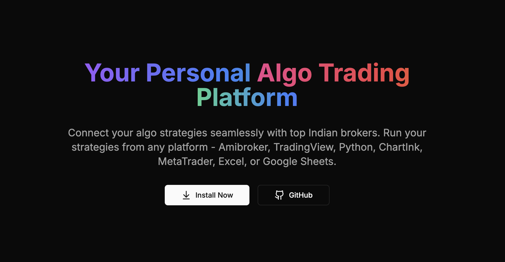

# OpenAlgo - Take Control of Your Algo Platform

OpenAlgo is an open-source, Flask-based Python application designed to bridge the gap between traders and major trading platforms such as Amibroker, Tradingview, Python, Chartink, MetaTrader, Excel, and Google Spreadsheets. With a focus on simplifying algotrading, OpenAlgo facilitates easy integration, automation, and execution of trading strategies, providing a user-friendly interface to enhance trading performance.

## Installation Guide

For detailed installation instructions, please refer to [INSTALL.md](https://docs.openalgo.in/getting-started)

## What is OpenAlgo?

## Supported Brokers

- **5paisa**
- **5paisa (XTS)**
- **AliceBlue**
- **AngelOne**
- **Compositedge**
- **Definedge**
- **Dhan**
- **Dhan (Sandbox)**
- **Firstock**
- **Flattrade**
- **Fyers**
- **IBulls**
- **Indmoney**
- **Kotak** 
- **Paytm**
- **Pocketful**
- **Shoonya**
- **Tradejini**
- **Upstox**
- **Wisdom Capital**
- **Zebu**
- **Zerodha**

## Features

### WebSocket Architecture with ZMQ Integration
- **Unified WebSocket Proxy Server**: Central WebSocket server (port 8765) that handles client authentication and subscription management
- **ZeroMQ (ZMQ) Message Bus**: High-performance message queue for real-time market data distribution
  - Publisher-Subscriber pattern for efficient data broadcasting
  - Dynamic port binding with automatic port management
  - Broker adapters publish to ZMQ, proxy server subscribes and routes to clients
- **Broker-Specific Adapters**: Each broker has a dedicated adapter implementing the base WebSocket interface
  - Handles broker-specific WebSocket protocols and data formats
  - Transforms broker data to unified OpenAlgo format
  - Supports multiple subscription modes: LTP (Last Traded Price), Quote, and Market Depth
- **Real-Time Market Data**: Live streaming of market data with support for:
  - LTP updates
  - Full quotes with OHLC data
  - Market depth (5/20/30 levels based on broker support)
  - Auto-reconnection and connection management

### Unified API Layer (`/api/v1/`)
OpenAlgo provides a RESTful API with standardized endpoints across all supported brokers:

#### Order Management APIs
- **`/api/v1/placeorder`**: Place regular orders with standard parameters
- **`/api/v1/placesmartorder`**: Smart order routing with advanced logic
- **`/api/v1/modifyorder`**: Modify existing orders
- **`/api/v1/cancelorder`**: Cancel specific orders
- **`/api/v1/cancelallorder`**: Cancel all pending orders
- **`/api/v1/closeposition`**: Close open positions
- **`/api/v1/basketorder`**: Execute multiple orders in a single request
- **`/api/v1/splitorder`**: Split large orders into smaller chunks

#### Account & Portfolio APIs
- **`/api/v1/funds`**: Get account funds and margins
- **`/api/v1/orderbook`**: Retrieve all orders for the day
- **`/api/v1/tradebook`**: Get executed trades
- **`/api/v1/positionbook`**: View current open positions
- **`/api/v1/holdings`**: Get demat holdings
- **`/api/v1/openposition`**: Check specific position details
- **`/api/v1/orderstatus`**: Get real-time order status

#### Market Data APIs
- **`/api/v1/quotes`**: Get real-time quotes for symbols
- **`/api/v1/history`**: Fetch historical OHLC data
- **`/api/v1/depth`**: Get market depth/order book
- **`/api/v1/ticker`**: Stream real-time price updates

#### Utility APIs
- **`/api/v1/search`**: Search for symbols across exchanges
- **`/api/v1/symbol`**: Get symbol details and mappings
- **`/api/v1/expiry`**: Get option expiry dates
- **`/api/v1/intervals`**: Get supported time intervals for historical data
- **`/api/v1/analyzer`**: Test and analyze API requests without execution
- **`/api/v1/ping`**: Test API connectivity and authentication

### Common Broker Integration Pattern
Each broker integration follows a standardized structure:
- **Authentication API** (`auth_api.py`): Handle login and session management
- **Order API** (`order_api.py`): Place, modify, cancel orders and manage positions
- **Data API** (`data.py`): Fetch quotes, historical data, and market information
- **Funds API** (`funds.py`): Get account balance and margin details
- **Symbol Mapping** (`transform_data.py`): Convert between OpenAlgo and broker formats
- **WebSocket Streaming** (`broker_adapter.py`): Real-time data streaming

- **ChartInk Platform Integration**: 
  - Direct integration with ChartInk for strategy execution
  - Automated scanning and trading based on ChartInk signals
  - Real-time strategy monitoring and management
  - Custom strategy configuration and deployment
  - Seamless execution of ChartInk strategies through your broker

- **Advanced Monitoring Tools**:
  - **Latency Monitor**: Track and analyze order execution performance
    - Real-time latency tracking across different brokers
    - Detailed breakdown of execution times
    - Performance comparison between brokers
    - Order execution success rates and patterns
  - **Traffic Monitor**: Monitor system performance and API usage
    - Real-time API request tracking
    - Endpoint-specific analytics
    - Error rate monitoring
    - System performance metrics
  - **PnL Tracker**: Real-time profit and loss monitoring with advanced charting
    - Intraday PnL curve visualization from 9 AM IST
    - Current MTM, Max MTM with time, Min MTM with time
    - Maximum drawdown tracking
    - Interactive charts powered by TradingView Lightweight Charts
    - Manual refresh control for performance optimization
    - IST timezone support for accurate time display
  For detailed information about monitoring tools, see [traffic.md](docs/traffic.md)

- **Modern UI with DaisyUI**: 
  - Sleek and responsive interface built with DaisyUI components
  - Three distinct themes:
    - Light theme for normal mode
    - Dark theme for reduced eye strain
    - Garden theme for analyzer mode
  - Instant theme switching with state preservation
  - Theme-aware syntax highlighting for code and JSON
  - Mobile-friendly layout with drawer navigation

- **Real-Time Trading Updates**:
  - Instant order book updates via WebSocket
  - Live trade book monitoring with automatic refresh
  - Real-time position tracking
  - Dynamic log updates for trade activities
  - Contextual notifications with sound alerts

- **API Analyzer**:
  - Real-time request validation and testing
  - Strategy testing without live execution
  - Detailed request/response analysis
  - Comprehensive error detection
  - Dedicated garden theme for better focus
  - See [Analyzer.md](docs/Analyzer.md) for detailed documentation

- **Comprehensive Integration**: Seamlessly connect with Amibroker, Tradingview, Excel, and Google Spreadsheets for smooth data and strategy transition.

- **User-Friendly Interface**: A straightforward Flask-based application interface accessible to traders of all levels of expertise.

- **Real-Time Execution**: Implement your trading strategies in real time, ensuring immediate action to capitalize on market opportunities.

- **Customizable Strategies**: Easily adapt and tailor your trading strategies to meet your specific needs, with extensive options for customization and automation.

- **Secure and Reliable**: With a focus on security and reliability, OpenAlgo provides a dependable platform for your algotrading activities, safeguarding your data and trades.

### Rate Limiting Controls
OpenAlgo implements comprehensive rate limiting to protect against abuse and ensure fair usage:

- **Configurable Rate Limits**: All rate limits are environment variable controlled
  - `LOGIN_RATE_LIMIT_MIN`: Login attempts per minute (default: 5 per minute)
  - `LOGIN_RATE_LIMIT_HOUR`: Login attempts per hour (default: 25 per hour)
  - `API_RATE_LIMIT`: General API endpoints (default: 10 per second)
  - `ORDER_RATE_LIMIT`: Order placement/modification/cancellation (default: 10 per second)
  - `SMART_ORDER_RATE_LIMIT`: Smart order operations
  - `WEBHOOK_RATE_LIMIT`: Webhook endpoint limits
  - `STRATEGY_RATE_LIMIT`: Strategy operation limits

- **Moving Window Strategy**: Uses Flask-Limiter with moving-window strategy for accurate rate limiting
- **IP-based Limiting**: Rate limits are applied per IP address
- **Graceful Handling**: Clear error messages when rate limits are exceeded

### Security Features

#### Browser-Level Security
- **Content Security Policy (CSP)**: Configurable CSP headers to prevent XSS attacks
  - Customizable directives via environment variables
  - Default restrictive policies for scripts, styles, and resources
  - WebSocket support for real-time features
- **CORS Protection**: Controlled Cross-Origin Resource Sharing
  - Configurable allowed origins, methods, and headers
  - Supports credentials for authenticated requests
- **CSRF Protection**: Built-in CSRF token validation for state-changing operations
- **Secure Headers**: X-Frame-Options, X-Content-Type-Options, and other security headers
- **Session Security**: Secure session management with proper cookie settings

#### Database-Level Security
- **Password Hashing**: Uses Argon2 (winner of Password Hashing Competition) for secure password storage
- **Token Encryption**: Auth tokens encrypted using Fernet symmetric encryption
  - PBKDF2 key derivation for encryption keys
  - Automatic encryption/decryption of sensitive tokens
- **API Key Security**: 
  - Hashed storage using Argon2 with pepper
  - Encrypted storage for retrieval
  - Time-based caching with TTL
- **SQL Injection Protection**: Uses SQLAlchemy ORM with parameterized queries
- **Connection Pooling**: Optimized database connections with proper pool management

### API Analyzer
The API Analyzer is a comprehensive testing and validation tool that provides:

#### For Traders
- **Risk-Free Testing**: Test all trading operations without actual execution
- **Real-Time Validation**: Instant feedback on order parameters and strategy logic
- **Strategy Monitoring**: Track multiple strategies simultaneously
- **Visual Feedback**: Garden theme UI with instant notifications and sound alerts
- **Cost Savings**: Avoid trading errors and optimize parameters without financial risk

#### For Developers
- **Complete API Testing**: Test all endpoints with detailed request/response analysis
- **Validation Engine**: Automatic parameter validation, symbol checks, and range verification
- **WebSocket Monitoring**: Real-time event tracking and debugging
- **Performance Metrics**: Track API usage, latency, and error rates
- **Debug Tools**: Complete request inspection and error analysis

The analyzer supports all major operations: Place Order, Smart Orders, Modifications, Cancellations, and Position Management. See [Analyzer.md](docs/Analyzer.md) for detailed documentation.

### OpenAlgo FOSS Universe
OpenAlgo is part of a larger ecosystem of open-source trading tools. The Mini FOSS Universe includes:

- **OpenAlgo Core**: Python Flask + Tailwind + DaisyUI (this repository)
- **Historify**: Full Stack Stock Market Data Management Platform
- **Python Library**: Native Python integration for algo trading
- **Node.js Library**: JavaScript/TypeScript support for trading applications
- **Excel Add-in**: Direct Excel integration for strategy development
- **Model Context Protocol**: AI Agents integration for intelligent trading
- **Chrome Plugin**: Browser-based trading tools
- **Fast Scalper**: High-performance trading built with Rust + Tauri
- **Web Portal**: Modern UI built with NextJS + ShadcnUI
- **Documentation**: Comprehensive guides on Gitbook

Built for traders, by traders - making algo trading more accessible, powerful, and open for everyone. Visit [docs.openalgo.in/mini-foss-universe](https://docs.openalgo.in/mini-foss-universe) for more details.

### Local MCP (Model Context Protocol) Integration
OpenAlgo includes native MCP server capabilities, enabling AI assistants to execute trades and manage portfolios directly:

#### Key Features
- **AI-Powered Trading**: Connect AI assistants like Claude Desktop, Cursor, or Windsurf to execute trades
- **Full Trading Capabilities**: 
  - Order Management: Place, modify, cancel orders (market/limit/stop-loss)
  - Smart Orders: Automatic position sizing and basket orders
  - Position Management: Close positions, track P&L
  - Market Data: Real-time quotes, market depth, historical data
- **Multi-Platform Support**: Works with any MCP-compatible AI client
- **Local & Secure**: Runs locally with your OpenAlgo instance

#### Available MCP Tools
- **Order Operations**: `place_order`, `place_smart_order`, `place_basket_order`, `modify_order`, `cancel_order`
- **Position Tracking**: `get_open_position`, `get_position_book`, `close_all_positions`
- **Market Data**: `get_quote`, `get_market_depth`, `get_historical_data`
- **Account Info**: `get_funds`, `get_holdings`, `get_order_book`, `get_trade_book`
- **Instrument Search**: `search_instruments`, `get_symbol_info`, `get_expiry_dates`

#### Quick Setup
1. Start your OpenAlgo server
2. Generate an API key from Settings → API Keys
3. Configure your AI assistant with the MCP server path and API key
4. Start trading with natural language commands like "Buy 100 shares of RELIANCE"

For detailed MCP setup instructions, see [mcp/README.md](mcp/README.md)

## Documentation

For detailed documentation on OpenAlgo, including setup guides, API references, and usage examples, refer to [https://docs.openalgo.in](https://docs.openalgo.in)

### Minimum Hardware Requirements

To run OpenAlgo we recommend:
- 2GB RAM or 0.5GB RAM with 2GB of Swap Memory
- 1GB disk space
- 1vCPU

## Contributing

We welcome contributions to OpenAlgo! If you're interested in improving the application or adding new features, please feel free to fork the repository, make your changes, and submit a pull request.

## License

OpenAlgo is released under the AGPL V3.0 License. See the `LICENSE` file for more details.

## Repo Activity

## Disclaimer

This software is for educational purposes only. Do not risk money which
you are afraid to lose. USE THE SOFTWARE AT YOUR OWN RISK. THE AUTHORS
AND ALL AFFILIATES ASSUME NO RESPONSIBILITY FOR YOUR TRADING RESULTS.

## Credits and Acknowledgements

### Third-Party Libraries

- **[DaisyUI](https://github.com/saadeghi/daisyui)** - The most popular component library for Tailwind CSS
  - License: MIT
  - Version: 4.12.21
  - Used for modern, responsive UI components throughout the application
  - Provides theming system (Light, Dark, Garden themes)
  - Powers the entire user interface design

- **[TradingView Lightweight Charts](https://github.com/tradingview/lightweight-charts)** - Advanced financial charting library
  - License: Apache 2.0
  - Version: 5.0.8
  - Used for interactive intraday PnL and drawdown visualization in PnL Tracker

## Support

For any questions not covered by the documentation or for further information about OpenAlgo, join our [Discord server](https://discord.com/invite/UPh7QPsNhP).
