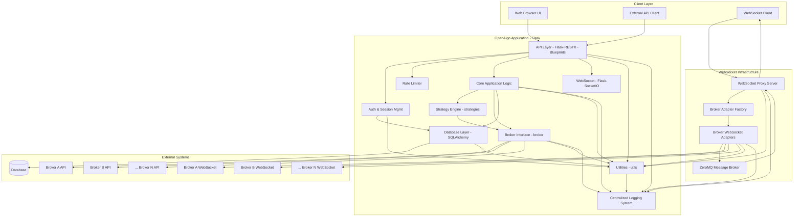

# OpenAlgo System Architecture

## Executive Summary

OpenAlgo is a sophisticated, broker-agnostic algorithmic trading platform built with Python Flask that provides a unified API interface for 25+ Indian stock brokers. The platform enables algorithmic trading strategies through REST APIs, WebSocket connections, and an intuitive web interface.

## Architectural Style

OpenAlgo employs a **Modular Monolithic Architecture** with a **RESTful API** interface, combining the benefits of monolithic simplicity with modular organization through Flask Blueprints and service layers.

### Key Architectural Principles
*   **Broker Abstraction:** Unified interface abstracting broker-specific implementations
*   **Service-Oriented Design:** Clear separation between presentation, business logic, and data layers
*   **Plugin Architecture:** Dynamic broker adapter loading and configuration
*   **Security by Design:** Multi-layered security with encryption, authentication, and authorization
*   **Scalability Ready:** Connection pooling, caching strategies, and horizontal scaling support
*   **Real-time Capabilities:** WebSocket proxy for live market data streaming
*   **Process Isolation:** Strategy execution in isolated processes for stability

## Technology Stack

### Core Technologies
*   **Programming Language:** Python 3.8+ with full type hints support
*   **Web Framework:** Flask 3.0.3 with modular Blueprint architecture
*   **API Framework:** Flask-RESTX with automatic OpenAPI/Swagger documentation
*   **Database ORM:** SQLAlchemy 2.0+ with connection pooling (50 base, 100 max overflow)
*   **Database Support:** SQLite (development), PostgreSQL/MySQL (production)

### Security & Authentication
*   **Password Hashing:** Argon2 with pepper for enhanced security
*   **API Authentication:** API key-based with Argon2 hashing
*   **Encryption:** Fernet symmetric encryption for sensitive data
*   **2FA Support:** TOTP (Time-based One-Time Password)
*   **Session Management:** Secure cookies with daily expiry at 3:30 AM IST
*   **CSRF Protection:** WTF-CSRF with secure cookie settings

### Real-time & Communication
*   **WebSocket Server:** Standalone proxy with ZeroMQ backend
*   **Real-time Updates:** Flask-SocketIO for dashboard updates
*   **Message Queue:** ZeroMQ for broker communication
*   **Telegram Integration:** python-telegram-bot for notifications
*   **Event Loop:** asyncio-based asynchronous processing

### Frontend & UI
*   **Template Engine:** Jinja2 with auto-escaping
*   **CSS Framework:** TailwindCSS with DaisyUI components
*   **JavaScript:** Vanilla ES6+ with Socket.IO client
*   **Theme Support:** Dark/light mode with localStorage persistence
*   **Responsive Design:** Mobile-first responsive layout

### Performance & Monitoring
*   **Rate Limiting:** Flask-Limiter with per-key limits
*   **Caching:** Session-based TTL cache
*   **Logging:** Colored logging with sensitive data filtering
*   **Monitoring:** Built-in latency and traffic analysis
*   **Connection Pooling:** httpx with connection reuse

### Deployment & Infrastructure
*   **WSGI Server:** Gunicorn (Linux) / Waitress (Windows)
*   **Process Manager:** Systemd (Linux) / Windows Service
*   **Container Support:** Docker with docker-compose
*   **Cloud Support:** AWS Elastic Beanstalk ready
*   **Environment Management:** python-dotenv with validation

## Directory Structure

```
openalgo/
├── app.py                     # Main Flask application entry point
├── blueprints/                # Flask blueprints for modular routing
│   ├── auth.py               # Authentication and user management
│   ├── dashboard.py          # Main trading dashboard
│   ├── orders.py             # Order management interface
│   ├── analyzer.py           # Trade analytics
│   ├── python_strategy.py    # Python strategy hosting
│   ├── telegram.py           # Telegram bot management
│   └── [15+ more blueprints]
├── broker/                    # Broker-specific adapters (25+ brokers)
│   ├── zerodha/              # Zerodha Kite Connect integration
│   ├── angelone/             # Angel One SmartAPI integration
│   ├── upstox/               # Upstox API integration
│   └── [22+ more brokers]
├── database/                  # Database models and operations
│   ├── auth_db.py            # Authentication models
│   ├── user_db.py            # User management
│   ├── token_db.py           # Token and instrument data
│   ├── telegram_db.py        # Telegram bot data
│   └── [10+ more models]
├── restx_api/                 # REST API endpoints
│   ├── __init__.py           # API initialization and namespaces
│   ├── place_order.py        # Order placement endpoints
│   ├── market_data.py        # Market data endpoints
│   └── [20+ API modules]
├── services/                  # Business logic services
│   ├── trading/              # Trading operations
│   ├── market_data/          # Market data services
│   ├── portfolio/            # Portfolio management
│   └── telegram_bot_service.py # Telegram bot service
├── utils/                     # Utility functions and helpers
│   ├── logging.py            # Colored logging with filtering
│   ├── constants.py          # System-wide constants
│   ├── plugin_loader.py      # Dynamic broker loading
│   └── [10+ utilities]
├── templates/                 # Jinja2 HTML templates
│   ├── base.html             # Base template with theme support
│   ├── dashboard.html        # Trading dashboard UI
│   └── [50+ templates]
├── static/                    # Static assets
│   ├── css/                  # Compiled TailwindCSS
│   ├── js/                   # JavaScript modules
│   └── images/               # UI assets
├── websocket_proxy/           # WebSocket proxy server
│   ├── server.py             # Main WebSocket server
│   └── app_integration.py    # Flask integration
├── strategies/                # Trading strategy examples
│   ├── scripts/              # Python strategy files
│   └── configs/              # Strategy configurations
├── test/                      # Test suites
├── logs/                      # Application logs
├── keys/                      # Security keys and certificates
└── docs/                      # Documentation
*   `.env`, `.sample.env`: Environment variable configuration.

## Component Diagram (Mermaid)


