# OpenAlgo System Architecture

## Executive Summary

OpenAlgo is a sophisticated, broker-agnostic algorithmic trading platform built with Python Flask that provides a unified API interface for 27 Indian stock brokers. The platform enables algorithmic trading strategies through REST APIs, WebSocket connections, and an intuitive web interface.

**Current Version**: 1.0.0.38 (UI), Python SDK 1.0.39

## Architectural Style

OpenAlgo employs a **Modular Monolithic Architecture** with a **RESTful API** interface, combining the benefits of monolithic simplicity with modular organization through Flask Blueprints and service layers.

### Key Architectural Principles
*   **Broker Abstraction:** Unified interface abstracting broker-specific implementations
*   **Service-Oriented Design:** Clear separation between presentation, business logic, and data layers
*   **Plugin Architecture:** Dynamic broker adapter loading and configuration
*   **Security by Design:** Multi-layered security with encryption, authentication, and authorization
*   **Scalability Ready:** Connection pooling, caching strategies, and horizontal scaling support
*   **Real-time Capabilities:** WebSocket proxy for live market data streaming
*   **Process Isolation:** Strategy execution in isolated processes for stability
*   **Sandbox Mode:** Complete paper trading environment with simulated execution

## Technology Stack

### Core Technologies
*   **Programming Language:** Python 3.8+ with full type hints support
*   **Web Framework:** Flask 3.0.3 with modular Blueprint architecture
*   **API Framework:** Flask-RESTX 1.3.0 with automatic OpenAPI/Swagger documentation
*   **Database ORM:** SQLAlchemy 2.0.31 with connection pooling (50 base, 100 max overflow)
*   **Database Support:** SQLite (development), PostgreSQL/MySQL (production)

### Security & Authentication
*   **Password Hashing:** Argon2 with pepper for enhanced security
*   **API Authentication:** API key-based with Argon2 hashing
*   **Encryption:** Fernet symmetric encryption (Cryptography 44.0.1) for sensitive data
*   **2FA Support:** TOTP (Time-based One-Time Password) via pyotp
*   **Session Management:** Secure cookies with configurable expiry at 3:00 AM IST
*   **CSRF Protection:** WTF-CSRF with secure cookie settings

### Real-time & Communication
*   **WebSocket Server:** Standalone proxy with ZeroMQ backend (websockets 15.0.1)
*   **Real-time Updates:** Flask-SocketIO 5.3.6 for dashboard updates
*   **Message Queue:** ZeroMQ for high-performance broker communication
*   **Telegram Integration:** python-telegram-bot 22.4 for notifications and mobile trading
*   **Event Loop:** asyncio-based asynchronous processing

### Frontend & UI
*   **Template Engine:** Jinja2 with auto-escaping
*   **CSS Framework:** TailwindCSS with DaisyUI components
*   **JavaScript:** Vanilla ES6+ with Socket.IO client
*   **Charting:** LightWeight Charts, Plotly 6.3.0
*   **Theme Support:** Dark/light mode with localStorage persistence
*   **Responsive Design:** Mobile-first responsive layout

### Data Processing
*   **Data Analysis:** Pandas 2.2.3, NumPy 2.2.4
*   **HTTP Client:** httpx 0.28.1 with connection pooling
*   **Task Scheduling:** APScheduler 3.11.0 with IST timezone support

### Performance & Monitoring
*   **Rate Limiting:** Flask-Limiter 3.7.0 with per-key limits
*   **Caching:** Session-based TTL cache (10-hour API key cache)
*   **Logging:** Colored logging with sensitive data filtering
*   **Monitoring:** Built-in latency tracking, traffic analysis, PnL tracking
*   **Connection Pooling:** httpx with connection reuse
*   **Process Monitoring:** psutil 7.0.0

### Deployment & Infrastructure
*   **WSGI Server:** Gunicorn with eventlet worker (Linux) / Waitress (Windows)
*   **Process Manager:** Systemd (Linux) / Windows Service
*   **Container Support:** Docker with docker-compose
*   **Cloud Support:** AWS Elastic Beanstalk ready
*   **Environment Management:** python-dotenv with validation
*   **Package Manager:** uv for fast dependency management

## Directory Structure

```
openalgo/
├── app.py                     # Main Flask application entry point
├── blueprints/                # Flask blueprints for modular routing (26 blueprints)
│   ├── auth.py               # Authentication and user management
│   ├── dashboard.py          # Main trading dashboard
│   ├── orders.py             # Order management interface
│   ├── analyzer.py           # Trade analytics and API analyzer
│   ├── python_strategy.py    # Python strategy hosting
│   ├── telegram.py           # Telegram bot management
│   ├── strategy.py           # TradingView webhook strategies
│   ├── chartink.py           # ChartInk strategy integration
│   ├── sandbox.py            # Paper trading interface
│   ├── pnltracker.py         # PnL tracking and analytics
│   ├── latency.py            # Order latency monitoring
│   ├── traffic.py            # API traffic analytics
│   ├── playground.py         # API testing playground
│   ├── master_contract_status.py  # Contract status monitoring
│   └── [12+ more blueprints]
├── broker/                    # Broker-specific adapters (27 brokers)
│   ├── zerodha/              # Zerodha Kite Connect integration
│   ├── angel/                # Angel One SmartAPI integration
│   ├── upstox/               # Upstox API integration
│   ├── motilal/              # Motilal Oswal API (with WebSocket)
│   ├── dhan/                 # Dhan API (Live + Sandbox)
│   └── [22+ more brokers]
├── database/                  # Database models and operations (21+ models)
│   ├── auth_db.py            # Authentication models
│   ├── user_db.py            # User management
│   ├── token_db.py           # Token and instrument data
│   ├── telegram_db.py        # Telegram bot data
│   ├── sandbox_db.py         # Sandbox/paper trading models
│   ├── action_center_db.py   # Semi-auto order approval
│   ├── latency_db.py         # Order latency tracking
│   ├── traffic_db.py         # API traffic logging
│   ├── strategy_db.py        # Strategy configurations
│   └── [12+ more models]
├── restx_api/                 # REST API endpoints (40+ modules)
│   ├── __init__.py           # API initialization and namespaces
│   ├── place_order.py        # Order placement endpoints
│   ├── smart_order.py        # Smart order with position sizing
│   ├── split_order.py        # Auto-split large orders
│   ├── basket_order.py       # Batch order placement
│   ├── options_order.py      # Single option orders
│   ├── options_multiorder.py # Multi-leg option orders
│   ├── quotes.py             # Single symbol quotes
│   ├── multiquotes.py        # Multi-symbol quotes
│   ├── depth.py              # Market depth (Level 5)
│   ├── history.py            # Historical data
│   ├── option_greeks.py      # Option Greeks calculator
│   ├── schemas.py            # Request/response schemas
│   └── [27+ API modules]
├── services/                  # Business logic services (40+ services)
│   ├── trading/              # Trading operations
│   ├── market_data/          # Market data services
│   ├── portfolio/            # Portfolio management
│   ├── telegram_bot_service.py # Telegram bot service (71KB)
│   ├── websocket_service.py  # WebSocket connection management
│   ├── sandbox_service.py    # Sandbox execution service
│   └── [34+ services]
├── sandbox/                   # Paper trading/simulator engine
│   ├── execution_engine.py   # Virtual order execution
│   ├── order_manager.py      # Order lifecycle management
│   ├── position_manager.py   # Position tracking
│   ├── fund_manager.py       # Virtual fund management
│   ├── holdings_manager.py   # Holdings simulation
│   └── squareoff_manager.py  # Auto square-off
├── utils/                     # Utility functions and helpers
│   ├── logging.py            # Colored logging with filtering
│   ├── constants.py          # System-wide constants
│   ├── plugin_loader.py      # Dynamic broker loading
│   ├── api_analyzer.py       # Sandbox mode analytics
│   ├── latency_monitor.py    # RTT measurement
│   ├── traffic_logger.py     # API usage logging
│   ├── session.py            # Session management
│   └── [10+ utilities]
├── websocket_proxy/           # WebSocket proxy server
│   ├── server.py             # Main WebSocket server (48KB)
│   ├── base_adapter.py       # Base broker adapter
│   ├── broker_factory.py     # Adapter factory
│   ├── mapping.py            # Data mapping
│   └── app_integration.py    # Flask integration
├── templates/                 # Jinja2 HTML templates (50+ templates)
├── static/                    # Static assets (CSS, JS, images)
├── strategies/                # Trading strategy storage
│   ├── scripts/              # Python strategy files
│   └── configs/              # Strategy configurations
├── collections/               # Database collections/fixtures
├── docs/                      # Documentation
├── design/                    # Design documents
├── test/                      # Test suites
├── logs/                      # Application logs
├── db/                        # Database files
│   ├── openalgo.db           # Main database
│   ├── sandbox.db            # Sandbox database
│   ├── latency.db            # Latency tracking
│   └── logs.db               # API logs database
├── keys/                      # Security keys and certificates
├── requirements.txt           # Python dependencies
├── pyproject.toml            # Python project configuration
└── .env                      # Environment configuration
```

## Component Diagram (Mermaid)

```mermaid
graph TD
    subgraph "Client Layer"
        WebUI[Web Browser UI]
        APIClient[External API Client]
        WSClient[WebSocket Client]
        TelegramClient[Telegram Bot]
        StrategyScripts[Python Strategies]
    end

    subgraph "OpenAlgo Application - Flask"
        direction TB
        APILayer[API Layer - Flask-RESTX - Blueprints]
        Auth[Auth & Session Mgmt]
        RateLimiter[Rate Limiter]
        SocketIO[WebSocket - Flask-SocketIO]
        CoreLogic[Core Application Logic]
        StrategyEngine[Strategy Engine - strategies]
        SandboxEngine[Sandbox Engine - sandbox]
        ActionCenter[Action Center - Semi-Auto Mode]
        BrokerInterface[Broker Interface - broker]
        DBLayer[Database Layer - SQLAlchemy]
        Utils[Utilities - utils]
        LoggingSystem[Centralized Logging System]
        PnLTracker[PnL Tracker]
        LatencyMonitor[Latency Monitor]
        TrafficLogger[Traffic Logger]
    end

    subgraph "WebSocket Infrastructure"
        direction TB
        WSProxy[WebSocket Proxy Server]
        BrokerAdapters[Broker WebSocket Adapters]
        ZMQBroker[ZeroMQ Message Broker]
        AdapterFactory[Broker Adapter Factory]
    end

    subgraph "External Systems"
        MainDB[(Main Database)]
        SandboxDB[(Sandbox Database)]
        LatencyDB[(Latency Database)]
        LogsDB[(Logs Database)]
        BrokerAPI1[Broker A API]
        BrokerAPI2[Broker B API]
        BrokerAPIn[... Broker N API]
        BrokerWS1[Broker A WebSocket]
        BrokerWS2[Broker B WebSocket]
        BrokerWSn[... Broker N WebSocket]
        TelegramAPI[Telegram API]
    end

    %% Main Application Flow
    WebUI --> APILayer
    APIClient --> APILayer
    TelegramClient --> APILayer
    StrategyScripts --> APILayer
    APILayer --> Auth
    APILayer --> RateLimiter
    APILayer --> CoreLogic
    APILayer --> SocketIO
    CoreLogic --> StrategyEngine
    CoreLogic --> SandboxEngine
    CoreLogic --> ActionCenter
    CoreLogic --> BrokerInterface
    CoreLogic --> DBLayer
    CoreLogic --> PnLTracker
    Auth --> DBLayer
    StrategyEngine --> BrokerInterface
    SandboxEngine --> DBLayer
    ActionCenter --> DBLayer
    BrokerInterface --> BrokerAPI1
    BrokerInterface --> BrokerAPI2
    BrokerInterface --> BrokerAPIn
    DBLayer --> MainDB
    DBLayer --> SandboxDB
    DBLayer --> LatencyDB
    DBLayer --> LogsDB

    %% WebSocket Flow
    WSClient --> WSProxy
    WSProxy --> AdapterFactory
    AdapterFactory --> BrokerAdapters
    BrokerAdapters --> ZMQBroker
    ZMQBroker --> WSProxy
    WSProxy --> WSClient
    BrokerAdapters --> BrokerWS1
    BrokerAdapters --> BrokerWS2
    BrokerAdapters --> BrokerWSn

    %% Telegram Flow
    TelegramClient --> TelegramAPI
    TelegramAPI --> CoreLogic

    %% Utility Dependencies
    APILayer --> Utils
    CoreLogic --> Utils
    BrokerInterface --> Utils
    DBLayer --> Utils
    Auth --> Utils
    WSProxy --> Utils
    BrokerAdapters --> Utils

    %% Monitoring
    APILayer --> LatencyMonitor
    APILayer --> TrafficLogger
    LatencyMonitor --> LatencyDB
    TrafficLogger --> LogsDB

    %% Logging System
    APILayer --> LoggingSystem
    CoreLogic --> LoggingSystem
    BrokerInterface --> LoggingSystem
    WSProxy --> LoggingSystem
    BrokerAdapters --> LoggingSystem
    Utils --> LoggingSystem
```



## Key Features Summary

### Trading Features
| Feature | Description |
|---------|-------------|
| **27 Broker Integrations** | Unified API for all major Indian brokers |
| **Order Types** | Market, Limit, SL, SL-M orders |
| **Smart Orders** | Position-sized orders with percentage/value calculations |
| **Basket Orders** | Multi-order batch placement |
| **Split Orders** | Auto-split large orders into smaller chunks |
| **Options Trading** | Single and multi-leg option orders |
| **Option Greeks** | Real-time Greeks calculator |

### Strategy Hosting
| Feature | Description |
|---------|-------------|
| **Python Strategies** | Upload and execute Python trading scripts |
| **TradingView Webhooks** | Execute signals from TradingView alerts |
| **ChartInk Integration** | Connect ChartInk scanners to trading |
| **Process Isolation** | Each strategy runs in isolated process |
| **Scheduling** | Cron-like scheduling with IST timezone |
| **Environment Variables** | Secure encrypted storage for API keys |

### Monitoring & Analytics
| Feature | Description |
|---------|-------------|
| **PnL Tracker** | Real-time profit/loss tracking with sub-minute support |
| **Latency Monitoring** | Order RTT measurement with percentile analysis |
| **Traffic Analytics** | API usage tracking and analysis |
| **Action Center** | Semi-auto order approval workflow |
| **API Playground** | Interactive API testing interface |

### Paper Trading
| Feature | Description |
|---------|-------------|
| **Sandbox Mode** | Rs 1 Crore virtual capital |
| **Real Market Data** | Orders execute at actual LTP |
| **Margin System** | Realistic leverage-based margin blocking |
| **Auto Square-off** | Exchange-specific MIS closure |
| **Complete Isolation** | Separate database and threads |

### Communication
| Feature | Description |
|---------|-------------|
| **Telegram Bot** | Mobile trading and monitoring |
| **Real-time Charts** | Generate and share charts via Telegram |
| **Notifications** | Order and position alerts |
| **WebSocket Streaming** | Live LTP, Quotes, and Market Depth |

## Security Architecture

### Multi-Layer Security
1. **Authentication Layer:** Argon2 password hashing with pepper, TOTP 2FA
2. **Authorization Layer:** API key verification with 10-hour TTL cache
3. **Encryption Layer:** Fernet symmetric encryption for sensitive data
4. **Session Layer:** Secure cookies with IST-based daily expiry
5. **Transport Layer:** HTTPS enforcement, HSTS headers
6. **Application Layer:** CSRF protection, rate limiting, input validation
7. **Audit Layer:** Comprehensive logging with sensitive data redaction

### Data Protection
- **At Rest:** Fernet encryption for tokens, API keys, and credentials
- **In Transit:** TLS 1.2+ for all external communications
- **In Memory:** TTL-based caching with automatic expiry
- **Logging:** Automatic redaction of sensitive patterns

## Performance Characteristics

### Response Time Targets
| Operation | Target | Typical |
|-----------|--------|---------|
| Order Placement | < 100ms | ~50ms |
| Quote Retrieval | < 200ms | ~100ms |
| Position Update | < 150ms | ~80ms |
| WebSocket Tick | < 50ms | ~20ms |

### Scalability
- **Concurrent Users:** 100+ simultaneous users
- **Orders/Second:** Up to 10 orders per second per user
- **WebSocket Connections:** 1000+ concurrent connections
- **Database Connections:** Pool of 50-150 connections

## Deployment Architecture

### Supported Deployments
1. **Ubuntu VPS with Nginx** (Production recommended)
2. **Docker Container** with docker-compose
3. **AWS Elastic Beanstalk** with auto-scaling
4. **Windows Server** with Waitress WSGI

### System Requirements
| Component | Minimum | Recommended |
|-----------|---------|-------------|
| CPU | 1 vCPU | 2+ vCPU |
| RAM | 2 GB | 4+ GB |
| Storage | 20 GB | 50+ GB |
| Network | 1 Mbps | 10+ Mbps |
| OS | Ubuntu 20.04 | Ubuntu 22.04 LTS |

## Recent Updates (November 2025)

### Core Enhancements
- **PNL Tracker Sub-Minute Support** - Fixed timestamp handling for intraday analysis
- **Motilal Oswal WebSocket** - LTP, Quotes, and Depth Level 1 support
- **Options Multi-Order Fix** - Corrected response schema for multi-leg orders
- **Multi-Quote API** - Batch quote retrieval for multiple symbols

### Infrastructure
- **4 Separate Databases** - Main, Sandbox, Latency, and Logs isolation
- **26 Flask Blueprints** - Comprehensive modular routing
- **40+ REST API Endpoints** - Complete trading functionality
- **21+ Database Models** - Full data persistence layer

## Conclusion

OpenAlgo provides a comprehensive, production-ready algorithmic trading platform with:
- **27 broker integrations** with unified REST API
- **Real-time WebSocket streaming** via ZMQ proxy
- **Multi-strategy hosting** (TradingView, ChartInk, Python)
- **Paper trading sandbox** with realistic execution
- **Advanced monitoring** (latency, traffic, PnL tracking)
- **Telegram bot integration** for mobile access
- **Action center** for semi-auto order approval
- **IST timezone support** throughout
- **Enterprise-grade security** (Argon2, Fernet, CSRF, rate limiting)
- **Complete API documentation** via Flask-RESTX Swagger UI
