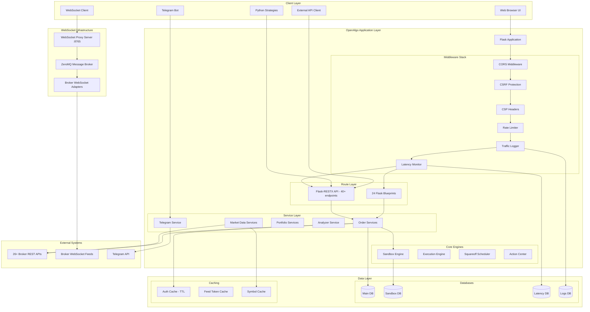

# OpenAlgo System Architecture

## Executive Summary

OpenAlgo is a broker-agnostic, open-source algorithmic trading platform built with Flask and Python. It provides a comprehensive web-based interface and REST API for automated trading across 26+ Indian broker integrations. The platform supports paper trading (sandbox mode), live trading, strategy automation, real-time market data streaming, and advanced analytics.

**Current Version:** 1.0.39
**Technology Stack:** Flask 3.0.3, Flask-SocketIO 5.3.6, Flask-RESTX 1.3.0, SQLAlchemy 2.0.31
**Supported Brokers:** 26 production brokers + 1 sandbox environment

## Architectural Style

OpenAlgo employs a **Modular Monolithic Architecture** with a **RESTful API** interface, combining the benefits of monolithic simplicity with modular organization through Flask Blueprints and service layers.

### Key Architectural Principles

- **Broker Abstraction:** Unified interface abstracting broker-specific implementations via plugin architecture
- **Service-Oriented Design:** Clear separation between presentation, business logic, and data layers
- **Plugin Architecture:** Dynamic broker adapter loading with factory pattern registration
- **Security by Design:** Multi-layered security with Argon2 hashing, Fernet encryption, CSRF protection, and CSP headers
- **Scalability Ready:** Connection pooling (50 base, 100 max), TTL caching, and parallel database initialization
- **Real-time Capabilities:** WebSocket proxy with ZeroMQ backend for live market data streaming
- **Process Isolation:** Strategy execution in isolated processes for stability
- **Sandbox Mode:** Complete paper trading environment with Rs 1 Crore virtual capital and simulated execution

## Technology Stack

### Core Technologies

| Category | Technology | Version | Purpose |
|----------|------------|---------|---------|
| **Language** | Python | 3.8+ | Full type hints support |
| **Web Framework** | Flask | 3.0.3 | Modular Blueprint architecture |
| **API Framework** | Flask-RESTX | 1.3.0 | OpenAPI/Swagger auto-documentation |
| **Database ORM** | SQLAlchemy | 2.0.31 | Connection pooling (50 base, 100 max) |
| **Database** | SQLite/PostgreSQL | - | SQLite (dev), PostgreSQL (production) |

### Security & Authentication

| Technology | Version | Purpose |
|------------|---------|---------|
| Argon2-cffi | 23.1.0 | Password hashing with pepper |
| Cryptography | 44.0.1 | Fernet symmetric encryption |
| PyJWT | 2.8.0 | JWT token handling |
| pyotp | 2.9.0 | TOTP 2FA support |
| Flask-WTF | 1.2.1 | CSRF protection |
| Flask-Bcrypt | 1.0.1 | Password hashing |

### Real-time & Communication

| Technology | Version | Purpose |
|------------|---------|---------|
| Flask-SocketIO | 5.3.6 | Real-time dashboard updates |
| websockets | 15.0.1 | Standalone WebSocket server |
| pyzmq | 27.1.0 | ZeroMQ high-performance messaging |
| python-telegram-bot | 22.4 | Telegram notifications & mobile trading |
| tornado | 6.5.0 | Async server support |

### Frontend & UI

| Technology | Purpose |
|------------|---------|
| Jinja2 | Template engine with auto-escaping |
| TailwindCSS + DaisyUI | CSS framework with components |
| Vanilla ES6+ | JavaScript with Socket.IO client |
| LightWeight Charts + Plotly 6.3.0 | Interactive charting |

### Data Processing & HTTP

| Technology | Version | Purpose |
|------------|---------|---------|
| Pandas | 2.3.3 | Data analysis and manipulation |
| NumPy | 2.3.5 | Numerical computing |
| httpx | 0.28.1 | Modern HTTP client with connection pooling |
| APScheduler | 3.11.0 | Task scheduling with IST timezone |

### Performance & Monitoring

| Technology | Version | Purpose |
|------------|---------|---------|
| Flask-Limiter | 3.7.0 | Rate limiting (moving-window strategy) |
| cachetools | 5.3.3 | TTL caching (10-hour API key cache) |
| logzero | 1.7.0 | Colored logging with filtering |
| psutil | 7.0.0 | Process monitoring |

## Directory Structure

```
openalgo/
├── app.py                          # Main Flask application entry point (678 lines)
├── extensions.py                   # SocketIO extension initialization
├── cors.py                         # CORS configuration & middleware
├── limiter.py                      # Rate limiter (moving-window strategy)
├── csp.py                          # Content Security Policy middleware
│
├── blueprints/                     # Flask blueprints - 24 web UI routes
│   ├── auth.py                     # Authentication (login, broker OAuth, 2FA, password reset)
│   ├── dashboard.py                # Main dashboard with funds display
│   ├── orders.py                   # Order management UI (32.8 KB)
│   ├── analyzer.py                 # Strategy analyzer (9.8 KB)
│   ├── strategy.py                 # Strategy management (31.0 KB)
│   ├── chartink.py                 # TradingView Chartink webhook integration (28.7 KB)
│   ├── sandbox.py                  # Sandbox/paper trading UI (16.2 KB)
│   ├── pnltracker.py               # P&L tracking dashboard (39.8 KB)
│   ├── python_strategy.py          # Python strategy editor & execution (66.7 KB)
│   ├── telegram.py                 # Telegram bot integration (16.3 KB)
│   ├── security.py                 # Security audit & monitoring (13.1 KB)
│   ├── log.py                      # API log viewer (10.6 KB)
│   ├── apikey.py                   # API key management
│   ├── platforms.py                # Broker platform list
│   ├── brlogin.py                  # Broker OAuth callbacks (32.8 KB)
│   ├── settings.py                 # Application settings
│   ├── traffic.py                  # Traffic logging viewer (6.2 KB)
│   ├── latency.py                  # API latency monitoring (9.0 KB)
│   ├── search.py                   # Symbol search
│   ├── master_contract_status.py   # Master contract sync status
│   ├── tv_json.py                  # TradingView JSON format conversion
│   ├── gc_json.py                  # GCloud JSON conversion
│   ├── websocket_example.py        # WebSocket example blueprint
│   └── core.py                     # Core routes (setup, health check)
│
├── restx_api/                      # Flask-RESTX REST API (v1) - 40+ endpoints
│   ├── __init__.py                 # API blueprint registration
│   ├── place_order.py              # POST /api/v1/placeorder
│   ├── place_smart_order.py        # Smart order placement
│   ├── modify_order.py             # Order modification
│   ├── cancel_order.py             # Single order cancellation
│   ├── cancel_all_order.py         # Batch order cancellation
│   ├── close_position.py           # Position closing
│   ├── basket_order.py             # Multi-leg basket orders
│   ├── split_order.py              # Order splitting
│   ├── quotes.py                   # Single symbol quotes
│   ├── multiquotes.py              # Batch quote fetching
│   ├── history.py                  # OHLC data / candlestick
│   ├── depth.py                    # Market depth (L2 data)
│   ├── option_chain.py             # Option chain data
│   ├── option_greeks.py            # Options Greeks calculation (Black-76)
│   ├── options_order.py            # Options trading
│   ├── options_multiorder.py       # Multi-option orders
│   ├── synthetic_future.py         # Synthetic futures calculator
│   ├── orderbook.py                # User's order history
│   ├── tradebook.py                # Executed trades
│   ├── positionbook.py             # Open positions
│   ├── holdings.py                 # Equity holdings
│   ├── funds.py                    # Account margin & funds
│   ├── margin.py                   # Margin calculator
│   ├── symbol.py                   # Master contract search
│   ├── search.py                   # Enhanced symbol search
│   ├── expiry.py                   # Expiry dates
│   ├── instruments.py              # Instrument details (JSON/CSV)
│   ├── intervals.py                # Supported candle intervals
│   ├── telegram_bot.py             # Telegram bot API
│   ├── ping.py                     # Health check endpoint
│   └── data_schemas.py             # Pydantic schemas for validation
│
├── services/                       # Business logic services - 43 files
│   ├── place_order_service.py      # Order placement logic
│   ├── place_smart_order_service.py
│   ├── modify_order_service.py
│   ├── cancel_order_service.py
│   ├── close_position_service.py
│   ├── basket_order_service.py
│   ├── split_order_service.py
│   ├── quotes_service.py           # Quote fetching with caching
│   ├── multiquotes_service.py
│   ├── history_service.py          # OHLC data retrieval
│   ├── depth_service.py            # Market depth
│   ├── market_data_service.py      # Centralized market data handling
│   ├── orderbook_service.py
│   ├── tradebook_service.py
│   ├── positionbook_service.py
│   ├── holdings_service.py
│   ├── funds_service.py
│   ├── margin_service.py
│   ├── analyzer_service.py
│   ├── telegram_bot_service.py     # Telegram bot implementation (71.8 KB)
│   └── websocket_service.py
│
├── database/                       # Data persistence layer - 17 modules
│   ├── auth_db.py                  # User auth, tokens, TTL caching (22.4 KB)
│   ├── user_db.py                  # User model & authentication
│   ├── symbol.py                   # Master contract database (SymToken model)
│   ├── apilog_db.py                # API request logging
│   ├── analyzer_db.py              # Strategy analyzer data
│   ├── settings_db.py              # Application settings
│   ├── chartink_db.py              # TradingView webhook data
│   ├── traffic_db.py               # API traffic logging
│   ├── latency_db.py               # Latency monitoring data
│   ├── strategy_db.py              # Strategy storage
│   ├── sandbox_db.py               # Paper trading orders/trades/positions
│   ├── telegram_db.py              # Telegram bot config
│   ├── action_center_db.py         # Semi-auto order approval
│   ├── token_db.py                 # Token management
│   ├── master_contract_status_db.py
│   ├── master_contract_cache_hook.py
│   └── db_init_helper.py           # Database initialization utilities
│
├── broker/                         # Broker integrations - 26+ brokers
│   ├── aliceblue/                  # AliceBlue broker adapter
│   ├── angel/                      # Angel One SmartAPI
│   ├── zerodha/                    # Zerodha Kite API
│   ├── shoonya/                    # Shoonya NorenAPI
│   ├── fyers/                      # Fyers v3 API
│   ├── upstox/                     # Upstox API v2
│   ├── dhan/                       # Dhan Trading
│   ├── dhan_sandbox/               # Dhan Sandbox (paper trading)
│   ├── paytm/                      # Paytm Money
│   ├── definedge/                  # Definedge / Quantsmart
│   ├── compositedge/               # Compositedge
│   ├── flattrade/                  # Flattrade
│   ├── firstock/                   # Firstock
│   ├── fivepaisa/                  # 5paisa
│   ├── fivepaisaxts/               # 5paisa XTS
│   ├── groww/                      # Groww
│   ├── ibulls/                     # IBulls
│   ├── iifl/                       # IIFL
│   ├── indmoney/                   # IndiaMoney
│   ├── kotak/                      # Kotak Securities Neo
│   ├── motilal/                    # Motilal Oswal (with WebSocket)
│   ├── mstock/                     # M Stock
│   ├── pocketful/                  # Pocketful
│   ├── tradejini/                  # TradeJini
│   ├── wisdom/                     # Wisdom Capital
│   └── zebu/                       # Zebu
│
├── sandbox/                        # Paper trading engine
│   ├── execution_engine.py         # Order execution simulator (28.1 KB)
│   ├── execution_thread.py         # Background execution thread
│   ├── squareoff_thread.py         # Square-off scheduler (9.7 KB)
│   ├── squareoff_manager.py        # Position closing logic
│   ├── order_manager.py            # Sandbox order management (41.4 KB)
│   ├── position_manager.py         # Position tracking (30.0 KB)
│   ├── fund_manager.py             # Virtual fund management (18.5 KB)
│   └── holdings_manager.py         # Virtual holdings (14.5 KB)
│
├── websocket_proxy/                # WebSocket server for market data
│   ├── server.py                   # Main WebSocket server (48.0 KB)
│   ├── app_integration.py          # Flask integration
│   ├── base_adapter.py             # Base broker adapter (abstract)
│   ├── broker_factory.py           # Dynamic broker adapter creation
│   ├── mapping.py                  # Data mapping utilities
│   └── port_check.py               # Port availability checking
│
├── utils/                          # Utility modules - 18 files
│   ├── logging.py                  # Centralized logging with color support
│   ├── env_check.py                # Environment variable validation
│   ├── auth_utils.py               # Authentication utilities
│   ├── session.py                  # Session management (expiry at 3:00 AM IST)
│   ├── plugin_loader.py            # Dynamic broker plugin loading
│   ├── security_middleware.py      # Security headers
│   ├── socketio_error_handler.py   # WebSocket error handling
│   ├── latency_monitor.py          # API latency tracking
│   ├── traffic_logger.py           # Request/response logging
│   ├── api_analyzer.py             # API response analysis
│   ├── email_utils.py              # Email sending (password reset)
│   ├── httpx_client.py             # HTTP client wrapper
│   ├── ip_helper.py                # IP address utilities
│   ├── number_formatter.py         # Indian number formatting
│   ├── config.py                   # Configuration helpers
│   ├── constants.py                # Application constants
│   └── version.py                  # Version management
│
├── templates/                      # Jinja2 HTML templates - 50+ templates
├── static/                         # Frontend assets (CSS, JS, images)
├── strategies/                     # Trading strategy storage
│   ├── scripts/                    # Python strategy files
│   └── configs/                    # Strategy configurations
├── collections/                    # Request collections
├── playground/                     # API playground/tester
├── db/                             # Database files
│   ├── openalgo.db                 # Main database
│   ├── sandbox.db                  # Sandbox database
│   ├── latency.db                  # Latency tracking
│   └── logs.db                     # API logs database
├── keys/                           # API key storage (encrypted)
├── log/                            # Application logs
│
├── .env                            # Environment configuration
├── requirements.txt                # Python dependencies (146 packages)
├── pyproject.toml                  # Project metadata
├── Dockerfile                      # Docker containerization
├── docker-compose.yaml             # Multi-container setup
└── start.sh                        # Startup script
```

## Component Architecture Diagram



## Application Initialization Flow

```
1. LOAD ENVIRONMENT VARIABLES
   utils/env_check.py::load_and_check_env_variables()
   - Validates critical .env variables before Flask starts

2. INITIALIZE LOGGING
   utils/logging.py::get_logger()
   - Sets up centralized colored logging with sensitive data filtering

3. CREATE FLASK APPLICATION
   create_app()
   - Flask(__name__)
   - Initialize SocketIO (threading mode)
   - CSRFProtect(app)
   - Initialize Flask-Limiter (moving-window, memory storage)
   - Initialize Flask-CORS (configurable from env)
   - Apply CSP middleware
   - Register Jinja2 filters (indian_number formatter)
   - Configure session security

4. REGISTER BLUEPRINTS
   - REST API Blueprint (/api/v1) - 40+ namespaced endpoints
   - 24 Web UI Blueprints (auth, dashboard, orders, etc.)
   - CSRF exemptions for webhooks and OAuth callbacks

5. SETUP ENVIRONMENT
   setup_environment(app)
   - Load broker auth functions (plugin loader)
   - PARALLEL DATABASE INITIALIZATION (12 threads)
     - auth_db, user_db, symbol, apilog_db
     - analyzer_db, settings_db, chartink_db
     - traffic_db, latency_db, strategy_db
     - sandbox_db, action_center_db

6. AUTO-START BACKGROUND SERVICES (if analyze mode ON)
   - sandbox/execution_engine.start_execution_engine()
   - sandbox/squareoff_thread.start_squareoff_scheduler()
   - sandbox/position_manager.catchup_missed_settlements()

7. START WEBSOCKET PROXY
   websocket_proxy/app_integration.start_websocket_proxy(app)
   - Port 8765 for market data streaming

8. RUN FLASK SERVER
   socketio.run(app, host, port, debug)
```

## Key Features Summary

### Trading Features

| Feature | Description |
|---------|-------------|
| **26+ Broker Integrations** | Unified API for all major Indian brokers |
| **Order Types** | Market, Limit, SL, SL-M orders |
| **Smart Orders** | Position-sized orders with percentage/value calculations |
| **Basket Orders** | Multi-order batch placement |
| **Split Orders** | Auto-split large orders into smaller chunks |
| **Options Trading** | Single and multi-leg option orders with offset resolution |
| **Option Greeks** | Real-time Greeks calculator (Black-76 model) |
| **Synthetic Futures** | ATM Call/Put synthetic future pricing |
| **Option Chain** | Full option chain with CE/PE pairs and ATM/ITM/OTM labels |

### Strategy Hosting

| Feature | Description |
|---------|-------------|
| **Python Strategies** | Upload and execute Python trading scripts |
| **TradingView Webhooks** | Execute signals from TradingView alerts |
| **ChartInk Integration** | Connect ChartInk scanners to trading |
| **Process Isolation** | Each strategy runs in isolated process |
| **Scheduling** | Cron-like scheduling with IST timezone |
| **Environment Variables** | Secure encrypted storage for API keys |

### Paper Trading (Sandbox)

| Feature | Description |
|---------|-------------|
| **Virtual Capital** | Rs 1 Crore virtual trading capital |
| **Real Market Data** | Orders execute at actual LTP from live market |
| **Margin System** | Realistic leverage-based margin blocking |
| **Auto Square-off** | Exchange-specific MIS closure (configurable time) |
| **Complete Isolation** | Separate database and execution threads |
| **P&L Tracking** | Real-time marked-to-market P&L |

### Monitoring & Analytics

| Feature | Description |
|---------|-------------|
| **PnL Tracker** | Real-time profit/loss tracking with sub-minute support |
| **Latency Monitoring** | Order RTT measurement with percentile analysis |
| **Traffic Analytics** | API usage tracking and analysis |
| **Action Center** | Semi-auto order approval workflow |
| **API Playground** | Interactive API testing interface |
| **Security Audit** | Security monitoring and 404 tracking |

### Communication

| Feature | Description |
|---------|-------------|
| **Telegram Bot** | Mobile trading, order alerts, and monitoring |
| **Real-time Charts** | Generate and share charts via Telegram |
| **Notifications** | Order placed/filled alerts, daily summaries |
| **WebSocket Streaming** | Live LTP, Quotes, and Market Depth (5/20 levels) |

## Security Architecture

### Multi-Layer Security Stack

```
Layer 1: Transport Security
- HTTPS enforcement (configurable)
- HSTS headers
- Secure WebSocket (wss://)

Layer 2: Application Security
- CORS middleware (configurable origins)
- CSRF protection (Flask-WTF)
- CSP headers (configurable policy)
- Rate limiting (moving-window strategy)

Layer 3: Authentication
- Argon2 password hashing with pepper
- API key verification with 10-hour TTL cache
- Session management (expires 3:00 AM IST)
- TOTP 2FA support

Layer 4: Authorization
- Order mode check (auto/semi_auto)
- Action center approval workflow
- Per-user API key isolation

Layer 5: Data Protection
- Fernet encryption for tokens and credentials
- Sensitive data redaction in logs
- Separate database isolation
```

### Security Configuration (Environment Variables)

```bash
# CSRF Protection
CSRF_ENABLED=TRUE
WTF_CSRF_COOKIE_HTTPONLY=True
WTF_CSRF_COOKIE_SAMESITE=Lax

# Session Security
SESSION_COOKIE_NAME=session
SESSION_COOKIE_HTTPONLY=True
SESSION_EXPIRY_TIME=03:00  # IST

# Content Security Policy
CSP_ENABLED=TRUE
CSP_DEFAULT_SRC='self'
CSP_SCRIPT_SRC='self' https://cdn.socket.io
CSP_CONNECT_SRC='self' wss: ws:

# CORS
CORS_ENABLED=FALSE
CORS_ALLOWED_ORIGINS=
CORS_ALLOW_CREDENTIALS=FALSE
```

## Performance Characteristics

### Response Time Targets

| Operation | Target | Typical |
|-----------|--------|---------|
| Order Placement | < 100ms | ~50ms |
| Quote Retrieval | < 200ms | ~100ms |
| Position Update | < 150ms | ~80ms |
| WebSocket Tick | < 50ms | ~20ms |

### Scalability Metrics

| Metric | Capacity |
|--------|----------|
| Concurrent Users | 100+ simultaneous |
| Orders/Second | 10 per second per user |
| WebSocket Connections | 1000+ concurrent |
| Database Connections | 50 base, 100 max overflow |
| API Key Cache | 10,000 entries, 10-hour TTL |

### Rate Limits (Configurable)

| Endpoint Type | Default Limit |
|---------------|---------------|
| Order Placement | 10/second |
| Smart Orders | 2/second |
| General API | 10/second |
| Option Greeks | 30/minute |
| Telegram Operations | 30/minute |
| Margin Calculator | 50/second |
| Login | 5/minute, 25/hour |
| Password Reset | 15/hour |

## Deployment Options

### Supported Deployments

1. **Ubuntu VPS with Nginx** (Production recommended)
2. **Docker Container** with docker-compose
3. **AWS Elastic Beanstalk** with auto-scaling
4. **Windows Server** with Waitress WSGI

### System Requirements

| Component | Minimum | Recommended |
|-----------|---------|-------------|
| CPU | 1 vCPU | 2+ vCPU |
| RAM | 2 GB | 4+ GB |
| Storage | 20 GB | 50+ GB |
| Network | 1 Mbps | 10+ Mbps |
| OS | Ubuntu 20.04 | Ubuntu 22.04 LTS |
| Python | 3.8+ | 3.11+ |

## Database Architecture

### Multi-Database Isolation

| Database | Purpose | Location |
|----------|---------|----------|
| openalgo.db | Main application data | db/openalgo.db |
| sandbox.db | Paper trading data | db/sandbox.db |
| latency.db | Latency metrics | db/latency.db |
| logs.db | API request logs | db/logs.db |

### Key Tables

| Table | Database | Purpose |
|-------|----------|---------|
| auth | Main | User authentication, broker tokens |
| users | Main | User accounts |
| symtoken | Main | Master contracts (100K+ rows) |
| api_logs | Logs | API request/response audit |
| strategies | Main | Strategy configurations |
| sandbox_orders | Sandbox | Paper trading orders |
| sandbox_trades | Sandbox | Paper trading executions |
| sandbox_positions | Sandbox | Virtual positions |
| latency_metrics | Latency | Order RTT tracking |
| traffic_logs | Logs | API traffic metrics |

## Caching Strategy

### TTL Cache Configuration

```python
auth_cache = TTLCache(
    maxsize=10000,
    ttl=session_based_ttl()  # Expires at 3:00 AM IST
)

feed_token_cache = TTLCache(
    maxsize=10000,
    ttl=session_based_ttl()
)

# Valid API key cache: 10 hours
# Invalid API key cache: 5 minutes (prevents brute force)
```

### Cache Invalidation

- On user logout: Clear auth_cache, feed_token_cache, symbol cache
- On API key regeneration: Invalidate specific key cache
- On session expiry: Automatic TTL-based expiration at 3:00 AM IST

## Background Services

### Execution Engine (Sandbox Mode)

- Runs every 5 seconds
- Fetches pending orders (status='open')
- Batch quote fetching with fallback
- Price matching for MARKET, LIMIT, SL, SL-M orders
- Updates positions, creates trades
- Respects rate limits (10 orders/sec)

### Square-off Scheduler

- Configurable square-off time (default 15:30 IST)
- Auto-closes MIS positions at EOD
- Creates opposite market orders
- Logs all square-off actions

### Telegram Bot Service

- Async initialization in background thread
- Handles order/trade notifications
- Supports daily summary
- User preference management

## Conclusion

OpenAlgo provides a comprehensive, production-ready algorithmic trading platform with:

- **26+ broker integrations** with unified REST API and WebSocket streaming
- **Real-time market data** via ZeroMQ-based WebSocket proxy
- **Multi-strategy hosting** (TradingView, ChartInk, Python scripts)
- **Paper trading sandbox** with realistic execution simulation
- **Advanced monitoring** (latency tracking, traffic analytics, PnL)
- **Telegram bot integration** for mobile trading and alerts
- **Action center** for semi-auto order approval
- **Enterprise-grade security** (Argon2, Fernet, CSRF, CSP, rate limiting)
- **IST timezone support** throughout the platform
- **Complete API documentation** via Flask-RESTX Swagger UI
