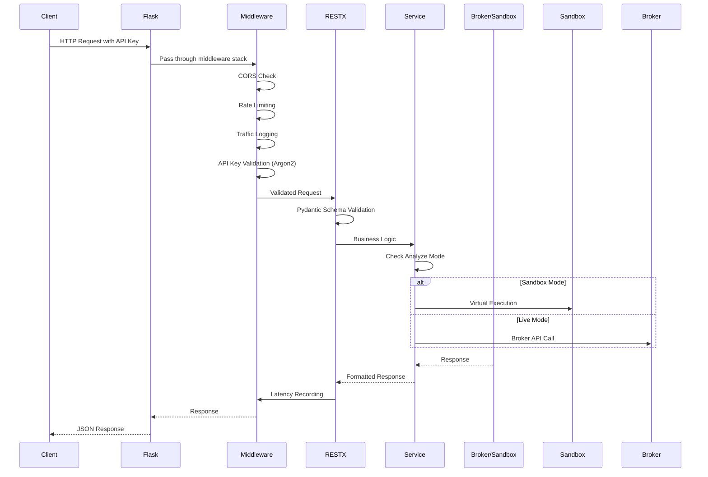

# OpenAlgo API Layer Architecture

## Executive Summary

The API layer serves as the primary programmatic interface for the OpenAlgo platform, providing 40+ RESTful endpoints for trading operations, market data access, portfolio management, options trading, and advanced analytics. Built with Flask-RESTX, it offers automatic OpenAPI/Swagger documentation, Pydantic validation, and standardized responses across 26+ broker integrations.

**Base URL:** `/api/v1`
**Total Endpoints:** 40+ organized in namespaced categories
**Authentication:** API Key-based with Argon2 hashing
**Documentation:** Auto-generated Swagger UI at `/api/v1/docs`

## Technology Stack

| Component | Technology | Version | Purpose |
|-----------|------------|---------|---------|
| Web Framework | Flask | 3.0.3 | Core application framework |
| API Framework | Flask-RESTX | 1.3.0 | RESTful API with Swagger |
| Rate Limiting | Flask-Limiter | 3.7.0 | Moving-window rate limiting |
| CORS | Flask-CORS | 6.0.0 | Cross-Origin Resource Sharing |
| HTTP Client | httpx | 0.28.1 | Connection pooling |
| Validation | Pydantic | - | Request/response schemas |

## API Architecture

### Request Flow



## Authentication

### API Key Authentication

All API endpoints require authentication via the `apikey` parameter in the request body or `X-API-KEY` header.

```python
# Authentication methods (in order of preference)
1. JSON Body: {"apikey": "your_api_key", ...}
2. Query Parameter: ?apikey=your_api_key
3. Header: X-API-KEY: your_api_key
```

### Authentication Flow

```python
def verify_api_key(api_key: str) -> Optional[str]:
    """Verify API key using Argon2 with intelligent caching"""

    # Step 1: Check invalid cache (5-minute TTL - prevents brute force)
    if api_key in invalid_cache:
        return None

    # Step 2: Check valid cache (10-hour TTL - performance)
    cache_key = sha256(api_key)
    if cache_key in valid_cache:
        return valid_cache[cache_key]

    # Step 3: Query database and verify with Argon2 + pepper
    api_key_record = get_api_key_record(api_key)
    if api_key_record and verify_argon2_hash(api_key, api_key_record.hash):
        valid_cache[cache_key] = api_key_record.user_id
        return api_key_record.user_id

    # Step 4: Cache invalid key
    invalid_cache[api_key] = True
    return None
```

### Security Features

- **Argon2 Hashing:** Password-grade security for API keys with pepper
- **Valid Key Cache:** 10-hour TTL using SHA256 hash as key
- **Invalid Key Cache:** 5-minute TTL to prevent brute force attacks
- **Cache Invalidation:** Automatic on key regeneration

## Rate Limiting

### Configurable Limits (Environment Variables)

| Endpoint Category | Default Limit | Environment Variable |
|-------------------|---------------|---------------------|
| Order Placement | 10/second | `ORDER_RATE_LIMIT` |
| Smart Orders | 2/second | `SMART_ORDER_RATE_LIMIT` |
| General API | 10/second | `API_RATE_LIMIT` |
| Option Greeks | 30/minute | `GREEKS_RATE_LIMIT` |
| Telegram Operations | 30/minute | `TELEGRAM_RATE_LIMIT` |
| Margin Calculator | 50/second | Special (higher limit) |

### Rate Limiter Configuration

```python
limiter = Limiter(
    key_func=get_remote_address,
    storage_uri="memory://",
    strategy="moving-window"
)
```

## API Endpoints - Complete Reference

### 1. Order Management APIs

#### Place Regular Order

```
POST /api/v1/placeorder
```

**Request Body:**
```json
{
    "apikey": "your_api_key",
    "strategy": "strategy_name",
    "exchange": "NSE",
    "symbol": "RELIANCE",
    "action": "BUY",
    "quantity": 1,
    "pricetype": "MARKET",
    "product": "MIS",
    "price": 0.0,
    "trigger_price": 0.0,
    "disclosed_quantity": 0
}
```

**Parameters:**

| Field | Type | Required | Values |
|-------|------|----------|--------|
| apikey | string | Yes | Your API key |
| strategy | string | No | Strategy identifier |
| exchange | string | Yes | NSE, BSE, NFO, BFO, CDS, BCD, MCX |
| symbol | string | Yes | Trading symbol |
| action | string | Yes | BUY, SELL |
| quantity | int | Yes | Number of shares/lots |
| pricetype | string | Yes | MARKET, LIMIT, SL, SL-M |
| product | string | Yes | MIS, CNC, NRML |
| price | float | No | Limit price (for LIMIT/SL) |
| trigger_price | float | No | Trigger price (for SL/SL-M) |
| disclosed_quantity | int | No | Disclosed quantity |

**Response:**
```json
{
    "status": "success",
    "orderid": "250115000012345",
    "message": "Order placed successfully"
}
```

---

#### Place Smart Order

```
POST /api/v1/placesmartorder
```

**Additional Field:**
| Field | Type | Description |
|-------|------|-------------|
| position_size | int | Total position size to maintain |

Smart orders automatically calculate quantity based on current position.

---

#### Modify Order

```
POST /api/v1/modifyorder
```

**Request Body:**
```json
{
    "apikey": "your_api_key",
    "strategy": "strategy_name",
    "exchange": "NSE",
    "symbol": "RELIANCE",
    "orderid": "order_id",
    "action": "BUY",
    "product": "MIS",
    "pricetype": "LIMIT",
    "price": 2500.0,
    "quantity": 5,
    "disclosed_quantity": 0,
    "trigger_price": 0.0
}
```

---

#### Cancel Order

```
POST /api/v1/cancelorder
```

**Request Body:**
```json
{
    "apikey": "your_api_key",
    "strategy": "strategy_name",
    "orderid": "order_id_to_cancel"
}
```

---

#### Cancel All Orders

```
POST /api/v1/cancelallorder
```

Cancels all pending orders for the authenticated account.

---

#### Close All Positions

```
POST /api/v1/closeposition
```

Closes all open positions by placing opposite market orders.

---

#### Basket Order (Batch Placement)

```
POST /api/v1/basketorder
```

**Request Body:**
```json
{
    "apikey": "your_api_key",
    "strategy": "strategy_name",
    "orders": [
        {
            "exchange": "NSE",
            "symbol": "RELIANCE",
            "action": "BUY",
            "quantity": 1,
            "pricetype": "MARKET",
            "product": "MIS",
            "price": 0.0,
            "trigger_price": 0.0,
            "disclosed_quantity": 0
        },
        {
            "exchange": "NSE",
            "symbol": "TCS",
            "action": "SELL",
            "quantity": 1,
            "pricetype": "MARKET",
            "product": "MIS",
            "price": 0.0,
            "trigger_price": 0.0,
            "disclosed_quantity": 0
        }
    ]
}
```

---

#### Split Order

```
POST /api/v1/splitorder
```

Auto-splits large orders into smaller chunks.

**Additional Fields:**
| Field | Type | Description |
|-------|------|-------------|
| quantity | int | Total quantity to split |
| splitsize | int | Size of each split order |

---

### 2. Options Trading APIs

#### Option Chain

```
POST /api/v1/optionchain
```

**Request Body:**
```json
{
    "apikey": "your_api_key",
    "underlying": "NIFTY",
    "exchange": "NSE_INDEX",
    "expiry_date": "30DEC25",
    "strike_count": 10
}
```

**Response:**
```json
{
    "status": "success",
    "underlying": "NIFTY",
    "underlying_ltp": 24250.50,
    "expiry_date": "30DEC25",
    "atm_strike": 24250.0,
    "chain": [
        {
            "strike": 24000.0,
            "ce": {
                "symbol": "NIFTY30DEC2524000CE",
                "label": "ITM5",
                "ltp": 320.50,
                "bid": 320.0,
                "ask": 321.0,
                "volume": 1000,
                "oi": 50000
            },
            "pe": {
                "symbol": "NIFTY30DEC2524000PE",
                "label": "OTM5",
                "ltp": 85.25,
                "bid": 85.0,
                "ask": 85.50,
                "volume": 800,
                "oi": 45000
            }
        }
    ]
}
```

---

#### Option Symbol Resolution

```
POST /api/v1/optionsymbol
```

Resolves option symbol from human-readable parameters using offset notation.

**Request Body:**
```json
{
    "apikey": "your_api_key",
    "underlying": "NIFTY",
    "exchange": "NSE_INDEX",
    "expiry_date": "28OCT25",
    "strike_int": 50,
    "offset": "ITM2",
    "option_type": "CE"
}
```

**Offset Values:** ATM, ITM1-ITM50, OTM1-OTM50

**Response:**
```json
{
    "status": "success",
    "symbol": "NIFTY28OCT2523500CE",
    "exchange": "NFO",
    "lotsize": 25,
    "tick_size": 0.05,
    "underlying_ltp": 23587.50
}
```

---

#### Place Options Order

```
POST /api/v1/optionsorder
```

Places option order by resolving symbol from offset parameters.

**Request Body:**
```json
{
    "apikey": "your_api_key",
    "strategy": "strategy_name",
    "underlying": "NIFTY",
    "exchange": "NSE_INDEX",
    "expiry_date": "28NOV24",
    "strike_int": 50,
    "offset": "ITM2",
    "option_type": "CE",
    "action": "BUY",
    "quantity": 75,
    "pricetype": "MARKET",
    "product": "MIS",
    "price": 0.0,
    "trigger_price": 0.0,
    "disclosed_quantity": 0
}
```

---

#### Options Multi-Order (Strategy Legs)

```
POST /api/v1/optionsmultiorder
```

Places multiple option legs with common underlying. BUY legs execute first, then SELL legs for margin efficiency.

**Use Cases:** Iron Condor, Bull Call Spread, Straddle, Strangle, etc.

**Request Body:**
```json
{
    "apikey": "your_api_key",
    "strategy": "Iron Condor",
    "underlying": "NIFTY",
    "exchange": "NSE_INDEX",
    "expiry_date": "28NOV24",
    "legs": [
        {
            "offset": "OTM10",
            "option_type": "CE",
            "action": "BUY",
            "quantity": 75,
            "pricetype": "MARKET",
            "product": "MIS"
        },
        {
            "offset": "OTM5",
            "option_type": "CE",
            "action": "SELL",
            "quantity": 75,
            "pricetype": "MARKET",
            "product": "MIS"
        }
    ]
}
```

---

#### Option Greeks Calculator

```
POST /api/v1/optiongreeks
```

Calculates Option Greeks (Delta, Gamma, Theta, Vega, Rho) and Implied Volatility using Black-76 model.

**Request Body:**
```json
{
    "apikey": "your_api_key",
    "symbol": "NIFTY02DEC2524000CE",
    "exchange": "NFO",
    "interest_rate": 7.0,
    "forward_price": 24550.75,
    "underlying_symbol": "NIFTY",
    "underlying_exchange": "NSE_INDEX",
    "expiry_time": "15:30"
}
```

**Response:**
```json
{
    "status": "success",
    "symbol": "NIFTY02DEC2524000CE",
    "exchange": "NFO",
    "underlying": "NIFTY",
    "strike": 24000,
    "option_type": "CE",
    "expiry_date": "02-Dec-2025",
    "days_to_expiry": 30.5,
    "forward_price": 24550.75,
    "option_price": 296.05,
    "interest_rate": 7.0,
    "implied_volatility": 15.25,
    "greeks": {
        "delta": 0.5234,
        "gamma": 0.000125,
        "theta": -4.9678,
        "vega": 30.7654,
        "rho": 0.001234
    }
}
```

**Supported Exchanges:** NFO, BFO, CDS, MCX

---

#### Synthetic Future Calculator

```
POST /api/v1/syntheticfuture
```

Calculates synthetic future price using ATM Call and Put options.

**Formula:** Synthetic Future = ATM Call LTP - ATM Put LTP + Strike Price

**Request Body:**
```json
{
    "apikey": "your_api_key",
    "underlying": "NIFTY",
    "exchange": "NSE_INDEX",
    "expiry_date": "28OCT25"
}
```

**Response:**
```json
{
    "status": "success",
    "underlying": "NIFTY",
    "underlying_ltp": 25966.05,
    "expiry": "28OCT25",
    "atm_strike": 26000,
    "synthetic_future_price": 26015.25
}
```

**Note:** This is calculation only - does NOT place any orders.

---

### 3. Market Data APIs

#### Single Symbol Quotes

```
POST /api/v1/quotes
```

**Request Body:**
```json
{
    "apikey": "your_api_key",
    "symbol": "RELIANCE",
    "exchange": "NSE"
}
```

**Response:**
```json
{
    "status": "success",
    "data": {
        "ltp": 2500.50,
        "bid": 2500.25,
        "ask": 2500.75,
        "high": 2510.00,
        "low": 2490.00,
        "open": 2495.00,
        "close": 2505.00,
        "volume": 1000000,
        "oi": 0,
        "timestamp": "2025-12-01T14:30:00Z"
    }
}
```

---

#### Multi-Symbol Quotes (Batch)

```
POST /api/v1/multiquotes
```

**Request Body:**
```json
{
    "apikey": "your_api_key",
    "symbols": [
        {"symbol": "RELIANCE", "exchange": "NSE"},
        {"symbol": "TCS", "exchange": "NSE"},
        {"symbol": "INFY", "exchange": "NSE"}
    ]
}
```

---

#### Market Depth

```
POST /api/v1/depth
```

Returns order book depth (bid/ask levels) for a symbol.

**Response:**
```json
{
    "status": "success",
    "symbol": "RELIANCE",
    "exchange": "NSE",
    "bid": [
        {"price": 2500.25, "quantity": 100},
        {"price": 2500.00, "quantity": 200}
    ],
    "ask": [
        {"price": 2500.75, "quantity": 100},
        {"price": 2501.00, "quantity": 200}
    ]
}
```

---

#### Historical Data (OHLCV)

```
POST /api/v1/history
```

**Request Body:**
```json
{
    "apikey": "your_api_key",
    "symbol": "RELIANCE",
    "exchange": "NSE",
    "interval": "5m",
    "start_date": "2025-11-01",
    "end_date": "2025-12-01"
}
```

**Supported Intervals:**

| Type | Intervals |
|------|-----------|
| Seconds | 1s, 5s, 10s, 15s, 30s, 45s |
| Minutes | 1m, 2m, 3m, 5m, 10m, 15m, 20m, 30m |
| Hours | 1h, 2h, 3h, 4h |
| Daily+ | D, W, M |

**Date Range Restrictions:**
- D, W, M intervals: Maximum 10 years
- Intraday intervals: Maximum 30 days

---

### 4. Portfolio APIs

#### Order Book

```
POST /api/v1/orderbook
```

Returns all orders (pending, executed, rejected, cancelled).

**Response:**
```json
{
    "status": "success",
    "data": [
        {
            "orderid": "order_123",
            "symbol": "RELIANCE",
            "exchange": "NSE",
            "action": "BUY",
            "quantity": 100,
            "filledqty": 100,
            "price": 0,
            "pricetype": "MARKET",
            "product": "MIS",
            "status": "COMPLETE",
            "average_price": 2450.50,
            "order_time": "2025-11-25 10:30:45"
        }
    ]
}
```

---

#### Trade Book

```
POST /api/v1/tradebook
```

Returns all executed trades/fills.

---

#### Position Book

```
POST /api/v1/positionbook
```

Returns current open positions.

**Response:**
```json
{
    "status": "success",
    "data": [
        {
            "symbol": "RELIANCE",
            "exchange": "NSE",
            "product": "MIS",
            "quantity": 5,
            "buyqty": 10,
            "sellqty": 5,
            "buyprice": 2495.00,
            "sellprice": 2505.00,
            "avgprice": 2500.00,
            "pnl": 25.00,
            "pnlpercent": 0.50
        }
    ]
}
```

---

#### Holdings

```
POST /api/v1/holdings
```

Returns long-term holdings (CNC/Delivery positions).

---

#### Account Funds

```
POST /api/v1/funds
```

Returns account balance, available margin, and fund details.

**Response:**
```json
{
    "status": "success",
    "data": {
        "availablecash": "100000.00",
        "collateral": "50000.00",
        "m2munrealized": "10000.00",
        "m2mrealized": "5000.00",
        "utiliseddebits": "25000.00"
    }
}
```

---

#### Order Status

```
POST /api/v1/orderstatus
```

Returns detailed status of a specific order.

---

#### Open Position Quantity

```
POST /api/v1/openposition
```

Returns quantity of an open position for a specific symbol.

---

### 5. Reference Data APIs

#### Symbol Search

```
POST /api/v1/search
```

Search for symbols by name, partial symbol, or ISIN.

---

#### Symbol Information

```
POST /api/v1/symbol
```

Get detailed information about a symbol.

---

#### Supported Intervals

```
POST /api/v1/intervals
```

Returns supported time intervals for historical data.

---

#### Expiry Dates

```
POST /api/v1/expiry
```

Returns available expiry dates for F&O instruments.

**Request Body:**
```json
{
    "apikey": "your_api_key",
    "symbol": "NIFTY",
    "exchange": "NFO",
    "instrumenttype": "futures"
}
```

**Supported Exchanges:** NFO, BFO, MCX, CDS

---

#### Download Instruments

```
GET /api/v1/instruments?apikey=your_key&exchange=NSE&format=csv
```

Downloads all instruments/symbols from the database.

**Query Parameters:**
| Parameter | Required | Description |
|-----------|----------|-------------|
| apikey | Yes | API key |
| exchange | No | Filter by exchange |
| format | No | json (default) or csv |

---

### 6. Margin Calculator

```
POST /api/v1/margin
```

Calculates margin requirement for a basket of positions.

**Rate Limit:** 50/second (higher than other endpoints)

**Request Body:**
```json
{
    "apikey": "your_api_key",
    "positions": [
        {
            "symbol": "NIFTY25DEC2525000CE",
            "exchange": "NFO",
            "action": "BUY",
            "quantity": 75,
            "price": 250.50
        },
        {
            "symbol": "NIFTY25DEC2525000PE",
            "exchange": "NFO",
            "action": "SELL",
            "quantity": 75,
            "price": 248.75
        }
    ]
}
```

**Note:** Calculation only - does NOT place orders.

---

### 7. Analyzer Mode API

#### Toggle Analyzer Mode

```
POST /api/v1/analyzer
```

Enable/disable sandbox (paper trading) mode.

**Request Body:**
```json
{
    "apikey": "your_api_key",
    "action": "enable"
}
```

When sandbox mode is enabled:
- Orders execute against virtual Rs 1 Crore capital
- Real market data (LTP) used for execution pricing
- No actual broker orders placed
- Complete isolation in separate database
- Orderid format: `SB-xxxxx`

---

### 8. Telegram Bot API

#### Configure Bot

```
POST /api/v1/telegram/config
```

Configure Telegram bot settings.

---

#### Send Broadcast

```
POST /api/v1/telegram/broadcast
```

Send message to all connected Telegram users.

---

#### Send Notification

```
POST /api/v1/telegram/notify
```

Send notification to specific user.

---

#### Update Preferences

```
POST /api/v1/telegram/preferences
```

Update user notification preferences.

---

### 9. Health Check

#### Ping

```
POST /api/v1/ping
```

Verify API connectivity and API key validity.

**Response:**
```json
{
    "status": "success",
    "message": "API key is valid",
    "user_id": "user_123",
    "broker": "your_broker",
    "timestamp": "2025-12-01T14:30:00Z"
}
```

---

## Response Format Standards

### Success Response

```json
{
    "status": "success",
    "data": {...},
    "message": "Optional message"
}
```

### Error Response

```json
{
    "status": "error",
    "message": "Error description",
    "error_code": "INVALID_ORDER",
    "details": {
        "field": "quantity",
        "reason": "Must be positive integer"
    }
}
```

### Error Codes

| Code | HTTP Status | Description |
|------|-------------|-------------|
| `INVALID_API_KEY` | 401 | Invalid or expired API key |
| `RATE_LIMIT_EXCEEDED` | 429 | Too many requests |
| `INVALID_ORDER` | 400 | Order validation failed |
| `INSUFFICIENT_FUNDS` | 400 | Not enough margin/funds |
| `BROKER_ERROR` | 500 | Broker API returned error |
| `SYMBOL_NOT_FOUND` | 404 | Invalid trading symbol |
| `MARKET_CLOSED` | 400 | Market is not open |
| `ORDER_NOT_FOUND` | 404 | Order ID not found |
| `VALIDATION_ERROR` | 400 | Request validation failed |

### HTTP Status Codes

| Code | Description |
|------|-------------|
| 200 | Success |
| 400 | Bad Request (validation error) |
| 401 | Unauthorized (invalid API key) |
| 403 | Forbidden (permission denied) |
| 404 | Not Found |
| 429 | Too Many Requests (rate limited) |
| 500 | Internal Server Error |

## Order Modes

### Auto Mode (Default)

Orders are executed immediately when placed via API.

### Semi-Auto Mode (Action Center)

Orders are queued for manual approval before execution:

1. Order placed via API
2. Order stored in `pending_orders` table
3. User reviews in Action Center UI
4. User approves or rejects
5. Approved orders sent to broker

```python
api_key_record = get_api_key_record(api_key)
if api_key_record.order_mode == 'semi_auto':
    create_pending_order(order_data)  # Queue for approval
else:
    execute_order(order_data)  # Execute immediately
```

## Performance Optimization

### Connection Pooling

```python
http_client = httpx.Client(
    limits=httpx.Limits(
        max_connections=100,
        max_keepalive_connections=20
    ),
    timeout=30.0
)
```

### Response Caching

| Data Type | Cache Duration |
|-----------|----------------|
| Quote data | 1-second (frequently accessed) |
| Instrument list | 24-hour |
| API key validation | 10-hour (valid), 5-minute (invalid) |

### Batch Processing

| Operation | Batch Size |
|-----------|------------|
| Basket orders | Up to 10 orders per request |
| Multi-quotes | Up to 50 symbols per request |
| Split orders | Configurable with delay between splits |

## Monitoring & Analytics

### Traffic Logging

All API requests logged to `logs.db`:
- Endpoint, method, status code
- Request/response size
- User ID and API key (hashed)
- Timestamp and processing time

### Latency Tracking

Order-related endpoints track RTT to `latency.db`:
- Request sent timestamp
- Order acknowledged timestamp
- Round-trip time (ms)
- Broker and API type

## Swagger Documentation

Flask-RESTX automatically generates interactive Swagger UI:

- **Development:** `http://localhost:5000/api/v1/docs`
- **Production:** `https://yourdomain.com/api/v1/docs`

### Features

- Interactive API testing
- Request/response schema documentation
- Authentication testing with API key
- Code generation support
- Try-it-out functionality

## Best Practices

### For API Consumers

1. **Respect rate limits** - Implement client-side throttling
2. **Cache static data** - Instruments/symbols don't change frequently
3. **Handle errors gracefully** - Implement retry logic with exponential backoff
4. **Use batch endpoints** - Prefer multi-quote over multiple single quotes
5. **Monitor order status** - Poll orderbook for status updates
6. **Use webhooks** - For strategy automation via TradingView/ChartInk

### For Integration

1. **Start with sandbox mode** - Test strategies without risking capital
2. **Use appropriate product types** - MIS for intraday, CNC for delivery
3. **Handle market hours** - Check market status before placing orders
4. **Implement position checks** - Verify positions before closing
5. **Log all API calls** - For debugging and audit trail
