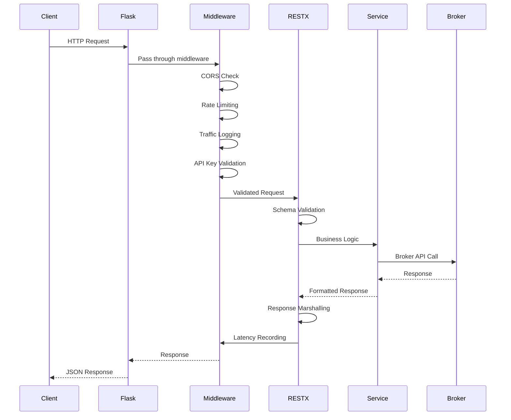

# OpenAlgo API Layer Architecture

## Executive Summary

The API layer serves as the primary programmatic interface for the OpenAlgo platform, providing comprehensive RESTful endpoints for trading operations, market data access, portfolio management, and advanced analytics. Built with Flask-RESTX, it offers automatic API documentation, robust validation, and standardized responses across 27 broker integrations.

## Core Architecture

### Technology Stack

*   **Flask 3.0.3**: Core web framework with extensive middleware support
*   **Flask-RESTX 1.3.0**: RESTful API framework with OpenAPI/Swagger generation
*   **Flask-Limiter 3.7.0**: Rate limiting and throttling
*   **Flask-CORS 6.0.0**: Cross-Origin Resource Sharing management
*   **HTTPx 0.28.1**: Modern async HTTP client with connection pooling

### API Organization

```python
# API Structure in restx_api/__init__.py
from flask_restx import Api, Namespace

api = Api(
    version='1.0',
    title='OpenAlgo Trading API',
    description='Unified trading API for 27 Indian brokers',
    doc='/api/v1/docs',
    prefix='/api/v1',
    authorizations={
        'apikey': {
            'type': 'apiKey',
            'in': 'header',
            'name': 'X-API-KEY'
        }
    }
)
```

## API Endpoints Overview

### Order Management Endpoints

| Endpoint | Method | Description |
|----------|--------|-------------|
| `/api/v1/placeorder` | POST | Place regular orders |
| `/api/v1/placesmartorder` | POST | Place smart orders with position sizing |
| `/api/v1/modifyorder` | PUT | Modify existing orders |
| `/api/v1/cancelorder` | DELETE | Cancel individual orders |
| `/api/v1/cancelallorder` | DELETE | Cancel all open orders |
| `/api/v1/closeposition` | POST | Close open positions |
| `/api/v1/basketorder` | POST | Batch order placement |
| `/api/v1/splitorder` | POST | Auto-split large orders |

### Options Trading Endpoints

| Endpoint | Method | Description |
|----------|--------|-------------|
| `/api/v1/optionsorder` | POST | Single option order |
| `/api/v1/optionsmultiorder` | POST | Multi-leg option orders (spreads) |
| `/api/v1/optionsymbol` | GET | Get option contract symbols |
| `/api/v1/optiongreeks` | GET | Calculate option Greeks |

### Portfolio Management Endpoints

| Endpoint | Method | Description |
|----------|--------|-------------|
| `/api/v1/orderbook` | GET | Get all orders |
| `/api/v1/tradebook` | GET | Get all executed trades |
| `/api/v1/positionbook` | GET | Get open positions |
| `/api/v1/holdings` | GET | Get portfolio holdings |
| `/api/v1/funds` | GET | Get account funds |
| `/api/v1/margin` | GET | Get margin details |

### Market Data Endpoints

| Endpoint | Method | Description |
|----------|--------|-------------|
| `/api/v1/quotes` | GET | Get real-time quotes (single symbol) |
| `/api/v1/multiquotes` | GET | Get quotes for multiple symbols |
| `/api/v1/depth` | GET | Get market depth (Level 5) |
| `/api/v1/history` | GET | Get historical OHLCV data |
| `/api/v1/intervals` | GET | Get available data intervals |
| `/api/v1/search` | GET | Symbol search |
| `/api/v1/symbol` | GET | Get symbol details |
| `/api/v1/expiry` | GET | Get option expiry dates |
| `/api/v1/instruments` | GET | Get all tradable instruments |

### Utility & Analytics Endpoints

| Endpoint | Method | Description |
|----------|--------|-------------|
| `/api/v1/analyzer` | POST | Toggle sandbox/analyzer mode |
| `/api/v1/ping` | GET | Health check endpoint |
| `/api/v1/syntheticfuture` | POST | Create synthetic futures |

## Request/Response Schemas

### Order Placement Schema

```python
# restx_api/schemas.py
class PlaceOrderSchema:
    """Schema for order placement"""
    symbol: str          # Trading symbol (e.g., "RELIANCE")
    exchange: str        # Exchange (NSE, BSE, NFO, CDS, BFO, BCD, MCX, NCDEX)
    action: str          # BUY or SELL
    quantity: int        # Number of shares/lots
    price_type: str      # MARKET, LIMIT, SL, SL-M
    product: str         # MIS, CNC, NRML
    price: float         # Limit price (for LIMIT/SL orders)
    trigger_price: float # Trigger price (for SL/SL-M orders)
    disclosed_quantity: int  # Optional disclosed quantity
```

### Smart Order Schema

```python
class SmartOrderSchema:
    """Schema for smart order with position sizing"""
    symbol: str
    exchange: str
    action: str
    position_size: str   # "10%" or "50000" (percentage or absolute value)
    price_type: str
    product: str
    price: float
    trigger_price: float
```

### Options Order Schema

```python
class OptionsOrderSchema:
    """Schema for single option order"""
    symbol: str          # Underlying symbol
    exchange: str        # NFO, BFO
    action: str          # BUY or SELL
    strike: float        # Strike price
    option_type: str     # CE (Call) or PE (Put)
    expiry: str          # Expiry date (YYYY-MM-DD)
    quantity: int        # Number of lots
    price_type: str
    product: str
    price: float
```

### Options Multi-Order Schema

```python
class OptionsMultiOrderSchema:
    """Schema for multi-leg option orders"""
    orders: List[OptionsOrderSchema]  # List of option orders
    # Useful for spreads, straddles, strangles, etc.
```

### Basket Order Schema

```python
class BasketOrderSchema:
    """Schema for batch order placement"""
    orders: List[PlaceOrderSchema]  # List of orders to execute
```

### Split Order Schema

```python
class SplitOrderSchema:
    """Schema for auto-splitting large orders"""
    symbol: str
    exchange: str
    action: str
    quantity: int
    split_quantity: int  # Size of each split
    price_type: str
    product: str
    price: float
    trigger_price: float
```

## Request Flow



## Request Handling

1.  An HTTP request arrives at the server (Gunicorn/Waitress).
2.  Flask routes the request based on the URL path and HTTP method to the corresponding Blueprint route or RESTX Resource method.
3.  **Middleware Layers:**
    *   **CORS:** `Flask-CORS` handles Cross-Origin Resource Sharing headers.
    *   **Rate Limiting:** `Flask-Limiter` enforces rate limits based on configured strategies.
    *   **Traffic Logging:** Custom middleware logs request/response details (`utils/traffic_logger.py`).
    *   **Latency Monitoring:** Custom middleware measures request processing time (`utils/latency_monitor.py`).
    *   **Authentication:** API key validation via `X-API-KEY` header.
4.  **Data Validation:**
    *   **Flask-RESTX:** Uses `@api.expect()` decorators with defined models for request validation.
    *   **Schema Validation:** Comprehensive schemas in `restx_api/schemas.py`.
5.  **Business Logic:** Request passed to appropriate service layer for processing.
6.  **Response Generation:**
    *   **Flask-RESTX:** Uses `@api.marshal_with()` decorators for response serialization.
    *   Standardized JSON response format across all endpoints.
7.  Response sent back to the client.

## Authentication

### API Key Authentication

```python
# API Key validation header
X-API-KEY: your_api_key_here
```

All API endpoints require authentication via the `X-API-KEY` header. The key is validated against the database using:
- **Argon2 hash verification** for security
- **10-hour TTL cache** for performance
- **Order mode check** (auto/semi_auto) for action center integration

### Authentication Flow

```python
def verify_api_key(api_key: str) -> Optional[str]:
    """Verify API key and return user_id"""
    # Check cache first (10-hour TTL)
    if api_key in cache:
        return cache[api_key]

    # Query database
    api_key_record = get_api_key_record(api_key)
    if not api_key_record:
        return None

    # Verify hash with pepper
    if verify_argon2_hash(api_key, api_key_record.hash):
        cache[api_key] = api_key_record.user_id
        return api_key_record.user_id

    return None
```

## Rate Limiting

### Default Limits

```python
# Rate limiting configuration
RATE_LIMITS = {
    'default': '200 per day, 50 per hour',
    'orders': '10 per second',
    'smart_orders': '2 per second',
    'quotes': '50 per second',
    'historical': '3 per second',
}
```

### Per-Endpoint Limits

| Endpoint Category | Rate Limit |
|------------------|------------|
| Order Placement | 10/second |
| Smart Orders | 2/second |
| Market Data | 50/second |
| Historical Data | 3/second |
| Portfolio Queries | 50/second |

## Error Handling

### Standard Error Response

```json
{
    "status": "error",
    "error_code": "INVALID_ORDER",
    "message": "Insufficient funds for order placement",
    "details": {
        "required_margin": 50000,
        "available_margin": 25000
    }
}
```

### Error Codes

| Code | Description |
|------|-------------|
| `INVALID_API_KEY` | Invalid or expired API key |
| `RATE_LIMIT_EXCEEDED` | Too many requests |
| `INVALID_ORDER` | Order validation failed |
| `INSUFFICIENT_FUNDS` | Not enough margin/funds |
| `BROKER_ERROR` | Broker API returned error |
| `SYMBOL_NOT_FOUND` | Invalid trading symbol |
| `MARKET_CLOSED` | Market is not open |
| `ORDER_NOT_FOUND` | Order ID not found |

### HTTP Status Codes

| Code | Description |
|------|-------------|
| 200 | Success |
| 400 | Bad Request (validation error) |
| 401 | Unauthorized (invalid API key) |
| 403 | Forbidden (permission denied) |
| 404 | Not Found |
| 429 | Too Many Requests (rate limited) |
| 500 | Internal Server Error |

## API Documentation

### Swagger UI

Flask-RESTX automatically generates interactive **Swagger UI** documentation accessible at:
- **Development:** `http://localhost:5000/api/v1/docs`
- **Production:** `https://yourdomain.com/api/v1/docs`

### Features
- Interactive API testing
- Request/response schema documentation
- Authentication testing
- Code generation support

## Sample API Calls

### Place Order

```bash
curl -X POST "http://localhost:5000/api/v1/placeorder" \
  -H "X-API-KEY: your_api_key" \
  -H "Content-Type: application/json" \
  -d '{
    "symbol": "RELIANCE",
    "exchange": "NSE",
    "action": "BUY",
    "quantity": 100,
    "price_type": "MARKET",
    "product": "MIS"
  }'
```

### Place Smart Order

```bash
curl -X POST "http://localhost:5000/api/v1/placesmartorder" \
  -H "X-API-KEY: your_api_key" \
  -H "Content-Type: application/json" \
  -d '{
    "symbol": "RELIANCE",
    "exchange": "NSE",
    "action": "BUY",
    "position_size": "10%",
    "price_type": "MARKET",
    "product": "MIS"
  }'
```

### Place Options Order

```bash
curl -X POST "http://localhost:5000/api/v1/optionsorder" \
  -H "X-API-KEY: your_api_key" \
  -H "Content-Type: application/json" \
  -d '{
    "symbol": "NIFTY",
    "exchange": "NFO",
    "action": "BUY",
    "strike": 19500,
    "option_type": "CE",
    "expiry": "2025-11-28",
    "quantity": 1,
    "price_type": "MARKET",
    "product": "MIS"
  }'
```

### Get Multi-Quotes

```bash
curl -X GET "http://localhost:5000/api/v1/multiquotes" \
  -H "X-API-KEY: your_api_key" \
  -H "Content-Type: application/json" \
  -d '{
    "symbols": ["RELIANCE", "TCS", "INFY"],
    "exchange": "NSE"
  }'
```

### Get Market Depth

```bash
curl -X GET "http://localhost:5000/api/v1/depth?symbol=RELIANCE&exchange=NSE" \
  -H "X-API-KEY: your_api_key"
```

### Get Historical Data

```bash
curl -X GET "http://localhost:5000/api/v1/history?symbol=RELIANCE&exchange=NSE&interval=5minute&start_date=2025-11-01&end_date=2025-11-25" \
  -H "X-API-KEY: your_api_key"
```

## Order Mode: Auto vs Semi-Auto

### Auto Mode
Orders are executed immediately when placed via API.

### Semi-Auto Mode (Action Center)
Orders are queued for manual approval before execution:
1. Order placed via API
2. Order stored in `pending_orders` table
3. User reviews in Action Center UI
4. User approves or rejects
5. Approved orders sent to broker

```python
# Check order mode
api_key_record = get_api_key_record(api_key)
if api_key_record.order_mode == 'semi_auto':
    # Queue for approval
    create_pending_order(order_data)
else:
    # Execute immediately
    execute_order(order_data)
```

## Sandbox/Analyzer Mode

### Enable Sandbox Mode

```bash
curl -X POST "http://localhost:5000/api/v1/analyzer" \
  -H "X-API-KEY: your_api_key" \
  -H "Content-Type: application/json" \
  -d '{"mode": true}'
```

When sandbox mode is enabled:
- Orders execute against virtual Rs 1 Crore capital
- Real market data (LTP) used for execution
- No actual broker orders placed
- Complete isolation in separate database

## Response Formats

### Success Response

```json
{
    "status": "success",
    "data": {
        "orderid": "250115000012345",
        "message": "Order placed successfully"
    }
}
```

### Order Book Response

```json
{
    "status": "success",
    "data": [
        {
            "orderid": "250115000012345",
            "symbol": "RELIANCE",
            "exchange": "NSE",
            "action": "BUY",
            "quantity": 100,
            "price": 0,
            "price_type": "MARKET",
            "product": "MIS",
            "status": "COMPLETE",
            "filled_quantity": 100,
            "average_price": 2450.50,
            "order_time": "2025-11-25 10:30:45"
        }
    ]
}
```

### Position Book Response

```json
{
    "status": "success",
    "data": [
        {
            "symbol": "RELIANCE",
            "exchange": "NSE",
            "product": "MIS",
            "quantity": 100,
            "average_price": 2450.50,
            "ltp": 2465.00,
            "pnl": 1450.00,
            "pnl_percent": 0.59
        }
    ]
}
```

## Performance Optimization

### Connection Pooling

```python
# HTTPx client configuration
http_client = httpx.Client(
    limits=httpx.Limits(
        max_connections=100,
        max_keepalive_connections=20
    ),
    timeout=30.0
)
```

### Response Caching

- **Quote data:** 1-second cache for frequently accessed symbols
- **Instrument list:** 24-hour cache
- **API key validation:** 10-hour TTL cache

### Batch Processing

- **Basket orders:** Up to 10 orders per request
- **Multi-quotes:** Up to 50 symbols per request
- **Split orders:** Automatic chunking with configurable delay

## Monitoring & Analytics

### Traffic Logging

All API requests are logged to `logs.db` with:
- Endpoint, method, status code
- Request/response size
- User ID and API key (hashed)
- Timestamp and processing time

### Latency Tracking

Order-related endpoints track RTT to `latency.db`:
- Request sent timestamp
- Order acknowledged timestamp
- Round-trip time (ms)
- Broker and API type

## Best Practices

### For API Consumers

1. **Use appropriate rate limiting** - Don't exceed rate limits
2. **Cache static data** - Instruments, symbols don't change frequently
3. **Handle errors gracefully** - Implement retry logic with backoff
4. **Use batch endpoints** - Prefer multi-quote over multiple single quotes
5. **Monitor order status** - Poll orderbook for status updates

### For Developers

1. **Validate inputs** - Always validate before processing
2. **Log sensitive data carefully** - Use redaction patterns
3. **Handle broker errors** - Map broker errors to standard codes
4. **Use connection pooling** - Reuse HTTP connections
5. **Implement circuit breakers** - For failing broker connections

## Future Enhancements

### Planned Features
1. **WebSocket API** - Real-time order and position updates
2. **GraphQL Support** - Flexible data querying
3. **Webhook Callbacks** - Push notifications for order updates
4. **API Versioning** - Support for multiple API versions
5. **Enhanced Analytics** - Detailed API usage metrics
