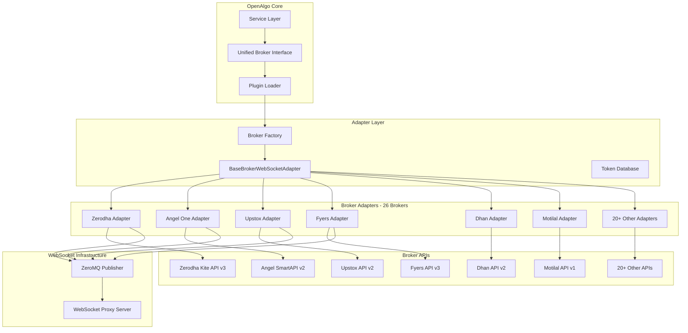

# OpenAlgo Broker Integration Layer

## Executive Summary

The broker integration layer is the cornerstone of OpenAlgo's broker-agnostic architecture, providing a unified interface to interact with 26 Indian stock brokers plus 1 sandbox environment. Through a sophisticated adapter pattern with dynamic plugin loading, it abstracts broker-specific APIs, authentication mechanisms, symbol formats, and WebSocket protocols into a consistent interface.

**Total Brokers:** 26 production brokers + 1 sandbox environment
**Architecture:** Plugin-based adapter pattern with factory registration
**WebSocket Support:** 15+ brokers with real-time streaming
**Symbol Database:** 100,000+ instruments across all exchanges

## Architecture Overview



## Supported Brokers - Complete List (26 + 1 Sandbox)

| # | Broker | Status | API Version | WebSocket | Auth Type | Notes |
|---|--------|--------|-------------|-----------|-----------|-------|
| 1 | **AliceBlue** | Active | ANT API | Yes | OAuth2 | Full streaming support |
| 2 | **Angel One** | Active | SmartAPI v2 | Yes | OAuth2 + TOTP | JWT + Feed token |
| 3 | **Compositedge** | Active | REST API | Yes | API Key | Symphony-based |
| 4 | **Definedge** | Active | Symphony API | Yes | API Key | Symbol mapping included |
| 5 | **Dhan** | Active | API v2 | Yes | API Key | Production environment |
| 6 | **Dhan Sandbox** | Active | Sandbox API | Yes | API Key | Paper trading/testing |
| 7 | **Firstock** | Active | REST API | Yes | API Key | Basic implementation |
| 8 | **5Paisa** | Active | OpenAPI | Yes | Session | Standard variant |
| 9 | **5Paisa XTS** | Active | XTS API | Yes | Session | Advanced variant |
| 10 | **Flattrade** | Active | NorenAPI | Yes | Hash-based | Quote streaming |
| 11 | **Fyers** | Active | API v3 | Yes | Hash-based | HSM + TBT WebSocket variants |
| 12 | **Groww** | Active | API v1 | Yes | OAuth2 | NATS-based streaming |
| 13 | **IBulls** | Active | REST API | No | Session | Basic implementation |
| 14 | **IIFL** | Active | API v3 | No | Session | Full-featured |
| 15 | **IndMoney** | Active | REST API | No | OAuth2 | Basic implementation |
| 16 | **Kotak Securities** | Active | Neo API | Yes | OAuth2 | Modern API platform |
| 17 | **Motilal Oswal** | Active | API v1 | Yes | API Key | LTP, Quotes, Depth L1 |
| 18 | **MStock** | Active | REST API | No | API Key | Basic implementation |
| 19 | **Paytm Money** | Active | REST API | Yes | OAuth2 | Public access token for WS |
| 20 | **Pocketful** | Active | REST API | No | API Key | Limited implementation |
| 21 | **Shoonya/Finvasia** | Active | NorenAPI | Yes | Hash-based | Dual-branded |
| 22 | **TradeJini** | Active | REST API | No | API Key | Basic implementation |
| 23 | **Upstox** | Active | API v2 | Yes | OAuth2 | High-performance, NSE filtering |
| 24 | **Wisdom Capital** | Active | REST API | No | API Key | Basic implementation |
| 25 | **Zebu** | Active | REST API | No | API Key | Basic implementation |
| 26 | **Zerodha** | Active | Kite API v3 | Yes | OAuth2 | Market leader, multi-quote |

### WebSocket Capabilities by Broker

| Broker | LTP | Quote | Depth | Max Depth Levels |
|--------|-----|-------|-------|-----------------|
| Angel One | Yes | Yes | Yes | 5 |
| Zerodha | Yes | Yes | Yes | 20 |
| Upstox | Yes | Yes | Yes | 20 |
| Fyers | Yes | Yes | Yes | 5 |
| Dhan | Yes | Yes | Yes | 20 |
| Motilal Oswal | Yes | Yes | Yes | L1 only |
| Shoonya | Yes | Yes | No | - |
| Flattrade | Yes | Yes | No | - |
| AliceBlue | Yes | Yes | No | - |
| Kotak | Yes | Yes | Yes | 5 |
| Compositedge | Yes | Yes | No | - |

## Broker Adapter Structure

### Standard Directory Layout

```
broker/{broker_name}/
├── __init__.py                      # Broker module initialization
├── api/
│   ├── __init__.py
│   ├── auth_api.py                  # authenticate_broker(...)
│   ├── order_api.py                 # place_order_api, modify_order, cancel_order
│   ├── data.py                      # Market data, historical data, quotes
│   ├── funds.py                     # get_margin_data(...)
│   └── margin_api.py                # Margin calculations (optional)
├── mapping/
│   ├── __init__.py
│   ├── order_data.py                # Order response mapping
│   ├── margin_data.py               # Margin response mapping (optional)
│   └── transform_data.py            # Data transformation functions
├── database/
│   ├── __init__.py
│   └── master_contract_db.py        # SQLAlchemy ORM for symbols/tokens
└── streaming/
    ├── __init__.py
    ├── {broker}_adapter.py          # WebSocketAdapter implementation
    ├── {broker}_mapping.py          # Exchange/capability registry
    ├── {broker}_client.py           # WebSocket client (if custom)
    └── {broker}_websocket.py        # Low-level WebSocket protocol
```

### Example: Angel One Structure

```
broker/angel/
├── __init__.py
├── api/
│   ├── __init__.py
│   ├── auth_api.py                  # SmartAPI OAuth2 + TOTP
│   ├── order_api.py                 # Order operations
│   ├── data.py                      # Market data
│   └── funds.py                     # RMS/Funds
├── mapping/
│   ├── __init__.py
│   ├── order_data.py
│   └── transform_data.py            # Action/product/ordertype mapping
├── database/
│   └── master_contract_db.py
└── streaming/
    ├── __init__.py
    ├── angel_adapter.py             # SmartWebSocketV2 adapter
    ├── angel_mapping.py             # Exchange codes, capabilities
    └── angel_websocket.py           # WebSocket client
```

## Authentication Mechanisms

### Pattern 1: OAuth2 with Request Token (Zerodha, Upstox, Angel One)

```python
# broker/{broker}/api/auth_api.py
def authenticate_broker(request_token: str) -> tuple:
    """
    OAuth2 flow with request token exchange

    Returns: (access_token, response_data) or (access_token, feed_token, error)
    """
    # Step 1: Exchange request token for access token
    payload = {
        "api_key": API_KEY,
        "request_token": request_token,
        "checksum": sha256(API_KEY + request_token + API_SECRET)
    }

    response = client.post(f"{BASE_URL}/session/token", json=payload)

    # Step 2: Extract tokens
    access_token = response.json()["access_token"]
    feed_token = response.json().get("feed_token")  # For WebSocket

    return (access_token, feed_token, None)
```

### Pattern 2: Hash-Based Authentication (Shoonya, Flattrade, Fyers)

```python
# broker/shoonya/api/auth_api.py
def authenticate_broker(userid: str, password: str, totp_code: str) -> tuple:
    """
    Hash-based authentication with TOTP

    Payload includes:
    - SHA256(password)
    - SHA256(userid|api_secret)
    - TOTP code
    """
    pwd_hash = sha256(password.encode()).hexdigest()
    app_key_hash = sha256(f"{userid}|{API_SECRET}".encode()).hexdigest()

    payload = {
        "uid": userid,
        "pwd": pwd_hash,
        "apkversion": "1.0.0",
        "factor2": totp_code,
        "imei": "openalgo",
        "appkey": app_key_hash
    }

    response = client.post(f"{BASE_URL}/QuickAuth", json=payload)
    return (response.json()["susertoken"], None)
```

### Pattern 3: Direct API Key (Dhan, Motilal)

```python
# broker/dhan/api/auth_api.py
def authenticate_broker(access_token: str, client_id: str) -> tuple:
    """
    Direct API key authentication

    No token exchange required - uses provided credentials directly
    """
    # Validate by making a test API call
    headers = {
        "Authorization": f"Bearer {access_token}",
        "client-id": client_id
    }

    response = client.get(f"{BASE_URL}/fundlimit", headers=headers)

    if response.status_code == 200:
        return (access_token, None)
    else:
        return (None, response.json().get("message"))
```

## Unified Interface Implementation

### Base WebSocket Adapter

```python
# websocket_proxy/base_adapter.py
from abc import ABC, abstractmethod
from typing import Dict, List, Any, Optional

class BaseBrokerWebSocketAdapter(ABC):
    """Abstract base class for all broker WebSocket adapters"""

    def __init__(self):
        self.zmq_socket = None      # ZeroMQ PUB socket
        self.subscriptions = set()   # Active subscriptions
        self.connected = False
        self.lock = threading.Lock()

    @abstractmethod
    def initialize(self, broker_name: str, user_id: str, auth_data: Optional[Dict] = None):
        """Initialize connection with broker WebSocket API"""
        pass

    @abstractmethod
    def connect(self) -> Dict[str, Any]:
        """Establish WebSocket connection"""
        pass

    @abstractmethod
    def subscribe(self, symbol: str, exchange: str, mode: int = 2, depth_level: int = 5):
        """
        Subscribe to market data

        Modes:
            1: LTP (Last Traded Price only)
            2: Quote (LTP + OHLC + Volume)
            3/4: Depth (Full market depth)

        depth_level: 5, 20, or 30 (broker-dependent)
        """
        pass

    @abstractmethod
    def unsubscribe(self, symbol: str, exchange: str, mode: int = 2):
        """Unsubscribe from market data"""
        pass

    @abstractmethod
    def disconnect(self):
        """Disconnect from WebSocket"""
        pass

    def publish_to_zmq(self, data: Dict):
        """Publish tick data to ZeroMQ for distribution"""
        topic = f"{data['symbol']}#{data['exchange']}"
        self.zmq_socket.send_multipart([
            topic.encode(),
            json.dumps(data).encode()
        ])
```

### Broker Factory

```python
# websocket_proxy/broker_factory.py
from typing import Dict, Type

BROKER_ADAPTERS: Dict[str, Type[BaseBrokerWebSocketAdapter]] = {}

def register_adapter(broker_name: str, adapter_class: Type[BaseBrokerWebSocketAdapter]):
    """Register a broker adapter"""
    BROKER_ADAPTERS[broker_name] = adapter_class

def create_broker_adapter(broker_name: str) -> BaseBrokerWebSocketAdapter:
    """
    Create broker adapter instance

    Uses dynamic import if not pre-registered:
    - Primary: broker.{broker_name}.streaming.{broker_name}_adapter
    - Class: {BrokerName}WebSocketAdapter
    """
    if broker_name in BROKER_ADAPTERS:
        return BROKER_ADAPTERS[broker_name]()

    # Dynamic import
    try:
        module_path = f"broker.{broker_name}.streaming.{broker_name}_adapter"
        module = importlib.import_module(module_path)
        class_name = f"{broker_name.capitalize()}WebSocketAdapter"
        adapter_class = getattr(module, class_name)
        register_adapter(broker_name, adapter_class)
        return adapter_class()
    except (ImportError, AttributeError) as e:
        raise ValueError(f"Broker adapter not found: {broker_name}") from e
```

## Order Operations

### Unified Order Placement

```python
# broker/{broker}/api/order_api.py
def place_order_api(data: Dict, auth: str) -> tuple:
    """
    Place order with broker

    Args:
        data: {
            'symbol': str,           # OpenAlgo symbol (e.g., 'RELIANCE')
            'exchange': str,         # 'NSE', 'BSE', 'NFO', etc.
            'quantity': int,
            'price': float,
            'trigger_price': float,
            'action': str,           # 'BUY' or 'SELL'
            'pricetype': str,        # 'MARKET', 'LIMIT', 'SL', 'SL-M'
            'product': str,          # 'CNC', 'NRML', 'MIS'
            'disclosed_quantity': int,
            'tag': str
        }
        auth: str (authentication token)

    Returns:
        (response_object, response_dict, order_id_str)
    """
    # Step 1: Symbol conversion
    br_symbol = get_br_symbol(data['symbol'], data['exchange'])
    token = get_token(data['symbol'], data['exchange'])

    # Step 2: Data transformation
    transformed = transform_data(data, token)

    # Step 3: API call
    headers = {"Authorization": f"Bearer {auth}"}
    response = client.post(f"{BASE_URL}/order/place", headers=headers, json=transformed)

    # Step 4: Extract order ID
    order_id = response.json().get("orderid", response.json().get("order_id"))

    return (response, response.json(), str(order_id))
```

### Order Type Mapping

```python
# broker/{broker}/mapping/transform_data.py
def transform_data(data: Dict, token: str = None) -> Dict:
    """Transform OpenAlgo order format to broker-specific format"""

    # Price type mapping
    PRICETYPE_MAP = {
        'MARKET': 'MARKET',
        'LIMIT': 'LIMIT',
        'SL': 'STOPLOSS_LIMIT',
        'SL-M': 'STOPLOSS_MARKET'
    }

    # Product type mapping
    PRODUCT_MAP = {
        'CNC': 'DELIVERY',
        'NRML': 'CARRYFORWARD',
        'MIS': 'INTRADAY'
    }

    return {
        'tradingsymbol': get_br_symbol(data['symbol'], data['exchange']),
        'symboltoken': token,
        'transactiontype': data['action'],
        'ordertype': PRICETYPE_MAP[data['pricetype']],
        'producttype': PRODUCT_MAP[data['product']],
        'quantity': str(data['quantity']),
        'price': str(data.get('price', 0)),
        'triggerprice': str(data.get('trigger_price', 0)),
        'disclosedquantity': str(data.get('disclosed_quantity', 0)),
        'ordertag': data.get('tag', '')
    }
```

### Modify Order

```python
def modify_order(data: Dict, auth: str) -> tuple:
    """
    Modify existing order

    Args:
        data: {
            'orderid': str,
            'symbol': str,
            'exchange': str,
            'quantity': int,
            'price': float,
            'trigger_price': float,
            'product': str,
            'pricetype': str,
            'disclosed_quantity': int
        }

    Returns:
        (status_dict, http_status_code)
    """
    token = get_token(data['symbol'], data['exchange'])
    transformed = transform_modify_order_data(data, token)

    headers = {"Authorization": f"Bearer {auth}"}
    response = client.post(f"{BASE_URL}/order/modify", headers=headers, json=transformed)

    return (response.json(), response.status_code)
```

### Cancel Order

```python
def cancel_order(orderid: str, auth: str) -> tuple:
    """
    Cancel pending order

    Args:
        orderid: str (broker order ID)
        auth: str (authentication token)

    Returns:
        (response_dict, http_status_code)
    """
    headers = {"Authorization": f"Bearer {auth}"}
    payload = {"orderid": orderid}

    response = client.post(f"{BASE_URL}/order/cancel", headers=headers, json=payload)

    return (response.json(), response.status_code)
```

## Portfolio Operations

### Get Positions

```python
def get_positions(auth: str) -> Dict:
    """
    Fetch open/intraday positions

    Returns broker-specific format, transformed by calling code:
    - Angel: {'status': true, 'data': [{'tradingsymbol': ..., 'netqty': ..., ...}]}
    - Zerodha: {'status': 'success', 'data': {'net': [...]}}
    - Fyers: {'s': 'ok', 'netPositions': [{'symbol': ..., 'netQty': ...}]}
    """
    headers = {"Authorization": f"Bearer {auth}"}
    response = client.get(f"{BASE_URL}/position/book", headers=headers)
    return response.json()
```

### Get Holdings

```python
def get_holdings(auth: str) -> Dict:
    """
    Fetch long-term holdings (CNC/Delivery)

    Endpoints vary by broker:
    - Angel: /rest/secure/angelbroking/portfolio/v1/getAllHolding
    - Zerodha: /portfolio/holdings
    - Fyers: /api/v3/holdings
    - Upstox: /v2/portfolio/long-term-holdings
    - Dhan: /v2/holdings
    """
    headers = {"Authorization": f"Bearer {auth}"}
    response = client.get(f"{BASE_URL}/holdings", headers=headers)
    return response.json()
```

### Get Funds/Margin

```python
def get_margin_data(auth_token: str) -> Dict:
    """
    Fetch account margin and funds

    Returns standardized format:
    {
        'availablecash': '100000.00',
        'collateral': '50000.00',
        'm2munrealized': '10000.00',
        'm2mrealized': '5000.00',
        'utiliseddebits': '25000.00'
    }
    """
    headers = {"Authorization": f"Bearer {auth_token}"}
    response = client.get(f"{BASE_URL}/funds", headers=headers)

    # Transform broker response to standard format
    broker_data = response.json()
    return transform_funds_response(broker_data)
```

## Symbol Mapping System

### Token Database

```python
# database/token_db.py
from sqlalchemy import Column, String, Integer, Float
from sqlalchemy.ext.declarative import declarative_base

Base = declarative_base()

class SymToken(Base):
    """Master contract table"""
    __tablename__ = 'symtoken'

    id = Column(Integer, primary_key=True)
    symbol = Column(String, index=True)          # OpenAlgo symbol
    brsymbol = Column(String, index=True)        # Broker symbol
    exchange = Column(String, index=True)        # Exchange code
    token = Column(String, index=True)           # Broker token
    expiry = Column(String)                      # Expiry date (derivatives)
    strike = Column(Float)                       # Strike price (options)
    lotsize = Column(Integer)                    # Lot size
    instrumenttype = Column(String)              # EQUITY, FUTURE, OPTION
    tick_size = Column(Float)                    # Minimum price movement

    # Composite indexes for fast lookup
    __table_args__ = (
        Index('idx_symbol_exchange', 'symbol', 'exchange'),
        Index('idx_brsymbol_exchange', 'brsymbol', 'exchange'),
    )
```

### Symbol Conversion Functions

```python
def get_token(symbol: str, exchange: str) -> str:
    """Get broker token for symbol"""
    result = session.query(SymToken).filter_by(
        symbol=symbol,
        exchange=exchange
    ).first()
    return result.token if result else None

def get_br_symbol(symbol: str, exchange: str) -> str:
    """Convert OpenAlgo symbol to broker format"""
    result = session.query(SymToken).filter_by(
        symbol=symbol,
        exchange=exchange
    ).first()
    return result.brsymbol if result else symbol

def get_oa_symbol(br_symbol: str, exchange: str) -> str:
    """Convert broker symbol to OpenAlgo format"""
    result = session.query(SymToken).filter_by(
        brsymbol=br_symbol,
        exchange=exchange
    ).first()
    return result.symbol if result else br_symbol

def get_symbol_info(symbol: str, exchange: str) -> SymToken:
    """Get full symbol information"""
    return session.query(SymToken).filter_by(
        symbol=symbol,
        exchange=exchange
    ).first()

def get_brexchange(exchange: str) -> str:
    """Convert OpenAlgo exchange to broker exchange code"""
    EXCHANGE_MAP = {
        'NSE': 'NSE',
        'BSE': 'BSE',
        'NFO': 'NFO',
        'BFO': 'BFO',
        'CDS': 'CDS',
        'MCX': 'MCX'
    }
    return EXCHANGE_MAP.get(exchange, exchange)
```

### Enhanced Caching

```python
# Token cache for O(1) lookups
from cachetools import TTLCache

symbol_cache = TTLCache(maxsize=100000, ttl=86400)  # 24-hour TTL

def get_token_cached(symbol: str, exchange: str) -> str:
    """Get token with caching"""
    cache_key = f"{symbol}|{exchange}"

    if cache_key in symbol_cache:
        return symbol_cache[cache_key]

    token = get_token(symbol, exchange)
    if token:
        symbol_cache[cache_key] = token

    return token
```

## WebSocket Streaming Implementation

### WebSocket Adapter Example (Angel One)

```python
# broker/angel/streaming/angel_adapter.py
from websocket_proxy.base_adapter import BaseBrokerWebSocketAdapter
from SmartApi.smartWebSocketV2 import SmartWebSocketV2

class AngelWebSocketAdapter(BaseBrokerWebSocketAdapter):
    def __init__(self):
        super().__init__()
        self.client = None
        self.feed_token = None

    def initialize(self, broker_name: str, user_id: str, auth_data: dict = None):
        """Initialize Angel One WebSocket"""
        self.auth_token = auth_data.get('auth_token')
        self.feed_token = auth_data.get('feed_token')
        self.api_key = auth_data.get('api_key')
        self.client_code = user_id

        self.client = SmartWebSocketV2(
            auth_token=self.auth_token,
            api_key=self.api_key,
            client_code=self.client_code,
            feed_token=self.feed_token
        )

    def connect(self) -> dict:
        """Establish WebSocket connection"""
        def on_data(wsapp, message):
            self._handle_ticks(message)

        def on_open(wsapp):
            self.connected = True

        def on_error(wsapp, error):
            logger.error(f"WebSocket error: {error}")

        def on_close(wsapp, close_status_code, close_msg):
            self.connected = False

        self.client.on_data = on_data
        self.client.on_open = on_open
        self.client.on_error = on_error
        self.client.on_close = on_close

        # Start in background thread
        threading.Thread(target=self.client.connect, daemon=True).start()

        return {"status": "connecting"}

    def subscribe(self, symbol: str, exchange: str, mode: int = 2, depth_level: int = 5):
        """Subscribe to market data"""
        token = get_token(symbol, exchange)
        exchange_type = EXCHANGE_TYPES.get(exchange, 1)

        correlation_id = f"{symbol}_{exchange}"
        token_list = [{"exchangeType": exchange_type, "tokens": [token]}]

        self.client.subscribe(correlation_id, mode, token_list)
        self.subscriptions.add((symbol, exchange, mode))

    def unsubscribe(self, symbol: str, exchange: str, mode: int = 2):
        """Unsubscribe from market data"""
        token = get_token(symbol, exchange)
        exchange_type = EXCHANGE_TYPES.get(exchange, 1)

        correlation_id = f"{symbol}_{exchange}"
        token_list = [{"exchangeType": exchange_type, "tokens": [token]}]

        self.client.unsubscribe(correlation_id, mode, token_list)
        self.subscriptions.discard((symbol, exchange, mode))

    def disconnect(self):
        """Disconnect WebSocket"""
        if self.client:
            self.client.close_connection()
        self.connected = False

    def _handle_ticks(self, message: dict):
        """Process incoming tick and publish to ZMQ"""
        normalized = {
            'symbol': get_oa_symbol(message.get('tk'), message.get('e')),
            'exchange': message.get('e'),
            'ltp': float(message.get('ltp', 0)),
            'open': float(message.get('o', 0)),
            'high': float(message.get('h', 0)),
            'low': float(message.get('l', 0)),
            'close': float(message.get('c', 0)),
            'volume': int(message.get('v', 0)),
            'oi': int(message.get('oi', 0)),
            'timestamp': message.get('ft')
        }
        self.publish_to_zmq(normalized)
```

### Exchange Mapping (Angel One)

```python
# broker/angel/streaming/angel_mapping.py
class AngelExchangeMapper:
    EXCHANGE_TYPES = {
        'NSE': 1,
        'NFO': 2,
        'BSE': 3,
        'BFO': 4,
        'MCX': 5,
        'CDS': 13
    }

class AngelCapabilityRegistry:
    exchanges = ['NSE', 'BSE', 'BFO', 'NFO', 'MCX', 'CDS']
    subscription_modes = [1, 2, 3]  # LTP, Quote, Depth
    depth_support = {
        'NSE': [5],
        'BSE': [5],
        'NFO': [5],
        'MCX': [5]
    }
```

## Error Handling

### Broker-Specific Error Mapping

```python
class BrokerErrorHandler:
    ERROR_MAPPINGS = {
        "zerodha": {
            "InputException": "INVALID_INPUT",
            "TokenException": "INVALID_TOKEN",
            "PermissionException": "INSUFFICIENT_PERMISSION",
            "OrderException": "ORDER_ERROR",
            "NetworkException": "NETWORK_ERROR"
        },
        "angelone": {
            "AB1001": "INVALID_TOKEN",
            "AB1002": "INVALID_ORDER",
            "AB1003": "INSUFFICIENT_FUNDS",
            "AB1004": "MARKET_CLOSED"
        },
        "upstox": {
            "UDAPI100050": "INVALID_TOKEN",
            "UDAPI100011": "INVALID_ORDER",
            "UDAPI100012": "INSUFFICIENT_MARGIN"
        },
        "fyers": {
            "-1": "INVALID_TOKEN",
            "-2": "INVALID_ORDER",
            "-10": "MARKET_CLOSED"
        }
    }

    def handle_error(self, broker: str, error: Exception) -> Dict:
        """Convert broker error to standardized format"""
        error_code = self.ERROR_MAPPINGS.get(broker, {}).get(
            str(error), "UNKNOWN_ERROR"
        )
        return {
            "status": "error",
            "error_code": error_code,
            "message": str(error),
            "broker": broker
        }
```

## Connection Management

### HTTP Connection Pooling

```python
# utils/httpx_client.py
import httpx

_client = None

def get_httpx_client() -> httpx.Client:
    """Get shared HTTP client with connection pooling"""
    global _client

    if _client is None:
        _client = httpx.Client(
            limits=httpx.Limits(
                max_connections=100,
                max_keepalive_connections=20
            ),
            timeout=httpx.Timeout(30.0),
            http2=True
        )

    return _client
```

### Broker Rate Limits

```python
class BrokerRateLimiter:
    """Per-broker rate limit configuration"""

    LIMITS = {
        "zerodha": {"orders": 10, "quotes": 1, "window": 1},
        "angelone": {"orders": 10, "quotes": 10, "window": 1},
        "upstox": {"orders": 25, "quotes": 25, "window": 1},
        "fyers": {"orders": 10, "quotes": 10, "window": 1},
        "dhan": {"orders": 20, "quotes": 20, "window": 1},
        "motilal": {"orders": 10, "quotes": 10, "window": 1}
    }
```

## Master Contract Management

### Contract Download & Sync

```python
# broker/{broker}/database/master_contract_db.py
class MasterContractManager:
    def __init__(self, broker: str):
        self.broker = broker
        self.engine = create_engine(DATABASE_URL)

    def download_contracts(self) -> pd.DataFrame:
        """Download latest instrument master from broker"""
        # Broker-specific download logic
        if self.broker == 'zerodha':
            url = "https://api.kite.trade/instruments"
        elif self.broker == 'angel':
            url = "https://margincalculator.angelbroking.com/OpenAPI_File/files/OpenAPIScripMaster.json"
        # ... other brokers

        response = requests.get(url)
        return pd.read_csv(io.StringIO(response.text))

    def process_contracts(self, df: pd.DataFrame) -> pd.DataFrame:
        """Process and standardize instrument data"""
        # Add OpenAlgo standard columns
        df['symbol'] = df.apply(self._create_oa_symbol, axis=1)
        df['brsymbol'] = df['tradingsymbol']
        df['token'] = df['instrument_token']

        # Filter active instruments
        df = df[df['exchange'].isin([
            'NSE', 'BSE', 'NFO', 'BFO', 'MCX', 'CDS', 'BCD'
        ])]

        # Broker-specific filtering
        if self.broker == 'upstox':
            df = df[df['segment'] != 'NSE_COM']

        return df

    def save_to_database(self, df: pd.DataFrame):
        """Save processed contracts to database"""
        df.to_sql('symtoken', self.engine, if_exists='replace', index=False)

    def sync_contracts(self):
        """Full sync: download, process, save"""
        df = self.download_contracts()
        df = self.process_contracts(df)
        self.save_to_database(df)
```

## Plugin Loader

### Dynamic Broker Loading

```python
# utils/plugin_loader.py
import importlib
import os

def load_broker_auth_functions(broker_directory: str = 'broker') -> Dict:
    """
    Dynamically load auth functions from all broker modules

    Returns: {
        'zerodha_auth': <function>,
        'angel_auth': <function>,
        ...
    }
    """
    auth_functions = {}

    for broker_name in os.listdir(broker_directory):
        broker_path = os.path.join(broker_directory, broker_name)
        if not os.path.isdir(broker_path):
            continue

        try:
            # Import broker.{broker_name}.api.auth_api
            module_name = f"broker.{broker_name}.api.auth_api"
            auth_module = importlib.import_module(module_name)

            # Get authenticate_broker function
            if hasattr(auth_module, 'authenticate_broker'):
                auth_functions[f"{broker_name}_auth"] = auth_module.authenticate_broker
        except ImportError as e:
            logger.warning(f"Could not load broker {broker_name}: {e}")

    return auth_functions

# Usage in app.py
app.broker_auth_functions = load_broker_auth_functions()
```

## Best Practices

### 1. Error Recovery

- Implement exponential backoff for retries (2^n seconds)
- Cache successful responses where appropriate
- Graceful degradation for non-critical features
- Circuit breaker pattern for failing brokers

### 2. Security

- Never log sensitive authentication tokens
- Encrypt stored credentials using Fernet
- Implement token refresh before expiry
- Use HTTPS for all API calls

### 3. Performance

- Use connection pooling for all HTTP requests
- Cache instrument master data (24-hour TTL)
- Batch quote requests where supported
- Use ZeroMQ for low-latency message distribution

### 4. Monitoring

- Log all broker API calls with latency
- Track error rates per broker
- Monitor rate limit usage
- Alert on WebSocket disconnections

## Adding a New Broker

### Step-by-Step Guide

1. **Create directory structure:**
```bash
mkdir -p broker/newbroker/{api,mapping,database,streaming}
```

2. **Implement auth_api.py:**
```python
def authenticate_broker(api_key, api_secret, ...):
    # Return (access_token, feed_token) or (access_token, error)
```

3. **Implement order_api.py:**
```python
def place_order_api(data, auth): ...
def modify_order(data, auth): ...
def cancel_order(orderid, auth): ...
def get_orderbook(auth): ...
def get_positions(auth): ...
def get_holdings(auth): ...
```

4. **Implement transform_data.py:**
```python
def transform_data(data, token): ...
def transform_order_response(response): ...
```

5. **Implement master_contract_db.py:**
```python
def download_master_contract(): ...
def get_api_data(): ...
```

6. **Implement WebSocket adapter (if supported):**
```python
class NewbrokerWebSocketAdapter(BaseBrokerWebSocketAdapter):
    def initialize(self, ...): ...
    def connect(self): ...
    def subscribe(self, ...): ...
    def disconnect(self): ...
```

7. **Register in broker factory**

8. **Add to .env configuration**

## Conclusion

The broker integration layer provides a robust, extensible foundation for multi-broker trading:

- **26 production brokers** with unified interface
- **Plugin architecture** for easy broker addition
- **Bidirectional symbol mapping** (100,000+ instruments)
- **WebSocket streaming** with ZeroMQ distribution
- **Standardized authentication** patterns
- **Connection pooling** for performance
- **Comprehensive error handling** with broker-specific mapping
- **Thread-safe operations** for concurrent trading
