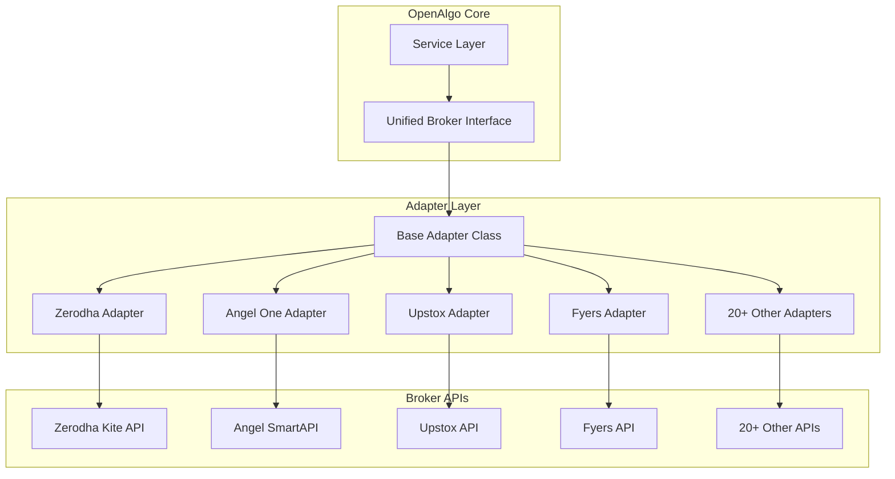
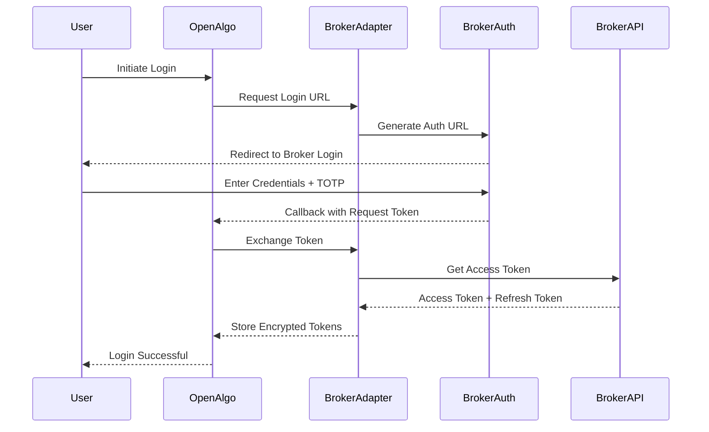

# OpenAlgo Broker Integration Layer

## Executive Summary

The broker integration layer is the cornerstone of OpenAlgo's broker-agnostic architecture, providing a unified interface to interact with 25+ Indian stock brokers. Through a sophisticated adapter pattern, it abstracts broker-specific APIs, authentication mechanisms, and data formats into a consistent interface.

## Architecture Overview

### Adapter Pattern Implementation



## Supported Brokers

### Current Integrations (25+)

| Category | Broker | Status | Features | Recent Updates |
|----------|--------|--------|----------|----------------|
| **Traditional Brokers** |
| | Zerodha | ✅ Active | Full API, WebSocket | Stable |
| | Angel One | ✅ Active | SmartAPI v2, WebSocket | Logging optimized (Sept 2025) |
| | Upstox | ✅ Active | API v2, WebSocket | NSE_COM filtered (Sept 2025) |
| | 5Paisa | ✅ Active | OpenAPI, WebSocket | Stable |
| | IIFL | ✅ Active | API v3 | Stable |
| **Discount Brokers** |
| | Fyers | ✅ Active | API v3, DataSocket | Logging optimized (Sept 2025) |
| | Alice Blue | ✅ Active | ANT API | Stable |
| | Flattrade | ✅ Active | REST API | Stable |
| | Shoonya | ✅ Active | NorenAPI | Stable |
| | Dhan | ✅ Active | API v2 | Date handling fixed (Sept 2025) |
| **Bank-based Brokers** |
| | Kotak Securities | ✅ Active | Neo API | Stable |
| | ICICI Direct | ✅ Active | Breeze API | Stable |
| **New Generation** |
| | Groww | ✅ Active | API v1 | Stable |
| | Paytm Money | ✅ Active | REST API | Stable |
| | Motilal Oswal | ✅ Active | API v1 | Stable |
| **Specialized** |
| | Definedge | ✅ Active | Symphony API | Stable |
| | Wisdom Capital | ✅ Active | REST API | Stable |
| | JM Financial | ✅ Active | API v1 | Stable |
| | Nuvama | ✅ Active | REST API | Stable |
| | Arham Capital | ✅ Active | API v1 | Stable |

## Broker Adapter Structure

### Standard Directory Layout

```
broker/
├── [broker_name]/
│   ├── __init__.py           # Adapter initialization
│   ├── plugin.json           # Broker metadata and configuration
│   ├── api/
│   │   ├── __init__.py
│   │   ├── auth_api.py       # Authentication handling
│   │   ├── order_api.py      # Order management
│   │   ├── market_data_api.py # Market data operations
│   │   ├── funds_api.py      # Account and funds
│   │   └── portfolio_api.py  # Positions and holdings
│   ├── mapping/
│   │   ├── __init__.py
│   │   ├── order_data.py     # Order data transformation
│   │   ├── symbol_mapping.py # Symbol format conversion
│   │   └── transform_data.py # Response transformation
│   ├── database/
│   │   ├── __init__.py
│   │   └── master_contract_db.py # Instrument master data
│   └── streaming/
│       ├── __init__.py
│       └── websocket_client.py # Real-time data streaming
```

### Plugin Configuration

```json
// broker/zerodha/plugin.json
{
    "name": "zerodha",
    "display_name": "Zerodha Kite",
    "version": "3.0.0",
    "api_version": "3",
    "supported_exchanges": ["NSE", "BSE", "NFO", "BFO", "MCX", "CDS"],
    "features": {
        "orders": true,
        "market_data": true,
        "historical_data": true,
        "websocket": true,
        "basket_orders": true,
        "gtt_orders": true,
        "cover_orders": true,
        "bracket_orders": false
    },
    "authentication": {
        "type": "oauth2",
        "requires_totp": true,
        "session_expiry": "daily",
        "api_key_required": true,
        "api_secret_required": true
    },
    "rate_limits": {
        "orders": "10/second",
        "quotes": "1/second",
        "historical": "3/second"
    },
    "maintenance_window": {
        "daily": "00:00-06:30",
        "weekly": "Saturday 00:00 - Sunday 08:00"
    }
}
```

## Authentication Mechanisms

### OAuth2 Flow (Zerodha, Upstox, Angel One)



### API Key Authentication (Fyers, Alice Blue)

```python
# Direct API key authentication
class FyersAuth:
    def authenticate(self, api_key: str, api_secret: str) -> Dict:
        auth_payload = {
            "client_id": api_key,
            "secret_key": api_secret,
            "grant_type": "client_credentials"
        }
        response = requests.post(
            f"{self.base_url}/auth/token",
            json=auth_payload
        )
        return {
            "access_token": response.json()["access_token"],
            "token_type": "Bearer"
        }
```

### Session-based Authentication (5Paisa, IIFL)

```python
# Session cookie authentication
class SessionAuth:
    def login(self, username: str, password: str, totp: str) -> str:
        session = requests.Session()

        # Initial login
        login_response = session.post(
            f"{self.base_url}/login",
            json={
                "username": username,
                "password": password,
                "totp": totp
            }
        )

        # Store session cookie
        self.session_cookie = session.cookies.get("session_id")
        return self.session_cookie
```

## Unified Interface Implementation

### Base Adapter Class

```python
# broker/base_adapter.py
from abc import ABC, abstractmethod
from typing import Dict, List, Optional

class BaseBrokerAdapter(ABC):
    """Abstract base class for all broker adapters"""

    def __init__(self, auth_token: str, config: Dict):
        self.auth_token = auth_token
        self.config = config
        self.base_url = config.get("base_url")

    @abstractmethod
    def place_order(self, params: Dict) -> Dict:
        """Place a new order"""
        pass

    @abstractmethod
    def modify_order(self, order_id: str, params: Dict) -> Dict:
        """Modify an existing order"""
        pass

    @abstractmethod
    def cancel_order(self, order_id: str) -> Dict:
        """Cancel an order"""
        pass

    @abstractmethod
    def get_orderbook(self) -> List[Dict]:
        """Get all orders"""
        pass

    @abstractmethod
    def get_positions(self) -> List[Dict]:
        """Get current positions"""
        pass

    @abstractmethod
    def get_holdings(self) -> List[Dict]:
        """Get holdings"""
        pass

    @abstractmethod
    def get_funds(self) -> Dict:
        """Get account funds"""
        pass

    @abstractmethod
    def get_quotes(self, symbols: List[str]) -> Dict:
        """Get real-time quotes"""
        pass
```

### Concrete Adapter Example

```python
# broker/zerodha/api/order_api.py
from broker.base_adapter import BaseBrokerAdapter
from kiteconnect import KiteConnect

class ZerodhaAdapter(BaseBrokerAdapter):
    def __init__(self, auth_token: str, config: Dict):
        super().__init__(auth_token, config)
        self.kite = KiteConnect(api_key=config["api_key"])
        self.kite.set_access_token(auth_token)

    def place_order(self, params: Dict) -> Dict:
        # Transform OpenAlgo params to Kite format
        kite_params = self._transform_order_params(params)

        try:
            order_id = self.kite.place_order(
                variety=kite_params["variety"],
                exchange=kite_params["exchange"],
                tradingsymbol=kite_params["tradingsymbol"],
                transaction_type=kite_params["transaction_type"],
                quantity=kite_params["quantity"],
                product=kite_params["product"],
                order_type=kite_params["order_type"],
                price=kite_params.get("price", 0),
                trigger_price=kite_params.get("trigger_price", 0)
            )

            return {
                "status": "success",
                "order_id": order_id,
                "message": "Order placed successfully"
            }
        except Exception as e:
            return {
                "status": "error",
                "message": str(e)
            }

    def _transform_order_params(self, params: Dict) -> Dict:
        """Transform OpenAlgo params to Kite format"""
        return {
            "variety": "regular",
            "exchange": params["exchange"],
            "tradingsymbol": params["symbol"],
            "transaction_type": params["action"],  # BUY/SELL
            "quantity": int(params["quantity"]),
            "product": params["product"],  # MIS/CNC/NRML
            "order_type": params["pricetype"],  # MARKET/LIMIT
            "price": float(params.get("price", 0)),
            "trigger_price": float(params.get("trigger_price", 0))
        }
```

## Data Transformation

### Symbol Mapping

```python
# broker/zerodha/mapping/symbol_mapping.py
class SymbolMapper:
    def to_broker_format(self, openalgo_symbol: str) -> str:
        """
        Convert OpenAlgo symbol format to broker format
        OpenAlgo: SBIN-EQ
        Zerodha: SBIN
        """
        if "-EQ" in openalgo_symbol:
            return openalgo_symbol.replace("-EQ", "")
        return openalgo_symbol

    def to_openalgo_format(self, broker_symbol: str, exchange: str) -> str:
        """
        Convert broker symbol to OpenAlgo format
        Zerodha: SBIN
        OpenAlgo: SBIN-EQ
        """
        if exchange in ["NSE", "BSE"]:
            return f"{broker_symbol}-EQ"
        return broker_symbol
```

### Response Transformation

```python
# broker/zerodha/mapping/transform_data.py
class ResponseTransformer:
    def transform_position(self, broker_position: Dict) -> Dict:
        """Transform broker position to OpenAlgo format"""
        return {
            "symbol": self.symbol_mapper.to_openalgo_format(
                broker_position["tradingsymbol"],
                broker_position["exchange"]
            ),
            "exchange": broker_position["exchange"],
            "quantity": broker_position["quantity"],
            "product": broker_position["product"],
            "buy_price": broker_position["average_price"],
            "sell_price": 0,
            "buy_quantity": broker_position["buy_quantity"],
            "sell_quantity": broker_position["sell_quantity"],
            "pnl": broker_position["pnl"],
            "ltp": broker_position["last_price"]
        }

    def transform_order(self, broker_order: Dict) -> Dict:
        """Transform broker order to OpenAlgo format"""
        return {
            "order_id": broker_order["order_id"],
            "symbol": self.symbol_mapper.to_openalgo_format(
                broker_order["tradingsymbol"],
                broker_order["exchange"]
            ),
            "exchange": broker_order["exchange"],
            "action": broker_order["transaction_type"],
            "quantity": broker_order["quantity"],
            "price": broker_order["price"],
            "pricetype": broker_order["order_type"],
            "product": broker_order["product"],
            "status": self._map_order_status(broker_order["status"]),
            "filled_quantity": broker_order["filled_quantity"],
            "pending_quantity": broker_order["pending_quantity"],
            "order_datetime": broker_order["order_timestamp"]
        }
```

## Master Contract Management

### Instrument Data Synchronization

```python
# broker/zerodha/database/master_contract_db.py
import pandas as pd
from sqlalchemy import create_engine

class MasterContractManager:
    def __init__(self, db_url: str):
        self.engine = create_engine(db_url)

    def download_contracts(self) -> pd.DataFrame:
        """Download latest instrument master from broker"""
        url = "https://api.kite.trade/instruments"
        df = pd.read_csv(url)
        return df

    def process_contracts(self, df: pd.DataFrame) -> pd.DataFrame:
        """Process and standardize instrument data"""
        # Add OpenAlgo specific columns
        df['openalgo_symbol'] = df.apply(self._create_symbol, axis=1)
        df['token'] = df['instrument_token']

        # Filter active instruments
        df = df[df['exchange'].isin(['NSE', 'BSE', 'NFO', 'BFO', 'MCX', 'CDS'])]

        # Recent Update: Filter out NSE_COM instruments (Upstox)
        if 'segment' in df.columns:
            df = df[df['segment'] != 'NSE_COM']

        return df

    def save_to_database(self, df: pd.DataFrame):
        """Save processed contracts to database"""
        df.to_sql(
            'master_contracts',
            self.engine,
            if_exists='replace',
            index=False
        )

        # Create indexes for fast lookup
        with self.engine.connect() as conn:
            conn.execute("CREATE INDEX idx_symbol ON master_contracts(openalgo_symbol)")
            conn.execute("CREATE INDEX idx_token ON master_contracts(token)")
```

## WebSocket Streaming

### Real-time Data Integration

```python
# broker/zerodha/streaming/websocket_client.py
from kiteconnect import KiteTicker
import asyncio
import json

class ZerodhaWebSocketClient:
    def __init__(self, api_key: str, access_token: str):
        self.kite_ticker = KiteTicker(api_key, access_token)
        self.subscribers = {}
        self.setup_callbacks()

    def setup_callbacks(self):
        self.kite_ticker.on_ticks = self.on_ticks
        self.kite_ticker.on_connect = self.on_connect
        self.kite_ticker.on_close = self.on_close
        self.kite_ticker.on_error = self.on_error

    def on_ticks(self, ws, ticks):
        """Process incoming tick data"""
        for tick in ticks:
            openalgo_tick = self._transform_tick(tick)
            self._broadcast_to_subscribers(openalgo_tick)

    def _transform_tick(self, tick: Dict) -> Dict:
        """Transform broker tick to OpenAlgo format"""
        return {
            "symbol": self._get_symbol_from_token(tick["instrument_token"]),
            "ltp": tick["last_price"],
            "volume": tick.get("volume", 0),
            "bid": tick.get("depth", {}).get("buy", [{}])[0].get("price", 0),
            "ask": tick.get("depth", {}).get("sell", [{}])[0].get("price", 0),
            "oi": tick.get("oi", 0),
            "timestamp": tick["timestamp"]
        }

    def subscribe(self, symbols: List[str], callback):
        """Subscribe to real-time data for symbols"""
        tokens = [self._get_token_from_symbol(s) for s in symbols]
        self.kite_ticker.subscribe(tokens)

        for symbol in symbols:
            if symbol not in self.subscribers:
                self.subscribers[symbol] = []
            self.subscribers[symbol].append(callback)

    def start(self):
        """Start WebSocket connection"""
        self.kite_ticker.connect(threaded=True)
```

## Error Handling

### Broker-specific Error Mapping

```python
# broker/common/error_handler.py
class BrokerErrorHandler:
    ERROR_MAPPINGS = {
        "zerodha": {
            "InputException": "INVALID_INPUT",
            "TokenException": "INVALID_TOKEN",
            "PermissionException": "INSUFFICIENT_PERMISSION",
            "OrderException": "ORDER_ERROR",
            "NetworkException": "NETWORK_ERROR"
        },
        "angelone": {
            "AB1001": "INVALID_TOKEN",
            "AB1002": "INVALID_ORDER",
            "AB1003": "INSUFFICIENT_FUNDS",
            "AB1004": "MARKET_CLOSED"
        }
    }

    def handle_error(self, broker: str, error: Exception) -> Dict:
        """Convert broker error to standardized format"""
        error_type = type(error).__name__
        error_code = self.ERROR_MAPPINGS.get(broker, {}).get(error_type, "UNKNOWN_ERROR")

        return {
            "status": "error",
            "error_code": error_code,
            "message": str(error),
            "broker": broker,
            "retry_after": self._get_retry_after(error_code)
        }

    def _get_retry_after(self, error_code: str) -> Optional[int]:
        """Get retry delay in seconds based on error type"""
        if error_code == "NETWORK_ERROR":
            return 5
        elif error_code == "RATE_LIMIT":
            return 60
        return None
```

## Rate Limiting

### Broker-specific Rate Management

```python
# broker/common/rate_limiter.py
from functools import wraps
import time
from collections import defaultdict

class BrokerRateLimiter:
    def __init__(self):
        self.limits = {
            "zerodha": {"orders": 10, "quotes": 1, "window": 1},
            "angelone": {"orders": 10, "quotes": 10, "window": 1},
            "upstox": {"orders": 25, "quotes": 25, "window": 1},
            "fyers": {"orders": 10, "quotes": 10, "window": 1}
        }
        self.counters = defaultdict(lambda: defaultdict(list))

    def rate_limit(self, broker: str, endpoint: str):
        """Decorator for rate limiting"""
        def decorator(func):
            @wraps(func)
            def wrapper(*args, **kwargs):
                if not self._can_proceed(broker, endpoint):
                    raise RateLimitError(f"Rate limit exceeded for {broker}:{endpoint}")

                self._record_request(broker, endpoint)
                return func(*args, **kwargs)
            return wrapper
        return decorator

    def _can_proceed(self, broker: str, endpoint: str) -> bool:
        """Check if request can proceed"""
        limit_config = self.limits.get(broker, {})
        limit = limit_config.get(endpoint, float('inf'))
        window = limit_config.get("window", 1)

        now = time.time()
        recent_requests = [
            t for t in self.counters[broker][endpoint]
            if now - t < window
        ]

        return len(recent_requests) < limit
```

## Connection Management

### Connection Pool Implementation

```python
# broker/common/connection_manager.py
from contextlib import contextmanager
import httpx

class BrokerConnectionManager:
    def __init__(self):
        self.clients = {}
        self.config = {
            "pool_connections": 10,
            "pool_maxsize": 100,
            "timeout": 30,
            "max_retries": 3
        }

    def get_client(self, broker: str) -> httpx.Client:
        """Get or create HTTP client for broker"""
        if broker not in self.clients:
            self.clients[broker] = self._create_client(broker)
        return self.clients[broker]

    def _create_client(self, broker: str) -> httpx.Client:
        """Create new HTTP client with connection pooling"""
        return httpx.Client(
            limits=httpx.Limits(
                max_connections=self.config["pool_connections"],
                max_keepalive_connections=self.config["pool_maxsize"]
            ),
            timeout=self.config["timeout"],
            headers={
                "User-Agent": f"OpenAlgo/1.0 ({broker})"
            }
        )

    @contextmanager
    def get_connection(self, broker: str):
        """Context manager for broker connections"""
        client = self.get_client(broker)
        try:
            yield client
        except httpx.NetworkError as e:
            # Retry logic
            for attempt in range(self.config["max_retries"]):
                try:
                    yield client
                    break
                except:
                    if attempt == self.config["max_retries"] - 1:
                        raise
```

## Recent Updates and Optimizations

### September 2025 Updates

#### 1. Upstox - NSE_COM Filtering
```python
# Filter out commodity instruments from equity segment
df = df[df['segment'] != 'NSE_COM']
```

#### 2. Logging Optimization (Fyers, Dhan, Angel One)
```python
# Changed from INFO to DEBUG for sensitive operations
logger.debug(f"Symbol subscription: {symbols}")  # Previously INFO
logger.debug(f"Order placement details: {masked_params}")  # Previously INFO
```

#### 3. Dhan - Historical Data Date Handling Fix
```python
# Fixed date parsing for sandbox environment
if is_sandbox:
    date_format = "%Y-%m-%d %H:%M:%S"
else:
    date_format = "%Y-%m-%d"
```

## Testing Strategy

### Integration Testing

```python
# test/test_broker_integration.py
import pytest
from broker.zerodha.api import ZerodhaAdapter

@pytest.fixture
def zerodha_adapter():
    return ZerodhaAdapter(
        auth_token="test_token",
        config={"api_key": "test_key"}
    )

def test_place_order(zerodha_adapter, mock_api):
    # Test order placement
    response = zerodha_adapter.place_order({
        "exchange": "NSE",
        "symbol": "SBIN-EQ",
        "action": "BUY",
        "quantity": 1,
        "pricetype": "MARKET",
        "product": "MIS"
    })

    assert response["status"] == "success"
    assert "order_id" in response
```

## Best Practices

### 1. Error Recovery
- Implement exponential backoff for retries
- Cache successful responses where appropriate
- Graceful degradation for non-critical features

### 2. Security
- Never log sensitive authentication tokens
- Encrypt stored credentials using Fernet
- Implement token refresh before expiry

### 3. Performance
- Use connection pooling for all HTTP requests
- Implement circuit breakers for failing brokers
- Cache instrument master data with TTL

### 4. Monitoring
- Log all broker API calls with latency
- Track error rates per broker
- Monitor rate limit usage

## Future Enhancements

### Planned Features
1. **Multi-account Support**: Single adapter managing multiple accounts
2. **Smart Order Routing**: Automatic broker selection based on rates
3. **Unified WebSocket**: Single WebSocket connection for all brokers
4. **Fallback Brokers**: Automatic failover to backup brokers
5. **Advanced Order Types**: OCO, Iceberg orders across all brokers
6. **Broker Health Dashboard**: Real-time broker status monitoring

## Conclusion

The broker integration layer successfully abstracts the complexity of 25+ different broker APIs into a unified, consistent interface. Through careful design patterns, robust error handling, and continuous optimization, it provides a stable foundation for algorithmic trading across multiple Indian brokers.