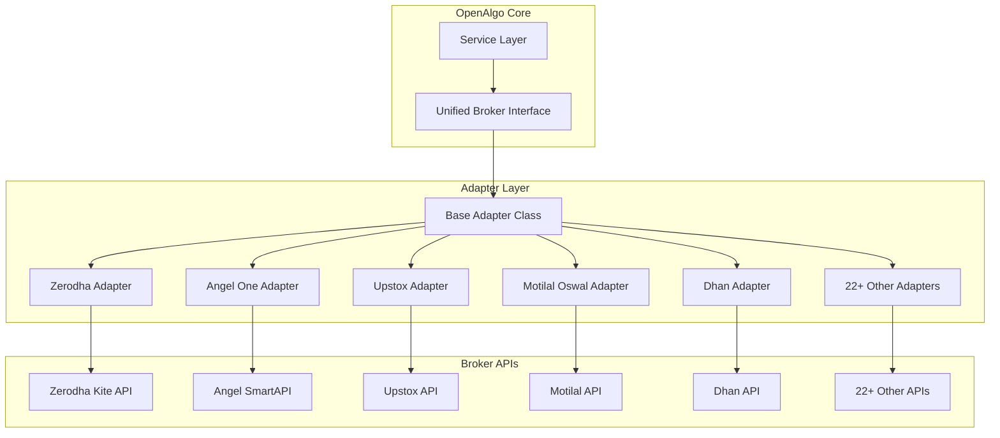
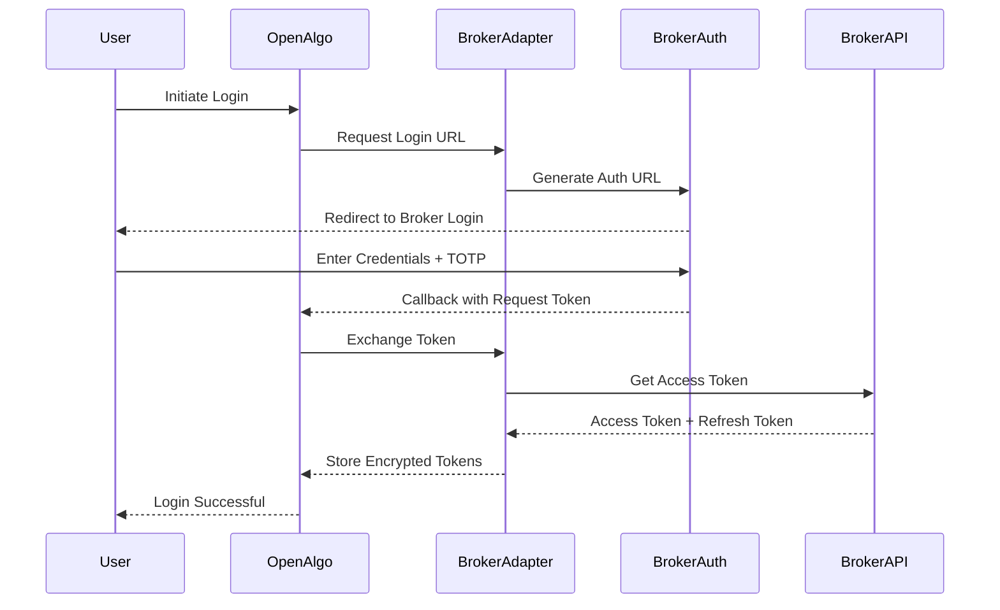

# OpenAlgo Broker Integration Layer

## Executive Summary

The broker integration layer is the cornerstone of OpenAlgo's broker-agnostic architecture, providing a unified interface to interact with 27 Indian stock brokers. Through a sophisticated adapter pattern, it abstracts broker-specific APIs, authentication mechanisms, and data formats into a consistent interface.

## Architecture Overview

### Adapter Pattern Implementation



## Supported Brokers (27 Total)

### Complete Broker List

| # | Broker | Status | API Version | WebSocket | Recent Updates |
|---|--------|--------|-------------|-----------|----------------|
| 1 | 5Paisa | Active | OpenAPI | Yes | Stable |
| 2 | 5Paisa XTS | Active | XTS API | Yes | Stable |
| 3 | AliceBlue | Active | ANT API | Yes | Stable |
| 4 | Angel One | Active | SmartAPI v2 | Yes | Logging optimized |
| 5 | Compositedge | Active | REST API | Yes | Stable |
| 6 | Definedge | Active | Symphony API | Yes | Stable |
| 7 | Dhan | Active | API v2 | Yes | Date handling fixed |
| 8 | Dhan Sandbox | Active | Sandbox API | No | Paper trading |
| 9 | Firstock | Active | REST API | No | Stable |
| 10 | Flattrade | Active | NorenAPI | Yes | Stable |
| 11 | Fyers | Active | API v3 | Yes | Logging optimized |
| 12 | Groww | Active | API v1 | No | Stable |
| 13 | IBulls | Active | REST API | No | Stable |
| 14 | IIFL | Active | API v3 | No | Stable |
| 15 | Indmoney | Active | REST API | No | Stable |
| 16 | Kotak Neo | Active | Neo API | Yes | Stable |
| 17 | **Motilal Oswal** | Active | API v1 | **Yes (New)** | **LTP, Quotes, Depth L1** |
| 18 | Mstock | Active | REST API | No | Stable |
| 19 | Paytm Money | Active | REST API | No | Stable |
| 20 | Pocketful | Active | REST API | No | Stable |
| 21 | Shoonya (Finvasia) | Active | NorenAPI | Yes | Stable |
| 22 | Tradejini | Active | REST API | No | Stable |
| 23 | Upstox | Active | API v2 | Yes | NSE_COM filtered |
| 24 | Wisdom Capital | Active | REST API | No | Stable |
| 25 | Zebu | Active | REST API | No | Stable |
| 26 | Zerodha | Active | Kite API v3 | Yes | Multi-quote API |
| 27 | (Reserved) | - | - | - | - |

### Broker Categories

#### Traditional Full-Service Brokers
- **Zerodha**: Market leader with comprehensive API
- **Angel One**: SmartAPI with WebSocket support
- **IIFL**: Full-featured API v3
- **Motilal Oswal**: Recently enhanced with WebSocket

#### Discount Brokers
- **Upstox**: High-performance API v2
- **Fyers**: DataSocket for streaming
- **Dhan**: Live and Sandbox modes
- **5Paisa**: Standard and XTS variants

#### Bank-based Brokers
- **Kotak Securities**: Neo API platform
- **ICICI Direct**: Breeze API integration

#### New Generation Platforms
- **Groww**: Modern REST API
- **Paytm Money**: Consumer-focused
- **Indmoney**: Wealth management focus

#### Specialized Platforms
- **Definedge**: Symphony for technical analysis
- **Shoonya/Flattrade**: NorenAPI based

## Broker Adapter Structure

### Standard Directory Layout

```
broker/
├── [broker_name]/
│   ├── __init__.py           # Adapter initialization
│   ├── api/
│   │   ├── __init__.py
│   │   ├── auth_api.py       # Authentication handling
│   │   ├── order_api.py      # Order management
│   │   ├── data.py           # Market data operations
│   │   ├── funds.py          # Account and funds
│   │   └── margin_api.py     # Margin calculations
│   ├── mapping/
│   │   ├── __init__.py
│   │   ├── order_data.py     # Order data transformation
│   │   └── transform_data.py # Response transformation
│   ├── database/
│   │   ├── __init__.py
│   │   └── master_contract_db.py # Instrument master data
│   └── streaming/
│       ├── __init__.py
│       ├── [broker]_adapter.py   # WebSocket adapter
│       ├── [broker]_client.py    # WebSocket client
│       └── [broker]_mapping.py   # Data mapping
```

### Example: Motilal Oswal Structure (Latest)

```
broker/motilal/
├── __init__.py
├── api/
│   ├── __init__.py
│   ├── auth_api.py
│   ├── order_api.py
│   ├── data.py
│   ├── funds.py
│   └── margin_api.py
├── mapping/
│   ├── __init__.py
│   ├── order_data.py
│   └── transform_data.py
├── database/
│   └── master_contract_db.py
└── streaming/
    ├── __init__.py
    ├── motilal_adapter.py
    ├── motilal_websocket.py
    └── motilal_mapping.py
```

## Authentication Mechanisms

### OAuth2 Flow (Zerodha, Upstox, Angel One)



### API Key Authentication (Fyers, Alice Blue)

```python
class FyersAuth:
    def authenticate(self, api_key: str, api_secret: str) -> Dict:
        auth_payload = {
            "client_id": api_key,
            "secret_key": api_secret,
            "grant_type": "client_credentials"
        }
        response = requests.post(
            f"{self.base_url}/auth/token",
            json=auth_payload
        )
        return {
            "access_token": response.json()["access_token"],
            "token_type": "Bearer"
        }
```

### Session-based Authentication (5Paisa, IIFL)

```python
class SessionAuth:
    def login(self, username: str, password: str, totp: str) -> str:
        session = requests.Session()
        login_response = session.post(
            f"{self.base_url}/login",
            json={
                "username": username,
                "password": password,
                "totp": totp
            }
        )
        self.session_cookie = session.cookies.get("session_id")
        return self.session_cookie
```

## Unified Interface Implementation

### Base Adapter Class

```python
# broker/base_adapter.py
from abc import ABC, abstractmethod
from typing import Dict, List, Optional

class BaseBrokerAdapter(ABC):
    """Abstract base class for all broker adapters"""

    def __init__(self, auth_token: str, config: Dict):
        self.auth_token = auth_token
        self.config = config
        self.base_url = config.get("base_url")

    @abstractmethod
    def place_order(self, params: Dict) -> Dict:
        """Place a new order"""
        pass

    @abstractmethod
    def modify_order(self, order_id: str, params: Dict) -> Dict:
        """Modify an existing order"""
        pass

    @abstractmethod
    def cancel_order(self, order_id: str) -> Dict:
        """Cancel an order"""
        pass

    @abstractmethod
    def get_orderbook(self) -> List[Dict]:
        """Get all orders"""
        pass

    @abstractmethod
    def get_positions(self) -> List[Dict]:
        """Get current positions"""
        pass

    @abstractmethod
    def get_holdings(self) -> List[Dict]:
        """Get holdings"""
        pass

    @abstractmethod
    def get_funds(self) -> Dict:
        """Get account funds"""
        pass

    @abstractmethod
    def get_quotes(self, symbols: List[str]) -> Dict:
        """Get real-time quotes"""
        pass

    @abstractmethod
    def get_depth(self, symbol: str, exchange: str) -> Dict:
        """Get market depth"""
        pass

    @abstractmethod
    def get_history(self, symbol: str, interval: str, start: str, end: str) -> List:
        """Get historical data"""
        pass
```

## Data Transformation

### Symbol Mapping

Each broker uses different symbol formats. OpenAlgo normalizes them:

```python
# OpenAlgo Standard Format Examples
NSE Equity:    "RELIANCE"
BSE Equity:    "RELIANCE"
NFO Futures:   "NIFTY25NOVFUT"
NFO Options:   "NIFTY2511519500CE"
MCX Futures:   "CRUDEOIL25NOVFUT"
```

### Response Transformation

```python
class ResponseTransformer:
    def transform_position(self, broker_position: Dict) -> Dict:
        """Transform broker position to OpenAlgo format"""
        return {
            "symbol": self.normalize_symbol(broker_position),
            "exchange": broker_position["exchange"],
            "quantity": broker_position["quantity"],
            "product": self.map_product(broker_position["product"]),
            "average_price": broker_position["average_price"],
            "ltp": broker_position["last_price"],
            "pnl": broker_position["pnl"],
            "pnl_percent": self.calculate_pnl_percent(broker_position)
        }

    def transform_order(self, broker_order: Dict) -> Dict:
        """Transform broker order to OpenAlgo format"""
        return {
            "orderid": broker_order["order_id"],
            "symbol": self.normalize_symbol(broker_order),
            "exchange": broker_order["exchange"],
            "action": broker_order["transaction_type"],
            "quantity": broker_order["quantity"],
            "price": broker_order["price"],
            "pricetype": self.map_order_type(broker_order["order_type"]),
            "product": self.map_product(broker_order["product"]),
            "status": self.map_status(broker_order["status"]),
            "filled_quantity": broker_order["filled_quantity"],
            "pending_quantity": broker_order["pending_quantity"],
            "order_datetime": broker_order["order_timestamp"]
        }
```

## WebSocket Streaming

### Supported Data Types

| Data Type | Description | Brokers Supporting |
|-----------|-------------|-------------------|
| **LTP** | Last Traded Price | All WebSocket brokers |
| **Quotes** | OHLC + Volume | Most brokers |
| **Depth** | Market Depth L1-L5 | Zerodha, Angel, Motilal, etc. |

### WebSocket Adapter Example (Motilal - Latest)

```python
# broker/motilal/streaming/motilal_adapter.py
class MotilalWebSocketAdapter(BaseBrokerWebSocketAdapter):
    def __init__(self, auth_token: str, feed_token: str):
        super().__init__()
        self.auth_token = auth_token
        self.feed_token = feed_token
        self.client = MotilalWebSocket(auth_token, feed_token)

    async def connect(self):
        """Establish WebSocket connection"""
        await self.client.connect()
        self.client.on_tick = self.on_tick
        self.client.on_connect = self.on_connect

    async def subscribe(self, symbols: List[str], mode: str):
        """Subscribe to market data
        Modes: LTP, QUOTE, DEPTH
        """
        tokens = [self.get_token(s) for s in symbols]
        await self.client.subscribe(tokens, mode)

    def on_tick(self, tick_data: Dict):
        """Process incoming tick"""
        normalized = self.normalize_tick(tick_data)
        self.publish_to_zmq(normalized)
```

## Master Contract Management

### Contract Synchronization

```python
class MasterContractManager:
    def __init__(self, broker: str, db_url: str):
        self.broker = broker
        self.engine = create_engine(db_url)

    def download_contracts(self) -> pd.DataFrame:
        """Download latest instrument master from broker"""
        # Broker-specific download logic
        pass

    def process_contracts(self, df: pd.DataFrame) -> pd.DataFrame:
        """Process and standardize instrument data"""
        # Add OpenAlgo standard columns
        df['openalgo_symbol'] = df.apply(self._create_symbol, axis=1)
        df['token'] = df['instrument_token']

        # Filter active instruments
        df = df[df['exchange'].isin([
            'NSE', 'BSE', 'NFO', 'BFO', 'MCX', 'CDS', 'BCD', 'NCDEX'
        ])]

        # Recent: Filter out NSE_COM for Upstox
        if self.broker == 'upstox' and 'segment' in df.columns:
            df = df[df['segment'] != 'NSE_COM']

        return df

    def save_to_database(self, df: pd.DataFrame):
        """Save processed contracts to database"""
        df.to_sql('master_contracts', self.engine, if_exists='replace')
```

## Error Handling

### Broker-specific Error Mapping

```python
class BrokerErrorHandler:
    ERROR_MAPPINGS = {
        "zerodha": {
            "InputException": "INVALID_INPUT",
            "TokenException": "INVALID_TOKEN",
            "PermissionException": "INSUFFICIENT_PERMISSION",
            "OrderException": "ORDER_ERROR",
            "NetworkException": "NETWORK_ERROR"
        },
        "angelone": {
            "AB1001": "INVALID_TOKEN",
            "AB1002": "INVALID_ORDER",
            "AB1003": "INSUFFICIENT_FUNDS",
            "AB1004": "MARKET_CLOSED"
        },
        "motilal": {
            "MOT001": "INVALID_TOKEN",
            "MOT002": "ORDER_REJECTED",
            "MOT003": "SYMBOL_NOT_FOUND"
        }
    }

    def handle_error(self, broker: str, error: Exception) -> Dict:
        """Convert broker error to standardized format"""
        error_type = type(error).__name__
        error_code = self.ERROR_MAPPINGS.get(broker, {}).get(
            error_type, "UNKNOWN_ERROR"
        )
        return {
            "status": "error",
            "error_code": error_code,
            "message": str(error),
            "broker": broker
        }
```

## Rate Limiting

### Broker-specific Rate Management

```python
class BrokerRateLimiter:
    def __init__(self):
        self.limits = {
            "zerodha": {"orders": 10, "quotes": 1, "window": 1},
            "angelone": {"orders": 10, "quotes": 10, "window": 1},
            "upstox": {"orders": 25, "quotes": 25, "window": 1},
            "fyers": {"orders": 10, "quotes": 10, "window": 1},
            "motilal": {"orders": 10, "quotes": 10, "window": 1},
            "dhan": {"orders": 20, "quotes": 20, "window": 1}
        }
```

## Recent Updates (November 2025)

### 1. Motilal Oswal WebSocket Enhancement

```python
# New WebSocket support for Motilal
# Supports: LTP, Quotes, Depth Level 1
# Features:
# - SSL certificate handling
# - Index quote support
# - Quantity conversion for lot sizes
```

### 2. Multi-Quote API (Zerodha)

```python
# Batch quote retrieval
def get_multi_quotes(symbols: List[str]) -> Dict:
    """Get quotes for multiple symbols in single request"""
    return self.kite.quote(symbols)
```

### 3. Upstox NSE_COM Filtering

```python
# Filter out commodity instruments from equity segment
df = df[df['segment'] != 'NSE_COM']
```

### 4. Logging Optimization (Fyers, Dhan, Angel One)

```python
# Changed from INFO to DEBUG for sensitive operations
logger.debug(f"Symbol subscription: {symbols}")
logger.debug(f"Order placement details: {masked_params}")
```

### 5. Dhan Historical Data Date Fix

```python
# Fixed date parsing for sandbox environment
if is_sandbox:
    date_format = "%Y-%m-%d %H:%M:%S"
else:
    date_format = "%Y-%m-%d"
```

## Connection Management

### Connection Pool Implementation

```python
class BrokerConnectionManager:
    def __init__(self):
        self.clients = {}
        self.config = {
            "pool_connections": 10,
            "pool_maxsize": 100,
            "timeout": 30,
            "max_retries": 3
        }

    def get_client(self, broker: str) -> httpx.Client:
        """Get or create HTTP client for broker"""
        if broker not in self.clients:
            self.clients[broker] = self._create_client(broker)
        return self.clients[broker]

    def _create_client(self, broker: str) -> httpx.Client:
        return httpx.Client(
            limits=httpx.Limits(
                max_connections=self.config["pool_connections"],
                max_keepalive_connections=self.config["pool_maxsize"]
            ),
            timeout=self.config["timeout"]
        )
```

## Best Practices

### 1. Error Recovery
- Implement exponential backoff for retries
- Cache successful responses where appropriate
- Graceful degradation for non-critical features

### 2. Security
- Never log sensitive authentication tokens
- Encrypt stored credentials using Fernet
- Implement token refresh before expiry

### 3. Performance
- Use connection pooling for all HTTP requests
- Implement circuit breakers for failing brokers
- Cache instrument master data with TTL

### 4. Monitoring
- Log all broker API calls with latency
- Track error rates per broker
- Monitor rate limit usage

## Future Enhancements

### Planned Features
1. **Multi-account Support**: Single adapter managing multiple accounts
2. **Smart Order Routing**: Automatic broker selection based on rates
3. **Unified WebSocket**: Single WebSocket connection for all brokers
4. **Fallback Brokers**: Automatic failover to backup brokers
5. **Advanced Order Types**: OCO, Iceberg orders across all brokers
6. **Broker Health Dashboard**: Real-time broker status monitoring

## Conclusion

The broker integration layer successfully abstracts the complexity of 27 different broker APIs into a unified, consistent interface. Through careful design patterns, robust error handling, and continuous optimization, it provides a stable foundation for algorithmic trading across multiple Indian brokers.
