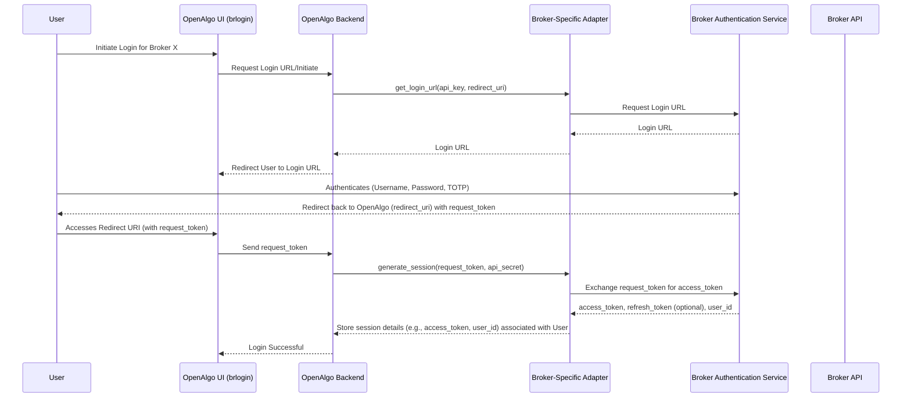
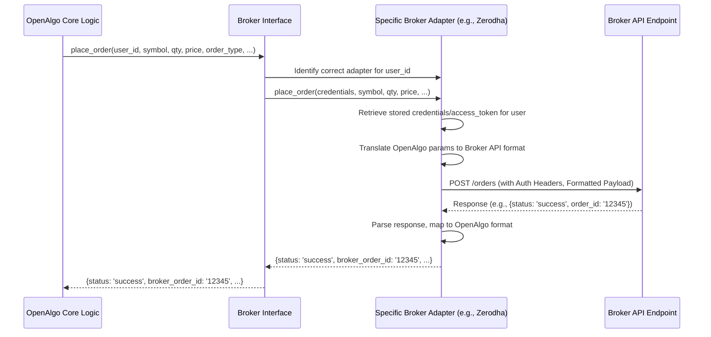

# Broker Integration

The `broker` directory is central to OpenAlgo's ability to connect and interact with various stock brokerage platforms. It implements an abstraction layer to provide a consistent interface regardless of the specific broker being used.

## Abstraction Layer Design

OpenAlgo likely employs the **Adapter Pattern** to integrate different broker APIs.

*   **Common Interface:** A base class or a set of expected function signatures (defined implicitly or explicitly, perhaps in `broker/__init__.py` or a base adapter file) likely defines the standard operations OpenAlgo needs to perform (e.g., `login`, `logout`, `place_order`, `get_order_status`, `get_positions`, `get_funds`, `get_quotes`, etc.).
*   **Specific Adapters:** Each subdirectory within `broker/` (e.g., `broker/zerodha/`, `broker/angel/`, `broker/fyers/`) contains a specific adapter implementation for that broker.
*   **Adapter Responsibility:** Each adapter class/module is responsible for:
    *   Importing the broker's official or unofficial Python SDK/library (if available) or making direct HTTP requests to the broker's API.
    *   Translating the standard OpenAlgo function calls into the specific methods and parameters required by the target broker's API.
    *   Handling broker-specific authentication flows.
    *   Parsing the broker's API responses and converting them into a standardized format expected by the rest of the OpenAlgo application.
    *   Managing broker-specific error conditions and translating them into common OpenAlgo exceptions where possible.
*   **Dynamic Loading:** The `utils.plugin_loader.load_broker_auth_functions` function (seen in `app.py`) suggests a mechanism to dynamically discover and load available broker adapters and their authentication functions at runtime.

## Broker Authentication

Authentication methods vary significantly between brokers. Common mechanisms likely implemented within the individual adapters include:

*   **API Key & Secret:** Used for programmatic access, often combined with other factors.
*   **Request Token / Access Token Flow (OAuth2 variants):** Many brokers use a multi-step process:
    1.  User logs in via a broker's web portal, authorizing the application.
    2.  A short-lived `request_token` is generated.
    3.  The application exchanges the `request_token` (along with API key/secret) for an `access_token` and potentially a `refresh_token`.
    4.  The `access_token` is used in subsequent API calls.
    5.  The `refresh_token` (if provided) is used to obtain new access tokens when the old one expires.
*   **Session Cookies:** Some integrations might involve simulating a web login and managing session cookies.
*   **TOTP (Time-based One-Time Password):** Often required as a second factor during login.
*   **User Credentials (Username/Password):** Direct login using user credentials (less common for APIs, sometimes used in initial token generation).

The `brlogin` blueprint (`blueprints/brlogin.py`) likely handles the user-facing part of interactive login flows required by some brokers to generate initial tokens/sessions.

### Generic Broker Login Flow (Illustrative Mermaid Diagram)

This diagram illustrates a common OAuth2-like flow often used by brokers for API access.

## Broker Interaction Example (Place Order - Mermaid Diagram)

## Connection Management & Error Handling

*   Adapters manage API client instances or HTTP sessions.
*   Error handling within adapters translates broker-specific errors (e.g., insufficient funds, invalid symbol, connection issues) into standardized exceptions or error responses for OpenAlgo's core logic.
*   Session expiry and re-authentication logic (using refresh tokens if applicable) should be handled within the adapter or the Broker Interface layer.
