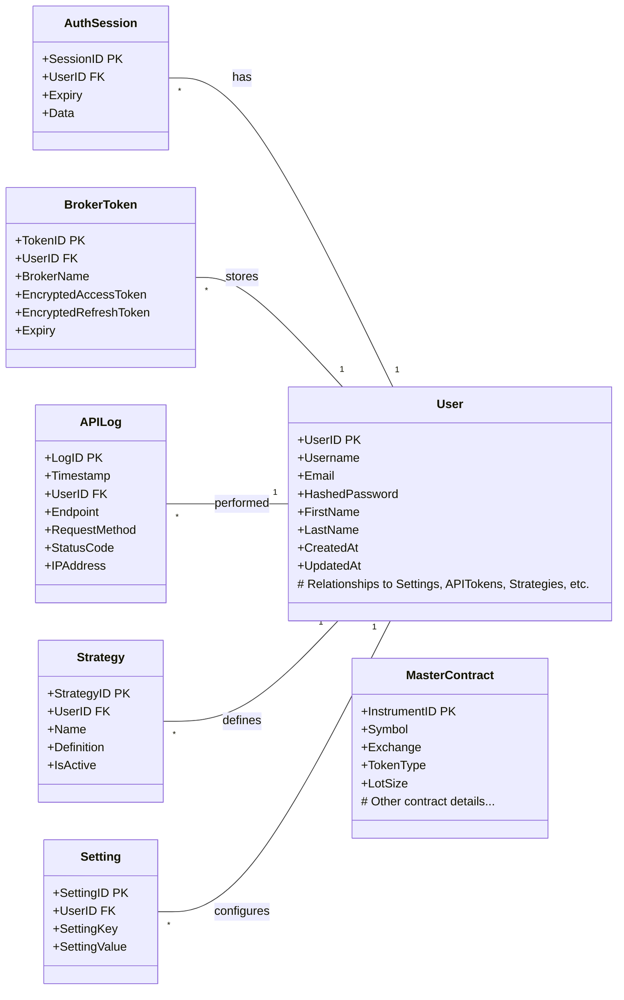

# Database Layer

The database layer is responsible for data persistence and retrieval within OpenAlgo. It interacts with the underlying database to store user information, broker credentials, trading activity, logs, and other relevant data.

## ORM and Library

*   **SQLAlchemy:** OpenAlgo utilizes SQLAlchemy as its primary Object-Relational Mapper (ORM). SQLAlchemy provides a high-level API for interacting with relational databases, allowing developers to work with Python objects instead of writing raw SQL queries for most operations.
*   **Flask-SQLAlchemy:** While not explicitly seen in `extensions.py`, the presence of `Flask-SQLAlchemy` in `requirements.txt` and the pattern of initializing databases within the app context strongly suggest its use. This extension integrates SQLAlchemy smoothly with Flask, managing sessions and configurations tied to the Flask application context.

## Database Structure and Models

*   **Modular Design:** The database logic is organized into modules within the `database/` directory, corresponding to different data domains:
    *   `auth_db.py`: User authentication, password hashing, sessions, possibly API keys.
    *   `user_db.py`: User profile information, preferences.
    *   `symbol.py`: Master contract/instrument details.
    *   `apilog_db.py`: Logging of API interactions (potentially distinct from traffic logs).
    *   `analyzer_db.py`: Data related to the analysis features.
    *   `settings_db.py`: Application or user-specific settings.
    *   `chartink_db.py`: Data related to ChartInk integration.
    *   `traffic_db.py`: Detailed HTTP request/response logs.
    *   `latency_db.py`: Latency metrics for monitoring.
    *   `strategy_db.py`: Definitions and states of trading strategies.
    *   `token_db.py`: Potentially stores broker API tokens (access/refresh tokens).
*   **Models:** Each module likely defines SQLAlchemy declarative models (classes inheriting from a declarative base) that map to database tables. These models define the table schema (columns, types, relationships).
*   **Initialization:** Each module contains an `init_db()` function (or similar, like `init_logs_db`), which is called during application startup (`setup_environment` in `app.py`) to ensure the necessary database tables exist (likely using `Base.metadata.create_all(engine)`).

## Database Connection Management

*   **Configuration:** The database connection string is configured via the `DATABASE_URL` environment variable.
*   **Engine:** SQLAlchemy uses an `Engine` object to manage connections to the database.
*   **Connection Pooling:** As per previous optimizations, OpenAlgo utilizes SQLAlchemy's built-in connection pooling to improve performance and resource management. Key configurations (set via environment variables):
    *   `DB_POOL_SIZE`: The initial number of connections kept open in the pool.
    *   `DB_MAX_OVERFLOW`: The number of additional connections that can be opened beyond `DB_POOL_SIZE` under load.
    *   `DB_POOL_TIMEOUT`: The time (in seconds) to wait for a connection from the pool before timing out.
    *   `DB_POOL_RECYCLE`: The time (in seconds) after which connections are automatically recycled to prevent stale connections.
    *   `pool_pre_ping=True`: Enabled to test connections for liveness before they are checked out from the pool, reducing errors due to closed or stale connections.
*   **Session Management:** Flask-SQLAlchemy typically manages SQLAlchemy `Session` objects, providing a thread-local session tied to the application or request context. This ensures that database operations within a single request are handled transactionally.

## Database Schema (Conceptual UML Class Diagram - Mermaid)

This is a *conceptual* diagram based on the file names. The actual models and relationships would need to be inspected within each `_db.py` file for full accuracy.

*Note: FK denotes Foreign Key.*
