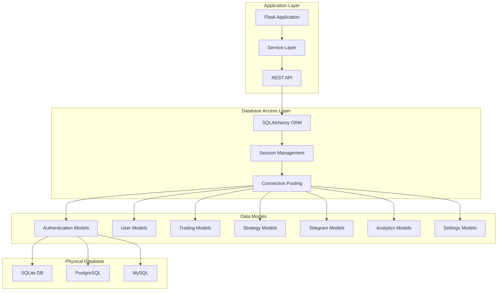

# OpenAlgo Database Layer Design

## Executive Summary

The database layer provides comprehensive data persistence for the OpenAlgo trading platform, managing everything from user authentication and broker credentials to trading history, strategy configurations, and Telegram bot data. Built on SQLAlchemy ORM, it offers database-agnostic support with optimized connection pooling and secure data handling.

## Architecture Overview

### Technology Stack

- **ORM**: SQLAlchemy 2.0+ with declarative models
- **Database Support**: SQLite (development), PostgreSQL/MySQL (production)
- **Migration**: Alembic for schema versioning
- **Connection Pooling**: Optimized pooling with 50 base, 100 max overflow
- **Encryption**: Fernet encryption for sensitive data
- **Hashing**: Argon2 for password and API key hashing

### Database Architecture



## Core Database Models

### 1. Authentication & Authorization

#### Auth Model (`database/auth_db.py`)
```python
class Auth(Base):
    __tablename__ = 'auth'

    id = Column(Integer, primary_key=True)
    name = Column(String(255), unique=True, nullable=False)
    auth = Column(Text, nullable=False)  # Encrypted auth token
    feed_token = Column(Text, nullable=True)  # Encrypted feed token
    broker = Column(String(20), nullable=False)
    user_id = Column(String(255), nullable=True)
    is_revoked = Column(Boolean, default=False)
    created_at = Column(DateTime(timezone=True), server_default=func.now())
    updated_at = Column(DateTime(timezone=True), onupdate=func.now())

    # Indexes
    __table_args__ = (
        Index('idx_auth_name', 'name'),
        Index('idx_auth_broker', 'broker'),
        Index('idx_auth_revoked', 'is_revoked'),
    )
```

#### API Keys Model (`database/auth_db.py`)
```python
class ApiKeys(Base):
    __tablename__ = 'api_keys'

    id = Column(Integer, primary_key=True)
    user_id = Column(String, nullable=False, unique=True)
    api_key_hash = Column(Text, nullable=False)  # Argon2 hash
    api_key_encrypted = Column(Text, nullable=False)  # Fernet encrypted
    created_at = Column(DateTime(timezone=True), server_default=func.now())
    last_used = Column(DateTime(timezone=True))
    is_active = Column(Boolean, default=True)

    __table_args__ = (
        Index('idx_apikey_user', 'user_id'),
        Index('idx_apikey_active', 'is_active'),
    )
```

### 2. User Management

#### User Model (`database/user_db.py`)
```python
class User(Base):
    __tablename__ = 'users'

    id = Column(Integer, primary_key=True)
    username = Column(String(80), unique=True, nullable=False)
    email = Column(String(120), unique=True, nullable=False)
    password_hash = Column(String(255), nullable=False)  # Argon2 with pepper
    totp_secret = Column(String(32), nullable=False)  # 2FA secret
    is_admin = Column(Boolean, default=False)
    is_active = Column(Boolean, default=True)
    created_at = Column(DateTime(timezone=True), server_default=func.now())
    last_login = Column(DateTime(timezone=True))

    # Relationships
    api_keys = relationship("ApiKeys", back_populates="user")
    strategies = relationship("Strategy", back_populates="user")
    telegram_accounts = relationship("TelegramUser", back_populates="user")

    __table_args__ = (
        Index('idx_user_username', 'username'),
        Index('idx_user_email', 'email'),
    )
```

### 3. Telegram Bot Integration

#### Telegram User Model (`database/telegram_db.py`)
```python
class TelegramUser(Base):
    __tablename__ = 'telegram_users'

    id = Column(Integer, primary_key=True)
    telegram_id = Column(BigInteger, unique=True, nullable=False)
    username = Column(String(255))
    first_name = Column(String(255))
    last_name = Column(String(255))
    api_key_encrypted = Column(Text, nullable=False)  # Fernet encrypted
    host_url = Column(String(255), nullable=False)
    created_at = Column(DateTime(timezone=True), server_default=func.now())
    updated_at = Column(DateTime(timezone=True), onupdate=func.now())
    is_active = Column(Boolean, default=True)
    last_command_at = Column(DateTime(timezone=True))

    # Relationships
    command_logs = relationship("CommandLog", back_populates="telegram_user")

    __table_args__ = (
        Index('idx_telegram_id', 'telegram_id'),
        Index('idx_telegram_active', 'is_active'),
    )
```

#### Bot Configuration Model (`database/telegram_db.py`)
```python
class BotConfig(Base):
    __tablename__ = 'bot_config'

    id = Column(Integer, primary_key=True)
    bot_token_encrypted = Column(Text)  # Fernet encrypted
    webhook_url = Column(String(500))
    is_polling = Column(Boolean, default=True)
    is_active = Column(Boolean, default=False)
    auto_start = Column(Boolean, default=False)
    created_at = Column(DateTime(timezone=True), server_default=func.now())
    updated_at = Column(DateTime(timezone=True), onupdate=func.now())
```

#### Command Log Model (`database/telegram_db.py`)
```python
class CommandLog(Base):
    __tablename__ = 'command_logs'

    id = Column(Integer, primary_key=True)
    telegram_id = Column(BigInteger, ForeignKey('telegram_users.telegram_id'), nullable=False)
    command = Column(String(100), nullable=False)
    parameters = Column(Text)
    response_time_ms = Column(Integer)
    success = Column(Boolean, default=True)
    error_message = Column(Text)
    created_at = Column(DateTime(timezone=True), server_default=func.now())

    # Relationships
    telegram_user = relationship("TelegramUser", back_populates="command_logs")

    __table_args__ = (
        Index('idx_command_telegram_id', 'telegram_id'),
        Index('idx_command_created', 'created_at'),
        Index('idx_command_name', 'command'),
    )
```

### 4. Trading Data

#### Order Model (`database/order_db.py`)
```python
class Order(Base):
    __tablename__ = 'orders'

    id = Column(Integer, primary_key=True)
    user_id = Column(Integer, ForeignKey('users.id'), nullable=False)
    broker = Column(String(20), nullable=False)
    order_id = Column(String(50), unique=True, nullable=False)
    exchange = Column(String(10), nullable=False)
    symbol = Column(String(50), nullable=False)
    action = Column(String(10), nullable=False)  # BUY/SELL
    quantity = Column(Integer, nullable=False)
    price = Column(Numeric(10, 2))
    price_type = Column(String(20))  # MARKET/LIMIT/SL/SLM
    product = Column(String(20))  # MIS/CNC/NRML
    status = Column(String(20))  # PENDING/COMPLETE/REJECTED/CANCELLED
    filled_quantity = Column(Integer, default=0)
    average_price = Column(Numeric(10, 2))
    order_datetime = Column(DateTime(timezone=True), server_default=func.now())

    __table_args__ = (
        Index('idx_order_user', 'user_id'),
        Index('idx_order_id', 'order_id'),
        Index('idx_order_status', 'status'),
        Index('idx_order_datetime', 'order_datetime'),
    )
```

#### Position Model (`database/position_db.py`)
```python
class Position(Base):
    __tablename__ = 'positions'

    id = Column(Integer, primary_key=True)
    user_id = Column(Integer, ForeignKey('users.id'), nullable=False)
    broker = Column(String(20), nullable=False)
    exchange = Column(String(10), nullable=False)
    symbol = Column(String(50), nullable=False)
    product = Column(String(20))  # MIS/CNC/NRML
    quantity = Column(Integer, nullable=False)
    buy_quantity = Column(Integer, default=0)
    sell_quantity = Column(Integer, default=0)
    net_quantity = Column(Integer, default=0)
    buy_price = Column(Numeric(10, 2))
    sell_price = Column(Numeric(10, 2))
    net_price = Column(Numeric(10, 2))
    pnl = Column(Numeric(10, 2))
    mtm = Column(Numeric(10, 2))
    ltp = Column(Numeric(10, 2))
    updated_at = Column(DateTime(timezone=True), onupdate=func.now())

    __table_args__ = (
        Index('idx_position_user', 'user_id'),
        Index('idx_position_symbol', 'symbol'),
        UniqueConstraint('user_id', 'broker', 'exchange', 'symbol', 'product'),
    )
```

### 5. Strategy Management

#### Strategy Model (`database/strategy_db.py`)
```python
class Strategy(Base):
    __tablename__ = 'strategies'

    id = Column(Integer, primary_key=True)
    user_id = Column(Integer, ForeignKey('users.id'), nullable=False)
    name = Column(String(255), nullable=False)
    file_path = Column(String(500), nullable=False)
    status = Column(String(20))  # PENDING/RUNNING/STOPPED/ERROR
    is_scheduled = Column(Boolean, default=False)
    schedule_start = Column(Time)
    schedule_stop = Column(Time)
    schedule_days = Column(JSON)  # ["mon", "tue", "wed", "thu", "fri"]
    pid = Column(Integer)  # Process ID when running
    created_at = Column(DateTime(timezone=True), server_default=func.now())
    updated_at = Column(DateTime(timezone=True), onupdate=func.now())
    last_run_at = Column(DateTime(timezone=True))
    error_message = Column(Text)

    # Relationships
    user = relationship("User", back_populates="strategies")
    logs = relationship("StrategyLog", back_populates="strategy")

    __table_args__ = (
        Index('idx_strategy_user', 'user_id'),
        Index('idx_strategy_status', 'status'),
        UniqueConstraint('user_id', 'name'),
    )
```

#### Strategy Log Model (`database/strategy_db.py`)
```python
class StrategyLog(Base):
    __tablename__ = 'strategy_logs'

    id = Column(Integer, primary_key=True)
    strategy_id = Column(Integer, ForeignKey('strategies.id'), nullable=False)
    log_level = Column(String(20))  # INFO/WARNING/ERROR/DEBUG
    message = Column(Text)
    created_at = Column(DateTime(timezone=True), server_default=func.now())

    # Relationships
    strategy = relationship("Strategy", back_populates="logs")

    __table_args__ = (
        Index('idx_strategylog_strategy', 'strategy_id'),
        Index('idx_strategylog_created', 'created_at'),
    )
```

### 6. Master Contract/Instrument Data

#### Token Model (`database/token_db.py`)
```python
class Token(Base):
    __tablename__ = 'tokens'

    id = Column(Integer, primary_key=True)
    broker = Column(String(20), nullable=False)
    exchange = Column(String(10), nullable=False)
    symbol = Column(String(50), nullable=False)
    token = Column(String(50), nullable=False)
    instrument_type = Column(String(20))  # EQ/FUT/OPT
    expiry = Column(Date)
    strike = Column(Numeric(10, 2))
    option_type = Column(String(2))  # CE/PE
    lot_size = Column(Integer)
    tick_size = Column(Numeric(5, 2))
    openalgo_symbol = Column(String(100), nullable=False)

    __table_args__ = (
        Index('idx_token_broker', 'broker'),
        Index('idx_token_symbol', 'symbol'),
        Index('idx_token_openalgo', 'openalgo_symbol'),
        UniqueConstraint('broker', 'exchange', 'token'),
    )
```

### 7. Analytics and Monitoring

#### API Log Model (`database/apilog_db.py`)
```python
class ApiLog(Base):
    __tablename__ = 'api_logs'

    id = Column(Integer, primary_key=True)
    user_id = Column(Integer, ForeignKey('users.id'))
    api_key = Column(String(100))  # Hashed
    endpoint = Column(String(255), nullable=False)
    method = Column(String(10), nullable=False)
    request_body = Column(JSON)
    response_body = Column(JSON)
    status_code = Column(Integer)
    response_time_ms = Column(Integer)
    broker = Column(String(20))
    error_message = Column(Text)
    created_at = Column(DateTime(timezone=True), server_default=func.now())

    __table_args__ = (
        Index('idx_apilog_user', 'user_id'),
        Index('idx_apilog_endpoint', 'endpoint'),
        Index('idx_apilog_created', 'created_at'),
    )
```

#### Traffic Model (`database/traffic_db.py`)
```python
class Traffic(Base):
    __tablename__ = 'traffic'

    id = Column(Integer, primary_key=True)
    ip_address = Column(String(45))
    user_agent = Column(String(500))
    endpoint = Column(String(255), nullable=False)
    method = Column(String(10), nullable=False)
    request_size = Column(Integer)
    response_size = Column(Integer)
    response_time_ms = Column(Integer)
    status_code = Column(Integer)
    created_at = Column(DateTime(timezone=True), server_default=func.now())

    __table_args__ = (
        Index('idx_traffic_endpoint', 'endpoint'),
        Index('idx_traffic_created', 'created_at'),
        Index('idx_traffic_ip', 'ip_address'),
    )
```

#### Latency Model (`database/latency_db.py`)
```python
class Latency(Base):
    __tablename__ = 'latency'

    id = Column(Integer, primary_key=True)
    broker = Column(String(20), nullable=False)
    endpoint = Column(String(255), nullable=False)
    latency_ms = Column(Integer, nullable=False)
    timestamp = Column(DateTime(timezone=True), server_default=func.now())

    __table_args__ = (
        Index('idx_latency_broker', 'broker'),
        Index('idx_latency_timestamp', 'timestamp'),
    )
```

### 8. Settings and Configuration

#### Settings Model (`database/settings_db.py`)
```python
class Settings(Base):
    __tablename__ = 'settings'

    id = Column(Integer, primary_key=True)
    user_id = Column(Integer, ForeignKey('users.id'))
    key = Column(String(100), nullable=False)
    value = Column(JSON)
    category = Column(String(50))  # TRADING/UI/NOTIFICATION
    is_encrypted = Column(Boolean, default=False)
    created_at = Column(DateTime(timezone=True), server_default=func.now())
    updated_at = Column(DateTime(timezone=True), onupdate=func.now())

    __table_args__ = (
        Index('idx_settings_user', 'user_id'),
        Index('idx_settings_key', 'key'),
        UniqueConstraint('user_id', 'key'),
    )
```

### 9. ChartInk Integration

#### ChartInk Webhook Model (`database/chartink_db.py`)
```python
class ChartInkWebhook(Base):
    __tablename__ = 'chartink_webhooks'

    id = Column(Integer, primary_key=True)
    user_id = Column(Integer, ForeignKey('users.id'), nullable=False)
    webhook_id = Column(String(100), unique=True, nullable=False)
    name = Column(String(255), nullable=False)
    strategy_type = Column(String(50))  # SCANNER/ALERT
    is_active = Column(Boolean, default=True)
    configuration = Column(JSON)
    created_at = Column(DateTime(timezone=True), server_default=func.now())
    last_triggered = Column(DateTime(timezone=True))
    trigger_count = Column(Integer, default=0)

    __table_args__ = (
        Index('idx_chartink_user', 'user_id'),
        Index('idx_chartink_webhook', 'webhook_id'),
    )
```

## Database Configuration

### Connection Settings

```python
# Environment Variables
DATABASE_URL = os.getenv('DATABASE_URL', 'sqlite:///openalgo.db')

# Connection Pool Configuration
DB_POOL_SIZE = int(os.getenv('DB_POOL_SIZE', '50'))
DB_MAX_OVERFLOW = int(os.getenv('DB_MAX_OVERFLOW', '100'))
DB_POOL_TIMEOUT = int(os.getenv('DB_POOL_TIMEOUT', '30'))
DB_POOL_RECYCLE = int(os.getenv('DB_POOL_RECYCLE', '3600'))

# SQLAlchemy Engine Configuration
engine = create_engine(
    DATABASE_URL,
    pool_size=DB_POOL_SIZE,
    max_overflow=DB_MAX_OVERFLOW,
    pool_timeout=DB_POOL_TIMEOUT,
    pool_recycle=DB_POOL_RECYCLE,
    pool_pre_ping=True,  # Test connections before use
    echo=False  # Set to True for SQL logging
)
```

### Session Management

```python
from sqlalchemy.orm import sessionmaker, scoped_session

# Create session factory
SessionFactory = sessionmaker(bind=engine)

# Create scoped session for thread-safe operations
Session = scoped_session(SessionFactory)

# Context manager for database operations
@contextmanager
def get_db_session():
    session = Session()
    try:
        yield session
        session.commit()
    except Exception:
        session.rollback()
        raise
    finally:
        session.close()
```

## Security Features

### 1. Encryption at Rest

```python
# Fernet encryption for sensitive data
from cryptography.fernet import Fernet

class EncryptionManager:
    def __init__(self):
        self.cipher_suite = Fernet(get_encryption_key())

    def encrypt(self, data: str) -> str:
        """Encrypt string data"""
        return self.cipher_suite.encrypt(data.encode()).decode()

    def decrypt(self, encrypted_data: str) -> str:
        """Decrypt string data"""
        return self.cipher_suite.decrypt(encrypted_data.encode()).decode()
```

### 2. Password Hashing

```python
# Argon2 hashing with pepper
from argon2 import PasswordHasher
from argon2.exceptions import VerifyMismatchError

class PasswordManager:
    def __init__(self):
        self.hasher = PasswordHasher()
        self.pepper = os.getenv('API_KEY_PEPPER', '')

    def hash_password(self, password: str) -> str:
        """Hash password with Argon2 and pepper"""
        return self.hasher.hash(password + self.pepper)

    def verify_password(self, password: str, hash: str) -> bool:
        """Verify password against hash"""
        try:
            self.hasher.verify(hash, password + self.pepper)
            return True
        except VerifyMismatchError:
            return False
```

### 3. Data Validation

```python
# SQLAlchemy validators
from sqlalchemy.orm import validates

class User(Base):
    @validates('email')
    def validate_email(self, key, email):
        if '@' not in email:
            raise ValueError("Invalid email address")
        return email.lower()

    @validates('username')
    def validate_username(self, key, username):
        if len(username) < 3:
            raise ValueError("Username must be at least 3 characters")
        return username
```

## Database Operations

### CRUD Operations

```python
# Create
def create_user(username: str, email: str, password: str) -> User:
    with get_db_session() as session:
        user = User(
            username=username,
            email=email,
            password_hash=hash_password(password)
        )
        session.add(user)
        return user

# Read
def get_user_by_id(user_id: int) -> Optional[User]:
    with get_db_session() as session:
        return session.query(User).filter_by(id=user_id).first()

# Update
def update_user_email(user_id: int, new_email: str) -> bool:
    with get_db_session() as session:
        user = session.query(User).filter_by(id=user_id).first()
        if user:
            user.email = new_email
            return True
        return False

# Delete
def delete_user(user_id: int) -> bool:
    with get_db_session() as session:
        user = session.query(User).filter_by(id=user_id).first()
        if user:
            session.delete(user)
            return True
        return False
```

### Query Optimization

```python
# Eager loading relationships
def get_user_with_strategies(user_id: int):
    with get_db_session() as session:
        return session.query(User)\
            .options(joinedload(User.strategies))\
            .filter_by(id=user_id)\
            .first()

# Bulk operations
def bulk_insert_orders(orders: List[Dict]):
    with get_db_session() as session:
        session.bulk_insert_mappings(Order, orders)

# Query with indexes
def get_recent_orders(user_id: int, days: int = 7):
    with get_db_session() as session:
        cutoff = datetime.now() - timedelta(days=days)
        return session.query(Order)\
            .filter(Order.user_id == user_id)\
            .filter(Order.order_datetime > cutoff)\
            .order_by(Order.order_datetime.desc())\
            .all()
```

## Migration Management

### Alembic Configuration

```python
# alembic.ini
[alembic]
script_location = migrations
sqlalchemy.url = ${DATABASE_URL}

# migrations/env.py
from sqlalchemy import engine_from_config
from alembic import context
from database.models import Base

target_metadata = Base.metadata

def run_migrations_online():
    connectable = engine_from_config(
        config.get_section(config.config_ini_section),
        prefix='sqlalchemy.',
        poolclass=pool.NullPool,
    )

    with connectable.connect() as connection:
        context.configure(
            connection=connection,
            target_metadata=target_metadata
        )

        with context.begin_transaction():
            context.run_migrations()
```

### Migration Commands

```bash
# Create new migration
alembic revision --autogenerate -m "Add telegram tables"

# Apply migrations
alembic upgrade head

# Rollback migration
alembic downgrade -1

# View migration history
alembic history
```

## Performance Optimization

### 1. Indexing Strategy
- Primary keys on all tables
- Foreign key indexes for joins
- Composite indexes for frequent queries
- Covering indexes for read-heavy operations

### 2. Connection Pooling
- Base pool size: 50 connections
- Max overflow: 100 connections
- Connection recycling: 1 hour
- Pre-ping for connection validation

### 3. Query Optimization
- Eager loading for relationships
- Query result caching
- Bulk operations for inserts/updates
- Pagination for large result sets

### 4. Database Maintenance
- Regular VACUUM (SQLite)
- Index statistics updates
- Query performance monitoring
- Slow query logging

## Monitoring and Analytics

### Database Metrics

```python
def get_database_statistics():
    """Get database performance metrics"""
    with get_db_session() as session:
        stats = {
            'total_users': session.query(User).count(),
            'active_strategies': session.query(Strategy)\
                .filter_by(status='RUNNING').count(),
            'orders_today': session.query(Order)\
                .filter(Order.order_datetime > datetime.today()).count(),
            'active_connections': engine.pool.size(),
            'overflow_connections': engine.pool.overflow()
        }
        return stats
```

### Query Performance Monitoring

```python
from sqlalchemy import event
from sqlalchemy.engine import Engine
import time

@event.listens_for(Engine, "before_cursor_execute")
def before_cursor_execute(conn, cursor, statement, parameters, context, executemany):
    conn.info.setdefault('query_start_time', []).append(time.time())

@event.listens_for(Engine, "after_cursor_execute")
def after_cursor_execute(conn, cursor, statement, parameters, context, executemany):
    total = time.time() - conn.info['query_start_time'].pop(-1)
    if total > 1.0:  # Log slow queries (> 1 second)
        logger.warning(f"Slow query ({total:.2f}s): {statement[:100]}")
```

## Backup and Recovery

### Backup Strategy

```python
def backup_database():
    """Create database backup"""
    if 'sqlite' in DATABASE_URL:
        # SQLite backup
        import shutil
        backup_path = f"backups/openalgo_{datetime.now():%Y%m%d_%H%M%S}.db"
        shutil.copy2('openalgo.db', backup_path)
    else:
        # PostgreSQL/MySQL backup
        os.system(f"pg_dump {DATABASE_URL} > backup.sql")
```

### Recovery Procedures

```python
def restore_database(backup_path: str):
    """Restore database from backup"""
    if 'sqlite' in DATABASE_URL:
        import shutil
        shutil.copy2(backup_path, 'openalgo.db')
    else:
        os.system(f"psql {DATABASE_URL} < {backup_path}")
```

## Future Enhancements

### Planned Improvements
1. **Time-series Database**: Integration for tick data
2. **Read Replicas**: For scaling read operations
3. **Sharding**: For horizontal scaling
4. **Cache Layer**: Redis for frequently accessed data
5. **Event Sourcing**: For audit trail
6. **Data Archival**: Automatic old data archival

## Conclusion

The OpenAlgo database layer provides a robust, secure, and scalable foundation for the trading platform. With comprehensive models covering all aspects from user management to trading operations, encrypted storage for sensitive data, and optimized performance through connection pooling and indexing, it ensures reliable data persistence and retrieval for algorithmic trading operations.