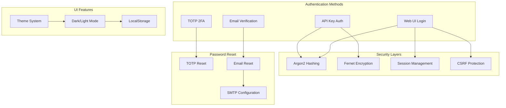

# OpenAlgo Authentication & Security Platform

## Executive Summary

OpenAlgo implements a comprehensive multi-layered security architecture with authentication mechanisms including session-based login, API key authentication, TOTP-based two-factor authentication, and secure password reset via email or TOTP. The platform features robust encryption, secure session management, and extensive security controls.

## Authentication Architecture

### System Overview



## Core Authentication Mechanisms

### 1. Web UI Session Authentication

#### Login Flow
```python
# blueprints/auth.py
@auth_bp.route('/login', methods=['POST'])
def login():
    username = request.form.get('username')
    password = request.form.get('password')

    # Authenticate user with Argon2
    user = authenticate_user(username, password)

    if user:
        # Create session
        session['user'] = username
        session['user_id'] = user.id
        session.permanent = True

        # Set session expiry (daily at 3:30 AM IST)
        app.permanent_session_lifetime = calculate_session_lifetime()

        return redirect('/dashboard')
```

#### Password Security
- **Hashing Algorithm**: Argon2id (winner of Password Hashing Competition)
- **Pepper**: Additional secret added before hashing
- **Salt**: Unique per password (handled by Argon2)
- **Parameters**: Memory-hard to prevent GPU attacks

```python
# database/auth_db.py
from argon2 import PasswordHasher
from argon2.exceptions import VerifyMismatchError

ph = PasswordHasher(
    time_cost=2,      # Number of iterations
    memory_cost=65536, # Memory usage in KB
    parallelism=1,     # Number of parallel threads
)

def hash_password(password: str) -> str:
    pepper = os.getenv('API_KEY_PEPPER', '')
    return ph.hash(password + pepper)

def verify_password(password: str, hash: str) -> bool:
    pepper = os.getenv('API_KEY_PEPPER', '')
    try:
        ph.verify(hash, password + pepper)
        # Rehash if needed (Argon2 parameters changed)
        if ph.check_needs_rehash(hash):
            return True, ph.hash(password + pepper)
        return True, None
    except VerifyMismatchError:
        return False, None
```

### 2. API Key Authentication

#### Key Generation and Storage
```python
# database/auth_db.py
class ApiKeys(Base):
    __tablename__ = 'api_keys'

    id = Column(Integer, primary_key=True)
    user_id = Column(String, nullable=False, unique=True)
    api_key_hash = Column(Text, nullable=False)      # Argon2 hash for verification
    api_key_encrypted = Column(Text, nullable=False)  # Fernet encrypted for display
    created_at = Column(DateTime(timezone=True), server_default=func.now())
    last_used = Column(DateTime(timezone=True))
    is_active = Column(Boolean, default=True)

def generate_api_key():
    # Generate secure random key
    raw_key = secrets.token_hex(32)  # 64 characters

    # Hash for verification
    pepper = os.getenv('API_KEY_PEPPER', '')
    key_hash = ph.hash(raw_key + pepper)

    # Encrypt for storage/retrieval
    cipher_suite = Fernet(get_fernet_key())
    key_encrypted = cipher_suite.encrypt(raw_key.encode()).decode()

    return raw_key, key_hash, key_encrypted
```

#### API Key Verification
```python
# restx_api/auth.py
def verify_api_key(provided_key: str) -> Optional[str]:
    # Get all active API keys
    api_keys = get_active_api_keys()
    pepper = os.getenv('API_KEY_PEPPER', '')

    for api_key_record in api_keys:
        try:
            # Verify against hash
            ph.verify(api_key_record.api_key_hash, provided_key + pepper)

            # Update last used timestamp
            update_api_key_last_used(api_key_record.id)

            return api_key_record.user_id
        except VerifyMismatchError:
            continue

    return None
```

### 3. TOTP Two-Factor Authentication

#### TOTP Setup
```python
# database/user_db.py
import pyotp
import qrcode
import io
import base64

def setup_totp(user_id: int) -> Dict:
    # Generate secret
    secret = pyotp.random_base32()

    # Create TOTP object
    totp = pyotp.TOTP(secret)

    # Generate provisioning URI
    provisioning_uri = totp.provisioning_uri(
        name=user.email,
        issuer_name='OpenAlgo'
    )

    # Generate QR code
    qr = qrcode.QRCode(version=1, box_size=10, border=5)
    qr.add_data(provisioning_uri)
    qr.make(fit=True)

    img = qr.make_image(fill_color="black", back_color="white")
    buf = io.BytesIO()
    img.save(buf, format='PNG')

    # Store encrypted secret
    encrypted_secret = encrypt_totp_secret(secret)
    update_user_totp_secret(user_id, encrypted_secret)

    return {
        'qr_code': base64.b64encode(buf.getvalue()).decode(),
        'secret': secret,  # For manual entry
        'provisioning_uri': provisioning_uri
    }
```

#### TOTP Verification
```python
def verify_totp(user_id: int, token: str) -> bool:
    # Get encrypted secret
    encrypted_secret = get_user_totp_secret(user_id)

    # Decrypt secret
    secret = decrypt_totp_secret(encrypted_secret)

    # Verify token
    totp = pyotp.TOTP(secret)

    # Allow 1 window of tolerance (30 seconds before/after)
    return totp.verify(token, valid_window=1)
```

## Password Reset System

### Dual-Mode Password Reset

The system offers two methods for password recovery:

#### 1. TOTP-Based Reset (Always Available)
```python
# blueprints/auth.py
@auth_bp.route('/reset_password_totp', methods=['POST'])
def reset_password_totp():
    email = request.form.get('email')
    totp_code = request.form.get('totp_code')

    # Get user by email
    user = get_user_by_email(email)
    if not user:
        return error_response()

    # Verify TOTP
    if verify_totp(user.id, totp_code):
        # Generate reset token
        reset_token = generate_reset_token(user.id)
        session['reset_token'] = reset_token
        session['reset_user_id'] = user.id

        return redirect('/reset_password_form')

    return error_response("Invalid TOTP code")
```

#### 2. Email-Based Reset (Requires SMTP)
```python
# blueprints/auth.py
@auth_bp.route('/reset_password_email', methods=['POST'])
@limiter.limit("3 per hour")  # Rate limiting
def reset_password_email():
    email = request.form.get('email')

    # Check SMTP configuration
    if not is_smtp_configured():
        return error_response("Email reset not available. Use TOTP method.")

    # Get user by email
    user = get_user_by_email(email)
    if not user:
        # Don't reveal if email exists
        return success_response("If email exists, reset link sent")

    # Generate secure token
    token = generate_secure_token()
    store_reset_token(user.id, token, expires_in=3600)  # 1 hour expiry

    # Send email
    reset_link = f"{HOST_SERVER}/reset_password?token={token}"
    send_reset_email(email, reset_link)

    return success_response("Reset link sent to email")
```

## SMTP Configuration System

### Database Schema for SMTP Settings
```python
# database/settings_db.py
class SMTPSettings(Base):
    __tablename__ = 'smtp_settings'

    id = Column(Integer, primary_key=True)
    user_id = Column(Integer, ForeignKey('users.id'), unique=True)
    smtp_server = Column(String(255), nullable=False)
    smtp_port = Column(Integer, nullable=False)
    smtp_username = Column(String(255), nullable=False)
    smtp_password_encrypted = Column(Text, nullable=False)  # Fernet encrypted
    use_tls = Column(Boolean, default=True)
    use_ssl = Column(Boolean, default=False)
    from_email = Column(String(255), nullable=False)
    from_name = Column(String(255), default='OpenAlgo')
    helo_hostname = Column(String(255))
    is_active = Column(Boolean, default=True)
    last_test_at = Column(DateTime(timezone=True))
    last_test_success = Column(Boolean)
    created_at = Column(DateTime(timezone=True), server_default=func.now())
    updated_at = Column(DateTime(timezone=True), onupdate=func.now())
```

### SMTP Configuration Interface
```python
# blueprints/profile.py
@profile_bp.route('/smtp_config', methods=['GET', 'POST'])
@login_required
def smtp_config():
    if request.method == 'POST':
        settings = {
            'smtp_server': request.form.get('smtp_server'),
            'smtp_port': int(request.form.get('smtp_port')),
            'smtp_username': request.form.get('smtp_username'),
            'smtp_password': encrypt_password(request.form.get('smtp_password')),
            'use_tls': request.form.get('use_tls') == 'on',
            'use_ssl': request.form.get('use_ssl') == 'on',
            'from_email': request.form.get('from_email'),
            'helo_hostname': request.form.get('helo_hostname', 'localhost')
        }

        save_smtp_settings(current_user.id, settings)
        return success_response("SMTP settings saved")

    return render_template('smtp_config.html')
```

### Email Service Implementation
```python
# utils/email_utils.py
import smtplib
from email.mime.text import MIMEText
from email.mime.multipart import MIMEMultipart

class EmailService:
    def __init__(self, smtp_settings):
        self.settings = smtp_settings
        self.password = decrypt_password(smtp_settings.smtp_password_encrypted)

    def send_email(self, to_email: str, subject: str, body: str, html_body: str = None):
        msg = MIMEMultipart('alternative')
        msg['Subject'] = subject
        msg['From'] = f"{self.settings.from_name} <{self.settings.from_email}>"
        msg['To'] = to_email

        # Add text part
        msg.attach(MIMEText(body, 'plain'))

        # Add HTML part if provided
        if html_body:
            msg.attach(MIMEText(html_body, 'html'))

        # Connect and send
        if self.settings.use_ssl:
            server = smtplib.SMTP_SSL(
                self.settings.smtp_server,
                self.settings.smtp_port
            )
        else:
            server = smtplib.SMTP(
                self.settings.smtp_server,
                self.settings.smtp_port
            )
            if self.settings.use_tls:
                server.starttls()

        # Authenticate
        server.login(self.settings.smtp_username, self.password)

        # Send email
        server.send_message(msg)
        server.quit()
```

## Theme System Implementation

### Frontend Theme Management

#### Theme Storage and Application
```javascript
// static/js/theme.js
class ThemeManager {
    constructor() {
        this.themes = ['light', 'dark', 'cupcake', 'bumblebee', 'emerald',
                      'corporate', 'synthwave', 'retro', 'cyberpunk', 'valentine',
                      'halloween', 'garden', 'forest', 'aqua', 'lofi', 'pastel',
                      'fantasy', 'wireframe', 'black', 'luxury', 'dracula'];
        this.defaultTheme = 'light';
        this.init();
    }

    init() {
        // Apply saved theme immediately (before page render)
        const savedTheme = this.getSavedTheme();
        this.applyTheme(savedTheme);

        // Setup theme toggle buttons
        this.setupThemeToggle();
    }

    getSavedTheme() {
        return localStorage.getItem('theme') || this.defaultTheme;
    }

    applyTheme(theme) {
        // Apply to HTML element for DaisyUI
        document.documentElement.setAttribute('data-theme', theme);

        // Save to localStorage
        localStorage.setItem('theme', theme);

        // Update UI elements
        this.updateThemeUI(theme);
    }

    setupThemeToggle() {
        // Theme toggle button in navbar
        const themeToggle = document.getElementById('theme-toggle');
        if (themeToggle) {
            themeToggle.addEventListener('click', () => {
                const currentTheme = this.getSavedTheme();
                const newTheme = currentTheme === 'dark' ? 'light' : 'dark';
                this.applyTheme(newTheme);
            });
        }

        // Theme dropdown for all themes
        const themeDropdown = document.getElementById('theme-dropdown');
        if (themeDropdown) {
            this.themes.forEach(theme => {
                const option = document.createElement('option');
                option.value = theme;
                option.textContent = theme.charAt(0).toUpperCase() + theme.slice(1);
                if (theme === this.getSavedTheme()) {
                    option.selected = true;
                }
                themeDropdown.appendChild(option);
            });

            themeDropdown.addEventListener('change', (e) => {
                this.applyTheme(e.target.value);
            });
        }
    }

    updateThemeUI(theme) {
        // Update icon
        const icon = document.querySelector('#theme-toggle i');
        if (icon) {
            if (theme === 'dark') {
                icon.classList.remove('fa-moon');
                icon.classList.add('fa-sun');
            } else {
                icon.classList.remove('fa-sun');
                icon.classList.add('fa-moon');
            }
        }

        // Update charts if they exist
        if (window.updateChartsTheme) {
            window.updateChartsTheme(theme);
        }
    }
}

// Initialize on DOM ready
document.addEventListener('DOMContentLoaded', () => {
    new ThemeManager();
});
```

#### DaisyUI Theme Configuration
```javascript
// tailwind.config.js
module.exports = {
    content: ["./templates/**/*.html", "./static/js/**/*.js"],
    theme: {
        extend: {
            // Custom theme extensions
        }
    },
    plugins: [
        require("daisyui")
    ],
    daisyui: {
        themes: [
            "light",
            "dark",
            "cupcake",
            "bumblebee",
            "emerald",
            "corporate",
            "synthwave",
            "retro",
            "cyberpunk",
            "valentine",
            "halloween",
            "garden",
            "forest",
            "aqua",
            "lofi",
            "pastel",
            "fantasy",
            "wireframe",
            "black",
            "luxury",
            "dracula",
            {
                openalgo: {  // Custom theme
                    "primary": "#0ea5e9",
                    "secondary": "#6366f1",
                    "accent": "#f59e0b",
                    "neutral": "#1e293b",
                    "base-100": "#ffffff",
                    "info": "#3b82f6",
                    "success": "#10b981",
                    "warning": "#f59e0b",
                    "error": "#ef4444",
                }
            }
        ],
        darkTheme: "dark",
        base: true,
        styled: true,
        utils: true,
        logs: false
    }
}
```

### Backend Theme Support
```python
# blueprints/profile.py
@profile_bp.route('/save_preferences', methods=['POST'])
@login_required
def save_preferences():
    preferences = {
        'theme': request.form.get('theme', 'light'),
        'language': request.form.get('language', 'en'),
        'timezone': request.form.get('timezone', 'Asia/Kolkata'),
        'notifications': request.form.get('notifications') == 'on'
    }

    save_user_preferences(current_user.id, preferences)
    return jsonify({'status': 'success'})
```

## Session Management

### Session Configuration
```python
# app.py
from datetime import datetime, timedelta
import pytz

# Session configuration
app.config['SESSION_TYPE'] = 'filesystem'
app.config['SESSION_PERMANENT'] = False
app.config['SESSION_USE_SIGNER'] = True
app.config['SESSION_KEY_PREFIX'] = 'openalgo:'
app.config['SESSION_COOKIE_SECURE'] = USE_HTTPS  # True in production
app.config['SESSION_COOKIE_HTTPONLY'] = True
app.config['SESSION_COOKIE_SAMESITE'] = 'Lax'

# Session expiry at 3:30 AM IST daily
def calculate_session_lifetime():
    ist = pytz.timezone('Asia/Kolkata')
    now = datetime.now(ist)

    # Next 3:30 AM IST
    next_expiry = now.replace(hour=3, minute=30, second=0, microsecond=0)
    if now >= next_expiry:
        next_expiry += timedelta(days=1)

    return next_expiry - now

app.permanent_session_lifetime = calculate_session_lifetime()
```

### Session Validation
```python
# utils/session.py
from functools import wraps
from flask import session, redirect, url_for, request

def check_session_validity(f):
    @wraps(f)
    def decorated_function(*args, **kwargs):
        # Check if user is logged in
        if 'user' not in session:
            if request.is_json:
                return jsonify({'error': 'Authentication required'}), 401
            return redirect(url_for('auth.login'))

        # Check session expiry
        if session.permanent:
            # Refresh session lifetime
            session.permanent = True

        # Validate CSRF for state-changing operations
        if request.method in ['POST', 'PUT', 'DELETE', 'PATCH']:
            validate_csrf()

        return f(*args, **kwargs)
    return decorated_function
```

## CSRF Protection

### CSRF Token Management
```python
# app.py
from flask_wtf.csrf import CSRFProtect

csrf = CSRFProtect(app)

# CSRF configuration
app.config['WTF_CSRF_ENABLED'] = os.getenv('CSRF_ENABLED', 'TRUE') == 'TRUE'
app.config['WTF_CSRF_TIME_LIMIT'] = None  # No time limit
app.config['WTF_CSRF_METHODS'] = ['POST', 'PUT', 'PATCH', 'DELETE']

# Exempt API endpoints (they use API key auth)
csrf.exempt('restx_api.doc')
csrf.exempt('restx_api.root')
```

## Rate Limiting

### Login and Password Reset Protection
```python
# app.py
from flask_limiter import Limiter
from flask_limiter.util import get_remote_address

limiter = Limiter(
    app=app,
    key_func=get_remote_address,
    default_limits=["200 per day", "50 per hour"],
    storage_uri="memory://",
)

# Specific limits
limiter.limit("5 per minute")(auth_bp.route('/login'))
limiter.limit("3 per hour")(auth_bp.route('/reset_password'))
limiter.limit("10 per hour")(auth_bp.route('/verify_totp'))
```

## Security Headers

### Content Security Policy
```python
# utils/security.py
from flask import make_response

def add_security_headers(response):
    # Content Security Policy
    csp = {
        "default-src": "'self'",
        "script-src": "'self' 'unsafe-inline' cdn.socket.io cdn.jsdelivr.net",
        "style-src": "'self' 'unsafe-inline' cdn.jsdelivr.net",
        "img-src": "'self' data: https:",
        "font-src": "'self' data: cdn.jsdelivr.net",
        "connect-src": "'self' wss: ws:",
    }

    csp_string = "; ".join([f"{k} {v}" for k, v in csp.items()])
    response.headers['Content-Security-Policy'] = csp_string

    # Other security headers
    response.headers['X-Content-Type-Options'] = 'nosniff'
    response.headers['X-Frame-Options'] = 'SAMEORIGIN'
    response.headers['X-XSS-Protection'] = '1; mode=block'
    response.headers['Referrer-Policy'] = 'strict-origin-when-cross-origin'

    if USE_HTTPS:
        response.headers['Strict-Transport-Security'] = 'max-age=31536000; includeSubDomains'

    return response

app.after_request(add_security_headers)
```

## Audit Logging

### Security Event Logging
```python
# database/audit_db.py
class SecurityAuditLog(Base):
    __tablename__ = 'security_audit_logs'

    id = Column(Integer, primary_key=True)
    event_type = Column(String(50), nullable=False)  # LOGIN/LOGOUT/PASSWORD_RESET/API_KEY_CREATED
    user_id = Column(Integer, ForeignKey('users.id'))
    ip_address = Column(String(45))
    user_agent = Column(String(500))
    success = Column(Boolean, default=True)
    failure_reason = Column(String(255))
    metadata = Column(JSON)
    created_at = Column(DateTime(timezone=True), server_default=func.now())

def log_security_event(event_type: str, user_id: int = None,
                       success: bool = True, metadata: dict = None):
    log = SecurityAuditLog(
        event_type=event_type,
        user_id=user_id,
        ip_address=get_client_ip(),
        user_agent=request.headers.get('User-Agent'),
        success=success,
        failure_reason=metadata.get('reason') if metadata else None,
        metadata=metadata
    )
    db.session.add(log)
    db.session.commit()
```

## Best Practices Implemented

### 1. Password Security
- Argon2id hashing (memory-hard, resistant to GPU attacks)
- Unique salt per password
- Pepper for additional security
- Automatic rehashing when parameters change
- Minimum password requirements enforced

### 2. API Key Security
- Cryptographically secure generation (64 characters)
- Hashed storage with pepper
- Encrypted copy for display only
- Regular rotation encouraged
- Last-used tracking

### 3. Session Security
- Secure cookie flags (HttpOnly, Secure, SameSite)
- Daily expiry at fixed time
- CSRF protection for state-changing operations
- Session signing with secret key

### 4. Communication Security
- HTTPS enforcement in production
- HSTS headers
- TLS for SMTP connections
- Secure WebSocket connections

### 5. Data Protection
- Fernet encryption for sensitive data
- Environment-based encryption keys
- Secure key storage
- Encrypted configuration storage

## Compliance Features

### GDPR Compliance
- Right to be forgotten (data deletion)
- Data portability (export features)
- Consent management
- Audit trail of data access

### Security Standards
- OWASP Top 10 protection
- PCI DSS compatible encryption
- SOC 2 audit trail capabilities
- ISO 27001 alignment

## Future Enhancements

### Planned Security Features
1. **OAuth2/SAML Integration**: Enterprise SSO support
2. **Hardware Token Support**: YubiKey integration
3. **Biometric Authentication**: WebAuthn support
4. **Advanced Threat Detection**: ML-based anomaly detection
5. **Zero-Trust Architecture**: Per-request validation
6. **Encrypted Database**: Full database encryption at rest

## Conclusion

The OpenAlgo authentication and security platform provides enterprise-grade security with multiple authentication methods, comprehensive encryption, secure session management, and robust password reset mechanisms. The theme system enhances user experience with 20+ themes including dark mode, while SMTP configuration enables email-based workflows. All security features follow industry best practices and standards.