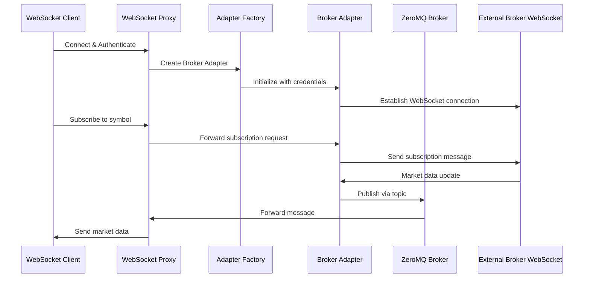

# WebSocket Architecture

## Overview

OpenAlgo features a comprehensive WebSocket infrastructure that enables real-time market data streaming from multiple brokers to client applications. The architecture is designed to be broker-agnostic, scalable, and fault-tolerant.

## Architecture Components

### 1. WebSocket Proxy Server

The `WebSocketProxy` class in `websocket_proxy/server.py` serves as the central hub for WebSocket connections:

- **Client Management**: Handles multiple concurrent WebSocket client connections
- **Authentication**: Validates API keys and manages user sessions
- **Subscription Management**: Tracks client subscriptions to specific market data feeds
- **Message Routing**: Routes market data from broker adapters to appropriate clients
- **Dynamic Port Allocation**: Automatically finds available ports to avoid conflicts

### 2. Broker Adapter Factory

The `broker_factory.py` implements a factory pattern for creating broker-specific WebSocket adapters:

- **Dynamic Loading**: Automatically discovers and loads broker adapters
- **Registry Pattern**: Maintains a registry of available broker adapters
- **Fallback Mechanism**: Supports multiple import paths for adapter discovery

### 3. Base Broker Adapter

The `BaseBrokerWebSocketAdapter` class provides a common interface for all broker implementations:

- **Abstract Interface**: Defines standard methods for subscribe, unsubscribe, connect, disconnect
- **ZeroMQ Integration**: Built-in ZeroMQ publisher for internal message distribution
- **Port Management**: Handles dynamic port allocation with conflict resolution
- **Subscription Tracking**: Maintains state of active subscriptions

### 4. ZeroMQ Message Broker

Internal communication uses ZeroMQ for efficient message passing:

- **Publisher-Subscriber Pattern**: Broker adapters publish market data, proxy subscribes
- **Topic-Based Routing**: Messages are tagged with topics for efficient filtering
- **Asynchronous Processing**: Non-blocking message processing for high throughput

## Data Flow Architecture



## Subscription Management

### Topic Format

Market data topics follow a standardized format:
- Standard: `BROKER_EXCHANGE_SYMBOL_MODE`
- Index data: `BROKER_NSE_INDEX_SYMBOL_MODE`
- Legacy support: `EXCHANGE_SYMBOL_MODE`

### Subscription Modes

1. **LTP (Last Traded Price)**: Mode 1 - Basic price updates
2. **Quote**: Mode 2 - Bid/ask prices with volume
3. **Depth**: Mode 3 - Full market depth (5/20/30 levels)

### State Management

- **Client Subscriptions**: Tracked per client with JSON serialization
- **Broker Connections**: Maintained per user to avoid duplicate connections
- **Cleanup Handling**: Automatic cleanup on client disconnect with broker-specific logic

## Broker-Specific Implementations

Each broker has its own adapter implementation in `broker/{broker_name}/streaming/`:

### Example: Angel One Adapter
- **Location**: `broker/angel/streaming/angel_adapter.py`
- **Features**: Supports LTP, Quote, and Depth modes
- **WebSocket**: Native Angel One WebSocket API integration

### Example: Flattrade Adapter
- **Location**: `broker/flattrade/streaming/flattrade_adapter.py`
- **Features**: Persistent connection management
- **Special Handling**: Keeps connections alive on client disconnect

### Example: Zerodha Adapter
- **Location**: `broker/zerodha/streaming/zerodha_adapter.py`
- **Features**: KiteConnect WebSocket integration
- **Mapping**: Symbol normalization and data transformation

## Error Handling and Resilience

### Connection Management
- **Auto-reconnection**: Automatic reconnection on broker WebSocket failures
- **Graceful Degradation**: Service continues for other clients on individual failures
- **Resource Cleanup**: Proper cleanup of ZMQ resources and port allocations

### Error Categories
1. **Authentication Errors**: Invalid API keys or expired sessions
2. **Broker Errors**: Connection failures or API limitations
3. **Subscription Errors**: Invalid symbols or unsupported modes
4. **Network Errors**: WebSocket connection drops or timeouts

### Logging Integration
- **Structured Logging**: Consistent log format across all components
- **Error Tracking**: Detailed error messages with context
- **Performance Monitoring**: Connection and subscription metrics

## Configuration

### Environment Variables

```bash
# WebSocket Server Configuration
WEBSOCKET_HOST=localhost
WEBSOCKET_PORT=8765

# ZeroMQ Configuration
ZMQ_HOST=localhost
ZMQ_PORT=5555

# Broker Configuration
VALID_BROKERS=angel,zerodha,flattrade
BROKER_API_KEY=your_api_key
BROKER_API_SECRET=your_api_secret
```

### Dynamic Configuration
- **Port Auto-discovery**: Automatically finds available ports
- **Broker Auto-detection**: Determines user's broker from database
- **Capability Detection**: Discovers broker-specific features

## Security Considerations

### Authentication
- **API Key Validation**: All connections require valid API keys
- **User Isolation**: Each user's data is isolated from others
- **Session Management**: Proper session cleanup on disconnect

### Data Protection
- **Sensitive Data Filtering**: Automatic redaction of credentials in logs
- **Secure Transmission**: WebSocket connections support TLS
- **Access Control**: Subscription access based on user permissions

## Performance Optimization

### Connection Pooling
- **Shared Connections**: One broker connection per user across multiple clients
- **Resource Reuse**: Efficient use of WebSocket connections
- **Memory Management**: Proper cleanup of inactive connections

### Message Processing
- **Asynchronous Processing**: Non-blocking message handling
- **Batch Processing**: Efficient handling of multiple subscriptions
- **Topic Filtering**: ZeroMQ topic-based filtering for performance

### Scalability Features
- **Horizontal Scaling**: Multiple proxy instances can run concurrently
- **Load Distribution**: ZeroMQ handles load distribution automatically
- **Resource Monitoring**: Built-in monitoring of connection and subscription counts

## Monitoring and Debugging

### Logging Features
- **Component-specific Loggers**: Separate loggers for proxy, adapters, and factory
- **Color-coded Output**: Enhanced readability with colored log levels
- **URL Highlighting**: Prominent display of service URLs
- **Sensitive Data Protection**: Automatic redaction of credentials

### Metrics Collection
- **Connection Metrics**: Track active connections and subscription counts
- **Performance Metrics**: Monitor message throughput and latency
- **Error Rates**: Track error frequencies by type and broker

### Debugging Tools
- **Detailed Error Messages**: Comprehensive error information with context
- **Connection State Tracking**: Real-time visibility into connection states
- **Message Tracing**: Ability to trace message flow through the system

## Future Enhancements

### Planned Features
1. **WebSocket Clustering**: Multi-instance deployment with load balancing
2. **Enhanced Monitoring**: Integration with monitoring systems like Prometheus
3. **Circuit Breakers**: Automatic fault isolation for failing brokers
4. **Rate Limiting**: Prevent abuse with subscription rate limits
5. **Data Persistence**: Optional persistence of market data streams

### Extensibility
- **Plugin Architecture**: Easy addition of new broker adapters
- **Custom Protocols**: Support for broker-specific WebSocket protocols
- **Data Transformation**: Pluggable data transformation pipelines
- **Authentication Providers**: Support for additional authentication methods