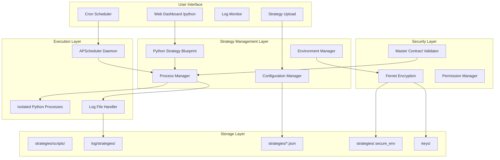

# Python Strategy Hosting System

## Overview

The Python Strategy Hosting System is a comprehensive solution for deploying, managing, and monitoring automated trading strategies within the OpenAlgo platform. Accessible via the `/python` route, this system provides traders with a web-based interface to upload, schedule, and control Python-based trading strategies with complete process isolation and monitoring capabilities.

## Architecture

### System Components



## Core Features

### 1. Strategy Upload and Management

**File Structure:**
```
strategies/
├── scripts/              # Python strategy files
│   ├── strategy1_20250907011910.py
│   └── strategy2_20250908143022.py
├── strategy_configs.json # Strategy configurations
├── strategy_env.json     # Regular environment variables
└── .secure_env          # Encrypted sensitive variables
```

**Upload Process:**
1. User uploads `.py` file through web interface
2. System generates unique ID with timestamp
3. File saved to `strategies/scripts/` directory
4. Configuration entry created in `strategy_configs.json`
5. File permissions set appropriately for OS

### 2. Process Isolation

Each strategy runs in a completely isolated Python process:

```python
# Process creation with platform-specific handling
def create_subprocess_args():
    args = {
        'stdout': subprocess.PIPE,
        'stderr': subprocess.STDOUT,
        'universal_newlines': False,
        'bufsize': 1,  # Line buffered
    }
    
    if IS_WINDOWS:
        # Windows-specific isolation
        args['creationflags'] = subprocess.CREATE_NEW_PROCESS_GROUP
        args['startupinfo'] = subprocess.STARTUPINFO()
        args['startupinfo'].dwFlags |= subprocess.STARTF_USESHOWWINDOW
    else:
        # Unix-like systems (Linux, macOS)
        args['start_new_session'] = True
        args['preexec_fn'] = os.setsid
    
    return args
```

**Benefits:**
- Complete isolation between strategies
- Strategy crash doesn't affect platform
- Independent resource allocation
- Clean process termination

### 3. Scheduling System

**APScheduler Integration:**
- Cron-like scheduling with IST timezone support
- Automatic start/stop at specified times
- Weekday/weekend scheduling options
- Persistent schedule across restarts

**Schedule Configuration:**
```json
{
  "strategy_id": {
    "is_scheduled": true,
    "schedule_start": "09:15",
    "schedule_stop": "15:30",
    "schedule_days": ["mon", "tue", "wed", "thu", "fri"]
  }
}
```

### 4. Environment Variable Management

**Two-Tier Variable System:**

1. **Regular Variables** (`strategy_env.json`):
   - Non-sensitive configuration
   - Stored in plain JSON
   - Easy to modify and backup

2. **Secure Variables** (`.secure_env`):
   - API keys, passwords, tokens
   - Encrypted using Fernet symmetric encryption
   - Key stored in `keys/.encryption_key`
   - Restrictive file permissions (700)

**Encryption Implementation:**
```python
# Generate or retrieve encryption key
def get_or_create_encryption_key():
    key_file = Path('keys') / '.encryption_key'
    if key_file.exists():
        with open(key_file, 'rb') as f:
            return f.read()
    else:
        key = Fernet.generate_key()
        key_file.parent.mkdir(parents=True, exist_ok=True)
        with open(key_file, 'wb') as f:
            f.write(key)
        if not IS_WINDOWS:
            os.chmod(key_file, 0o600)
        return key
```

### 5. Logging System

**Comprehensive Logging:**
- Separate log file for each strategy run
- IST timestamp in filenames
- Real-time log streaming to web interface
- Log rotation and cleanup capabilities

**Log File Naming:**
```
log/strategies/
├── strategy1_20250910_091500_IST.log
├── strategy1_20250910_153000_IST.log
└── strategy2_20250910_093000_IST.log
```

### 6. Master Contract Dependency

**Validation Before Execution:**
- Checks if broker master contracts are downloaded
- Prevents strategy start if contracts not ready
- Automatic retry when contracts become available
- Error state management with clear messaging

### 7. State Management

**Strategy States:**
- **Pending**: Not yet started
- **Running**: Currently executing
- **Scheduled**: Configured for automatic execution
- **Error**: Failed to start or crashed
- **Stopped**: Manually or automatically stopped

**State Persistence:**
- States saved to `strategy_configs.json`
- Automatic restoration after system restart
- Process recovery for running strategies
- Error state tracking with timestamps

## Security Considerations

### 1. File System Security

```bash
# Directory permissions (Ubuntu/Linux)
strategies/          # 755 - Read/execute for all
strategies/scripts/  # 755 - Strategy files
log/strategies/      # 755 - Log files
keys/               # 700 - Only owner access
```

### 2. Process Security

- Runs as `www-data` user (Linux) or appropriate service user
- No elevated privileges required
- Process isolation prevents cross-strategy access
- Resource limits can be applied per process

### 3. API Key Protection

- Encrypted storage for sensitive data
- Keys never logged or displayed in UI
- Separate storage from regular configuration
- Automatic key rotation support

## Platform Compatibility

### Windows Support
- Uses `CREATE_NEW_PROCESS_GROUP` for process isolation
- Handles path separators correctly
- Compatible with Windows Service wrapper

### Linux/Ubuntu Support
- Uses `setsid` for process group creation
- Systemd service integration
- Proper signal handling (SIGTERM, SIGKILL)

### macOS Support
- Similar to Linux with BSD-specific handling
- LaunchAgent compatibility for auto-start
- Proper permission management

## Web Interface Routes

### Main Routes

| Route | Method | Description |
|-------|--------|-------------|
| `/python/` | GET | Main dashboard |
| `/python/new` | GET/POST | Upload new strategy |
| `/python/start/<id>` | POST | Start strategy |
| `/python/stop/<id>` | POST | Stop strategy |
| `/python/schedule/<id>` | POST | Schedule strategy |
| `/python/delete/<id>` | POST | Delete strategy |
| `/python/logs/<id>` | GET | View logs |
| `/python/edit/<id>` | GET/POST | Edit strategy code |
| `/python/env/<id>` | GET/POST | Manage environment variables |
| `/python/status` | GET | System status |

## Integration with OpenAlgo

### 1. API Access

Strategies can use the OpenAlgo Python client:

```python
from openalgo import api

# Initialize client with API key from environment
client = api(
    api_key=os.getenv('OPENALGO_API_KEY'),
    host='http://localhost:5000'
)

# Use all OpenAlgo API features
positions = client.positions()
order_id = client.place_order(...)
```

### 2. Database Access

Strategies share the same database but have read-only access by default:
- Can read market data
- Can read account information
- Cannot modify system configuration
- Audit trail for all operations

### 3. WebSocket Integration

Strategies can subscribe to real-time market data:
```python
# Connect to WebSocket feed
ws = client.ws_connect()
ws.subscribe(['NSE:NIFTY50', 'NSE:RELIANCE'])
ws.on_tick = on_tick_handler
```

## Deployment Considerations

### 1. Resource Requirements

**Minimum Requirements:**
- RAM: 512MB per strategy (typical)
- CPU: Minimal (< 5% per strategy)
- Disk: 10MB per strategy + logs
- Network: Depends on data requirements

### 2. Scaling Considerations

**Vertical Scaling:**
- Add more RAM for more concurrent strategies
- Faster CPU for computation-heavy strategies
- SSD for better log performance

**Horizontal Scaling:**
- Multiple OpenAlgo instances possible
- Load balancing for web interface
- Shared database for coordination

### 3. Monitoring and Alerting

**Built-in Monitoring:**
- Process status checking
- Memory usage tracking
- Log file size monitoring
- Error state detection

**External Monitoring:**
- Prometheus metrics export
- Health check endpoints
- System resource alerts
- Strategy performance metrics

## Best Practices

### 1. Strategy Development

- **Error Handling**: Always implement try-catch blocks
- **Logging**: Use appropriate log levels
- **Resource Cleanup**: Close connections properly
- **State Management**: Handle interruptions gracefully

### 2. Security

- **API Keys**: Never hardcode credentials
- **Validation**: Validate all inputs
- **Rate Limiting**: Respect broker rate limits
- **Audit**: Log all trading decisions

### 3. Performance

- **Efficiency**: Optimize loops and calculations
- **Caching**: Cache frequently used data
- **Batch Operations**: Group API calls when possible
- **Memory Management**: Release unused objects

## Troubleshooting

### Common Issues and Solutions

1. **Strategy Won't Start**
   - Check master contracts are downloaded
   - Verify Python syntax in strategy file
   - Check environment variables are set
   - Review logs for specific errors

2. **Strategy Crashes Immediately**
   - Check import statements
   - Verify API credentials
   - Check broker connection
   - Review strategy logs

3. **Scheduling Not Working**
   - Verify timezone settings (IST)
   - Check APScheduler daemon status
   - Verify cron expression syntax
   - Check system time accuracy

4. **Permission Errors**
   - Verify directory permissions
   - Check file ownership
   - Ensure www-data user access
   - Review SELinux/AppArmor policies

## Future Enhancements

### Planned Features

1. **Strategy Marketplace**
   - Share strategies with community
   - Version control integration
   - Strategy templates library

2. **Advanced Monitoring**
   - Real-time P&L tracking
   - Performance analytics
   - Risk metrics dashboard

3. **Backtesting Integration**
   - Historical data replay
   - Strategy optimization
   - Walk-forward analysis

4. **Multi-Account Support**
   - Run strategies on multiple accounts
   - Account-level isolation
   - Centralized management

5. **Cloud Deployment**
   - AWS Lambda support
   - Kubernetes orchestration
   - Auto-scaling capabilities