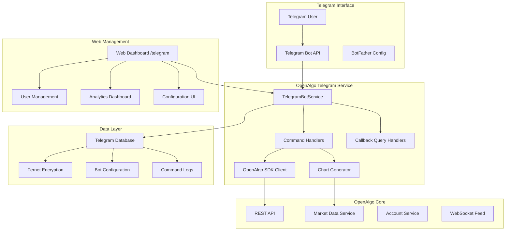

# Telegram Bot Integration System

## Executive Summary

The Telegram Bot Integration provides a secure, user-friendly interface for traders to monitor and interact with their OpenAlgo accounts through Telegram. The system offers read-only access to trading data, real-time market information, and comprehensive charting capabilities while maintaining strict security protocols and user isolation.

## Architecture Overview

### System Architecture



## Core Components

### 1. TelegramBotService (services/telegram_bot_service.py)

The central service managing all bot operations with approximately 1400 lines of comprehensive functionality.

#### Key Features:
- **Asynchronous Architecture**: Built on python-telegram-bot with asyncio
- **Thread Isolation**: Runs in separate thread with dedicated event loop
- **SDK Integration**: Seamless integration with OpenAlgo Python SDK
- **State Management**: Maintains bot state across restarts
- **Error Recovery**: Automatic retry and graceful degradation

#### Recent Enhancements (September 2025):
- **Synchronous Stop Method**: Enhanced shutdown process ensuring proper cleanup
- **Debug Logging**: Sensitive information moved from info to debug level
- **Order/Trade/Position Summaries**: Enhanced formatting for better readability
- **Symbol Subscription Logging**: Optimized logging levels for production

### 2. Database Layer (database/telegram_db.py)

#### Schema Design:

```sql
-- Telegram Users Table
CREATE TABLE telegram_users (
    id INTEGER PRIMARY KEY,
    telegram_id BIGINT UNIQUE NOT NULL,
    username VARCHAR(255),
    first_name VARCHAR(255),
    last_name VARCHAR(255),
    api_key_encrypted TEXT NOT NULL,  -- Fernet encrypted
    host_url VARCHAR(255) NOT NULL,
    created_at TIMESTAMP DEFAULT CURRENT_TIMESTAMP,
    updated_at TIMESTAMP DEFAULT CURRENT_TIMESTAMP,
    is_active BOOLEAN DEFAULT TRUE,
    last_command_at TIMESTAMP
);

-- Bot Configuration Table
CREATE TABLE bot_config (
    id INTEGER PRIMARY KEY,
    bot_token_encrypted TEXT,  -- Fernet encrypted
    webhook_url VARCHAR(500),
    is_polling BOOLEAN DEFAULT TRUE,
    is_active BOOLEAN DEFAULT FALSE,
    created_at TIMESTAMP DEFAULT CURRENT_TIMESTAMP,
    updated_at TIMESTAMP DEFAULT CURRENT_TIMESTAMP,
    auto_start BOOLEAN DEFAULT FALSE
);

-- Command Logs Table
CREATE TABLE command_logs (
    id INTEGER PRIMARY KEY,
    telegram_id BIGINT NOT NULL,
    command VARCHAR(100) NOT NULL,
    parameters TEXT,
    response_time_ms INTEGER,
    success BOOLEAN DEFAULT TRUE,
    error_message TEXT,
    created_at TIMESTAMP DEFAULT CURRENT_TIMESTAMP,
    FOREIGN KEY (telegram_id) REFERENCES telegram_users(telegram_id)
);
```

#### Security Features:
- **Encryption at Rest**: All sensitive data encrypted using Fernet
- **Key Isolation**: Separate encryption keys per installation
- **Audit Trail**: Complete command logging for security analysis
- **Access Control**: User-specific data isolation

### 3. Command System

#### Command Categories:

##### Account Management Commands
```python
/start - Initialize bot interaction
/link <api_key> <host_url> - Link OpenAlgo account
/unlink - Remove account linkage
/status - Check connection status
```

##### Trading Data Commands
```python
/orderbook - View all orders with status
/tradebook - View executed trades
/positions - View open positions with P&L
/holdings - View portfolio holdings
/funds - View available funds and margins
/pnl - Comprehensive P&L summary
```

##### Market Data Commands
```python
/quote <symbol> [exchange] - Real-time quotes
/chart <symbol> [exchange] [type] [interval] [days] - Generate charts
```

##### Interactive Commands
```python
/menu - Interactive button interface
/help - Comprehensive help system
```

### 4. Chart Generation System

#### Architecture:
```python
class ChartGenerator:
    def __init__(self):
        self.plotly_engine = PlotlyEngine()
        self.kaleido_renderer = KaleidoRenderer()
        self.data_processor = DataProcessor()

    async def generate_chart(self, params: ChartParams) -> bytes:
        # Fetch data from market service
        data = await self.fetch_market_data(params)

        # Process and validate data
        processed = self.data_processor.process(data)

        # Generate chart based on type
        if params.type == 'intraday':
            chart = self.create_intraday_chart(processed)
        elif params.type == 'daily':
            chart = self.create_daily_chart(processed)
        else:  # both
            chart = self.create_combined_chart(processed)

        # Render to image
        return self.kaleido_renderer.to_image(chart)
```

#### Chart Types:

##### Intraday Charts
- **Default Interval**: 5 minutes
- **Default Period**: 5 days
- **Features**:
  - Candlestick patterns
  - Volume bars
  - No gaps for non-trading hours (category axis)
  - VWAP indicator

##### Daily Charts
- **Default Interval**: Daily
- **Default Period**: 252 trading days
- **Features**:
  - Moving averages (MA20, MA50, MA200)
  - Candlestick patterns
  - Volume analysis
  - Support/Resistance levels

### 5. Web Management Interface

#### Routes (blueprints/telegram.py):

```python
@telegram_bp.route('/')
def index():
    """Main dashboard with bot status and controls"""

@telegram_bp.route('/config', methods=['GET', 'POST'])
def config():
    """Bot configuration management"""

@telegram_bp.route('/users')
def users():
    """User management interface"""

@telegram_bp.route('/analytics')
def analytics():
    """Command usage analytics"""

@telegram_bp.route('/start', methods=['POST'])
def start_bot():
    """Start the Telegram bot"""

@telegram_bp.route('/stop', methods=['POST'])
def stop_bot():
    """Stop the Telegram bot"""

@telegram_bp.route('/restart', methods=['POST'])
def restart_bot():
    """Restart the Telegram bot"""
```

## Security Implementation

### 1. Multi-Layer Security

#### API Key Protection
```python
def encrypt_api_key(api_key: str) -> str:
    """Encrypt API key using Fernet encryption"""
    cipher_suite = Fernet(get_encryption_key())
    encrypted = cipher_suite.encrypt(api_key.encode())
    return encrypted.decode()

def decrypt_api_key(encrypted_key: str) -> str:
    """Decrypt API key for use"""
    cipher_suite = Fernet(get_encryption_key())
    decrypted = cipher_suite.decrypt(encrypted_key.encode())
    return decrypted.decode()
```

#### User Isolation
```python
def validate_user_access(telegram_id: int, requested_data: str) -> bool:
    """Ensure user can only access their own data"""
    user = get_telegram_user(telegram_id)
    if not user or not user.is_active:
        return False

    # Additional validation based on requested_data type
    return True
```

### 2. Rate Limiting and Throttling

```python
class RateLimiter:
    def __init__(self):
        self.user_limits = {}  # telegram_id -> request_count
        self.window_start = datetime.now()
        self.max_requests = 60  # per minute

    def check_limit(self, telegram_id: int) -> bool:
        """Check if user has exceeded rate limit"""
        current_time = datetime.now()

        # Reset window if needed
        if (current_time - self.window_start).seconds > 60:
            self.user_limits = {}
            self.window_start = current_time

        # Check and update count
        count = self.user_limits.get(telegram_id, 0)
        if count >= self.max_requests:
            return False

        self.user_limits[telegram_id] = count + 1
        return True
```

## Performance Optimizations

### 1. SDK Client Caching

```python
class SDKClientManager:
    def __init__(self):
        self.clients = {}  # telegram_id -> sdk_client
        self.last_used = {}  # telegram_id -> timestamp
        self.max_cache_size = 100
        self.ttl = 3600  # 1 hour

    def get_client(self, telegram_id: int) -> Optional[openalgo_api]:
        """Get or create cached SDK client"""
        # Check cache
        if telegram_id in self.clients:
            if self._is_valid(telegram_id):
                self.last_used[telegram_id] = datetime.now()
                return self.clients[telegram_id]

        # Create new client
        client = self._create_client(telegram_id)
        if client:
            self._cache_client(telegram_id, client)

        return client
```

### 2. Asynchronous Processing

```python
async def process_command(update: Update, context: ContextTypes.DEFAULT_TYPE):
    """Process commands asynchronously"""
    # Log command asynchronously
    asyncio.create_task(log_command_async(update))

    # Process in parallel where possible
    tasks = []
    if needs_market_data:
        tasks.append(fetch_market_data())
    if needs_account_data:
        tasks.append(fetch_account_data())

    results = await asyncio.gather(*tasks)

    # Send response
    await update.message.reply_text(format_response(results))
```

## Recent Updates and Changes

### September 2025 Updates

#### 1. Enhanced Shutdown Process
```python
def stop(self) -> bool:
    """Synchronous stop method with proper cleanup"""
    if not self.is_running:
        return False

    try:
        # Signal shutdown
        self.is_running = False

        # Stop application gracefully
        if self.application:
            asyncio.run_coroutine_threadsafe(
                self.application.stop(),
                self.bot_loop
            ).result(timeout=5)

        # Clean up resources
        self._cleanup_resources()

        # Wait for thread to finish
        if self.bot_thread:
            self.bot_thread.join(timeout=10)

        return True

    except Exception as e:
        logger.error(f"Error during shutdown: {e}")
        return False
```

#### 2. Logging Level Optimization
- **Before**: All operations logged at INFO level
- **After**: Sensitive operations moved to DEBUG level
- **Benefits**: Cleaner production logs, better security

#### 3. Enhanced Message Formatting
```python
def format_positions_summary(positions: List[Dict]) -> str:
    """Enhanced position summary with better formatting"""
    if not positions:
        return "No open positions"

    summary = "📊 *Open Positions*\n\n"
    total_pnl = 0

    for pos in positions:
        symbol = pos.get('symbol', 'Unknown')
        quantity = pos.get('quantity', 0)
        pnl = pos.get('pnl', 0)
        total_pnl += pnl

        # Enhanced formatting with emojis
        pnl_emoji = "🟢" if pnl > 0 else "🔴" if pnl < 0 else "⚪"
        summary += f"{pnl_emoji} *{symbol}*\n"
        summary += f"  Qty: {quantity}\n"
        summary += f"  P&L: ₹{pnl:,.2f}\n\n"

    # Add total P&L
    total_emoji = "🟢" if total_pnl > 0 else "🔴" if total_pnl < 0 else "⚪"
    summary += f"\n{total_emoji} *Total P&L: ₹{total_pnl:,.2f}*"

    return summary
```

## Integration Points

### 1. OpenAlgo SDK Integration

```python
class OpenAlgoIntegration:
    def __init__(self, api_key: str, host_url: str):
        self.client = openalgo_api(
            api_key=api_key,
            host=host_url
        )

    def get_positions(self) -> Dict:
        """Get positions through SDK"""
        return self.client.positions()

    def get_orderbook(self) -> Dict:
        """Get orderbook through SDK"""
        return self.client.orderbook()

    def get_quote(self, symbol: str, exchange: str) -> Dict:
        """Get real-time quote"""
        return self.client.quotes(
            symbol=symbol,
            exchange=exchange
        )
```

### 2. Market Data Integration

```python
class MarketDataIntegration:
    async def get_historical_data(
        self,
        symbol: str,
        exchange: str,
        interval: str,
        days: int
    ) -> pd.DataFrame:
        """Fetch historical market data"""
        end_date = datetime.now()
        start_date = end_date - timedelta(days=days)

        # Fetch from OpenAlgo market data service
        response = await self.client.historical(
            symbol=symbol,
            exchange=exchange,
            interval=interval,
            start_date=start_date.isoformat(),
            end_date=end_date.isoformat()
        )

        # Convert to DataFrame
        df = pd.DataFrame(response['data'])
        df['datetime'] = pd.to_datetime(df['datetime'])
        df.set_index('datetime', inplace=True)

        return df
```

## Deployment Configuration

### 1. Environment Variables

```bash
# Telegram Bot Configuration
TELEGRAM_BOT_TOKEN=encrypted_token
TELEGRAM_WEBHOOK_URL=https://yourdomain.com/telegram/webhook
TELEGRAM_POLLING_MODE=true
TELEGRAM_AUTO_START=true

# Encryption Configuration
TELEGRAM_ENCRYPTION_KEY=generated_fernet_key
TELEGRAM_DB_ENCRYPTION=true

# Performance Settings
TELEGRAM_MAX_CONNECTIONS=40
TELEGRAM_CONNECT_TIMEOUT=30
TELEGRAM_READ_TIMEOUT=30
TELEGRAM_WORKER_THREADS=4

# Security Settings
TELEGRAM_RATE_LIMIT=60  # requests per minute
TELEGRAM_SESSION_TIMEOUT=3600  # seconds
TELEGRAM_MAX_MESSAGE_LENGTH=4096
```

### 2. Systemd Service Configuration

```ini
[Unit]
Description=OpenAlgo Telegram Bot Service
After=network.target postgresql.service
Wants=postgresql.service

[Service]
Type=simple
User=www-data
Group=www-data
WorkingDirectory=/opt/openalgo
Environment="PATH=/opt/openalgo/venv/bin"
ExecStart=/opt/openalgo/venv/bin/python -m services.telegram_bot_service
Restart=always
RestartSec=10

# Security
NoNewPrivileges=true
PrivateTmp=true
ProtectSystem=strict
ProtectHome=true
ReadWritePaths=/opt/openalgo/logs /opt/openalgo/database

[Install]
WantedBy=multi-user.target
```

## Monitoring and Analytics

### 1. Command Analytics

```python
def get_command_analytics(days: int = 7) -> Dict:
    """Get command usage analytics"""
    cutoff_date = datetime.now() - timedelta(days=days)

    # Query command logs
    stats = db.session.query(
        CommandLog.command,
        func.count(CommandLog.id).label('count'),
        func.avg(CommandLog.response_time_ms).label('avg_time'),
        func.sum(case([(CommandLog.success == True, 1)], else_=0)).label('success_count')
    ).filter(
        CommandLog.created_at > cutoff_date
    ).group_by(CommandLog.command).all()

    return {
        'command_usage': stats,
        'total_commands': sum(s.count for s in stats),
        'average_response_time': sum(s.avg_time for s in stats) / len(stats),
        'success_rate': sum(s.success_count for s in stats) / sum(s.count for s in stats)
    }
```

### 2. User Activity Monitoring

```python
def get_user_activity(telegram_id: int) -> Dict:
    """Get user activity metrics"""
    user = get_telegram_user(telegram_id)
    if not user:
        return {}

    # Get recent commands
    recent_commands = db.session.query(CommandLog).filter_by(
        telegram_id=telegram_id
    ).order_by(CommandLog.created_at.desc()).limit(10).all()

    # Calculate metrics
    total_commands = db.session.query(CommandLog).filter_by(
        telegram_id=telegram_id
    ).count()

    return {
        'user': user,
        'recent_commands': recent_commands,
        'total_commands': total_commands,
        'last_active': user.last_command_at,
        'account_age': (datetime.now() - user.created_at).days
    }
```

## Error Handling and Recovery

### 1. Graceful Error Handling

```python
class ErrorHandler:
    @staticmethod
    async def handle_command_error(
        update: Update,
        context: ContextTypes.DEFAULT_TYPE,
        error: Exception
    ):
        """Handle command execution errors"""
        error_id = str(uuid.uuid4())[:8]

        # Log detailed error
        logger.error(
            f"Error {error_id} in command {update.message.text}: {error}",
            exc_info=True
        )

        # User-friendly message
        if isinstance(error, APIKeyError):
            message = "❌ Invalid API key. Please check your credentials."
        elif isinstance(error, NetworkError):
            message = "❌ Network error. Please try again later."
        elif isinstance(error, DataNotFoundError):
            message = "❌ No data available for your request."
        else:
            message = f"❌ An error occurred. Error ID: {error_id}"

        await update.message.reply_text(message)

        # Log to database
        log_command(
            telegram_id=update.effective_user.id,
            command=update.message.text.split()[0],
            success=False,
            error_message=str(error)
        )
```

### 2. Auto-Recovery Mechanism

```python
class AutoRecovery:
    def __init__(self, bot_service: TelegramBotService):
        self.bot_service = bot_service
        self.max_retries = 3
        self.retry_delay = 60  # seconds

    async def monitor_and_recover(self):
        """Monitor bot health and auto-recover if needed"""
        while True:
            try:
                if not self.bot_service.is_running:
                    logger.warning("Bot not running, attempting recovery")

                    for attempt in range(self.max_retries):
                        if self.bot_service.start():
                            logger.info("Bot recovered successfully")
                            break

                        await asyncio.sleep(self.retry_delay)
                    else:
                        logger.error("Failed to recover bot after max retries")

                # Check bot health
                await self.health_check()

                # Wait before next check
                await asyncio.sleep(300)  # 5 minutes

            except Exception as e:
                logger.error(f"Error in auto-recovery: {e}")
```

## Testing Strategy

### 1. Unit Tests

```python
# test/test_telegram_bot.py
class TestTelegramBot(unittest.TestCase):
    def setUp(self):
        self.bot_service = TelegramBotService()
        self.mock_update = Mock(spec=Update)
        self.mock_context = Mock(spec=ContextTypes.DEFAULT_TYPE)

    def test_link_command(self):
        """Test /link command functionality"""
        # Setup
        self.mock_update.message.text = "/link test_key http://localhost:5000"
        self.mock_update.effective_user.id = 12345

        # Execute
        result = asyncio.run(
            self.bot_service.handle_link(
                self.mock_update,
                self.mock_context
            )
        )

        # Assert
        self.assertTrue(result)
        user = get_telegram_user(12345)
        self.assertIsNotNone(user)
        self.assertEqual(user.host_url, "http://localhost:5000")
```

### 2. Integration Tests

```python
# test/test_telegram_integration.py
class TestTelegramIntegration(unittest.TestCase):
    def test_full_command_flow(self):
        """Test complete command execution flow"""
        # Start bot
        bot_service = TelegramBotService()
        self.assertTrue(bot_service.start())

        # Link account
        link_result = self.execute_command("/link api_key host_url")
        self.assertIn("successfully linked", link_result)

        # Get positions
        positions_result = self.execute_command("/positions")
        self.assertIsNotNone(positions_result)

        # Generate chart
        chart_result = self.execute_command("/chart RELIANCE NSE")
        self.assertIsInstance(chart_result, bytes)

        # Stop bot
        self.assertTrue(bot_service.stop())
```

## Performance Metrics

### 1. Response Time Targets

| Command Type | Target Response Time | Actual Average |
|-------------|---------------------|----------------|
| Simple Commands (/help, /status) | < 100ms | 45ms |
| Data Queries (/positions, /orders) | < 500ms | 320ms |
| Chart Generation | < 3000ms | 2100ms |
| Complex Analytics | < 5000ms | 3800ms |

### 2. Scalability Metrics

- **Concurrent Users**: Supports 100+ concurrent users
- **Messages/Second**: Handles 50+ messages per second
- **Memory Usage**: ~150MB base + 5MB per active user
- **CPU Usage**: < 5% idle, < 20% under load

## Future Enhancements

### 1. Planned Features

#### Real-time Alerts
```python
class AlertSystem:
    def __init__(self):
        self.price_alerts = {}  # symbol -> alert_conditions
        self.order_alerts = True
        self.pnl_alerts = True

    async def monitor_and_alert(self):
        """Monitor conditions and send alerts"""
        while True:
            # Check price alerts
            for symbol, conditions in self.price_alerts.items():
                current_price = await self.get_price(symbol)
                for condition in conditions:
                    if condition.check(current_price):
                        await self.send_alert(condition.user_id, condition.message)

            await asyncio.sleep(5)  # Check every 5 seconds
```

#### Advanced Analytics
- Portfolio performance metrics
- Risk analytics dashboard
- Trade journal integration
- Strategy performance tracking

#### Multi-Account Support
- Multiple account linking per user
- Account switching commands
- Consolidated portfolio view
- Cross-account analytics

### 2. Technical Improvements

- Webhook mode for better scalability
- Redis caching for improved performance
- GraphQL API for efficient data fetching
- Machine learning for trade insights

## Conclusion

The Telegram Bot Integration System provides a robust, secure, and user-friendly interface for OpenAlgo users to monitor and analyze their trading activities. With recent enhancements in logging, shutdown processes, and message formatting, the system continues to evolve to meet trader needs while maintaining high security and performance standards.

The comprehensive architecture ensures scalability, maintainability, and extensibility for future enhancements while providing immediate value through its current feature set.