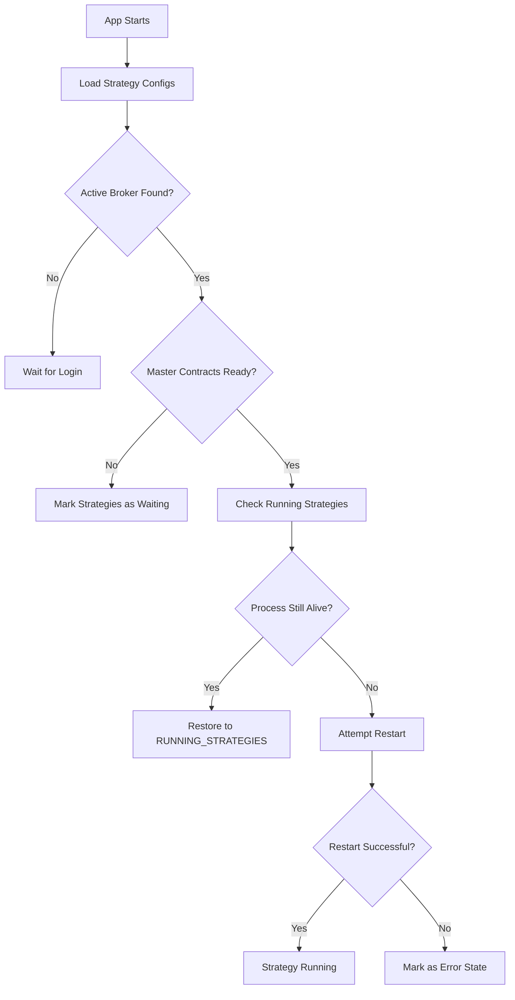
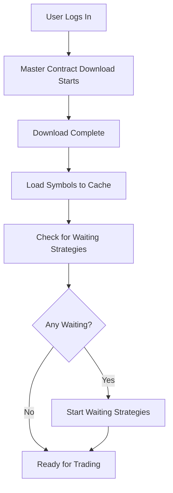

# Master Contract Dependency & State Management

## Overview

The Python Strategy Management System includes advanced features for handling master contract dependencies and maintaining strategy state across application restarts. This ensures reliable 24x5 operation of trading strategies.

## Master Contract Dependency

### Why Master Contracts Matter

Master contracts contain critical information about trading instruments including:
- Symbol mappings and instrument tokens
- Trading hours and market segments
- Lot sizes and tick values
- Contract specifications

**Without master contracts, trading strategies cannot:**
- Place orders correctly
- Get real-time market data
- Calculate position sizes
- Validate trading symbols

### How It Works

#### 1. Dependency Checking
When a strategy attempts to start, the system:
1. Checks if master contracts are downloaded for the current broker
2. If not ready, marks the strategy as "Waiting for master contracts"
3. Prevents strategy execution until contracts are available

#### 2. Automatic Recovery
Once master contracts are successfully downloaded:
1. System automatically detects waiting strategies
2. Clears the waiting state
3. Starts strategies that were previously waiting
4. No manual intervention required

#### 3. Visual Indicators

The UI provides clear status indicators:

| State | Badge Color | Icon | Description |
|-------|------------|------|-------------|
| Ready | Green | ✓ | Master contracts downloaded, strategies can run |
| Waiting | Yellow | ⏰ | Waiting for master contracts to download |
| Error | Red | ⚠ | Actual error requiring user intervention |

### Manual Controls

#### Check & Start Button
- Available in the Master Contract status widget
- Manually triggers contract check
- Starts any pending strategies if contracts are ready
- Useful for forcing immediate check after login

## State Management

### Persistent State

The system maintains strategy state across:
- Application restarts
- Server reboots
- User logout/login cycles
- Session timeouts

### State Information Preserved

```json
{
  "strategy_id": {
    "name": "Strategy Name",
    "file_path": "strategies/scripts/strategy.py",
    "is_running": true,
    "is_scheduled": false,
    "is_error": false,
    "pid": 12345,
    "last_started": "2024-09-07T09:15:00+05:30",
    "last_stopped": null,
    "error_message": null,
    "error_time": null
  }
}
```

### State Restoration Process

#### On Application Startup



#### After User Login



### Error State Management

#### Types of Error States

1. **Waiting State** (Yellow Badge)
   - Cause: Master contracts not ready
   - Resolution: Automatic when contracts download
   - User Action: None required

2. **Error State** (Red Badge)
   - Cause: Strategy crash, syntax error, import failure
   - Resolution: Manual intervention required
   - User Action: Fix code, clear error, restart

#### Error Recovery Options

- **Clear Error**: Removes error state, allows restart
- **Restart**: Attempts to start strategy after clearing error
- **Edit**: Fix strategy code if there's a syntax/logic error
- **Delete**: Remove problematic strategy

### Process Recovery

#### Orphaned Process Detection
The system detects and handles orphaned processes:
```python
# Check if process from previous session is still running
if psutil.pid_exists(pid):
    process = psutil.Process(pid)
    # Verify it's actually our strategy process
    if strategy_file in process.cmdline():
        # Restore to RUNNING_STRATEGIES
```

#### Process Type Handling
The system handles both:
- `subprocess.Popen` objects (new strategies)
- `psutil.Process` objects (restored strategies)

## Safety Features

### Running Strategy Protection

When a strategy is running, the following are disabled:
- Schedule modifications
- Environment variable changes
- Code editing
- File deletion

This prevents:
- Accidental disruption of running strategies
- Configuration conflicts
- Data corruption
- Unexpected behavior

### Atomic Operations

All state changes are atomic:
1. Update in-memory state
2. Save to configuration file
3. Confirm operation success
4. Update UI

## Configuration Files

### Strategy Configurations
**File**: `strategies/strategy_configs.json`
```json
{
  "ema_crossover_20240907": {
    "name": "EMA Crossover",
    "file_path": "strategies/scripts/ema_crossover.py",
    "is_running": true,
    "pid": 12345,
    "is_error": false,
    "last_started": "2024-09-07T09:15:00+05:30"
  }
}
```

### Master Contract Status
**Database Table**: `master_contract_status`
```sql
CREATE TABLE master_contract_status (
    broker VARCHAR PRIMARY KEY,
    status VARCHAR,  -- pending, downloading, success, error
    message VARCHAR,
    last_updated DATETIME,
    total_symbols VARCHAR,
    is_ready BOOLEAN
);
```

## Best Practices

### 1. Strategy Design
- Implement proper error handling
- Add retry logic for transient failures
- Log important events for debugging
- Use environment variables for configuration

### 2. Deployment
- Test strategies locally first
- Set up proper scheduling for market hours
- Monitor logs regularly
- Keep backup of strategy files

### 3. Monitoring
- Check Master Contract status after login
- Review error messages in strategy cards
- Monitor system resources (CPU, memory)
- Set up alerts for critical errors

## API Reference

### Check Master Contract Status
```http
GET /api/master-contract/status
```

Response:
```json
{
  "broker": "zerodha",
  "status": "success",
  "message": "Master contracts ready",
  "is_ready": true,
  "total_symbols": "50000"
}
```

### Check and Start Pending Strategies
```http
POST /python/check-contracts
```

Response:
```json
{
  "success": true,
  "message": "Started 2 strategies, 0 failed"
}
```

### Clear Error State
```http
POST /python/clear-error/<strategy_id>
```

Response:
```json
{
  "success": true,
  "message": "Error state cleared"
}
```

## Troubleshooting

### Strategy Shows "Waiting" After Login

**Cause**: Master contracts still downloading
**Solution**: Wait 30-60 seconds for download to complete
**Manual Fix**: Click "Check & Start" button

### Strategy Won't Restart After App Restart

**Possible Causes**:
1. Master contracts not ready
2. Strategy file deleted or moved
3. Syntax error in strategy code
4. Required dependencies missing

**Solutions**:
1. Wait for master contracts
2. Check file exists in `strategies/scripts/`
3. Review error message in UI
4. Check logs in `log/strategies/`

### "No Broker Session Found" Error

**Cause**: App restarted but no active session
**Solution**: Log in to establish broker session
**Prevention**: Ensure auto-login is configured

## Security Considerations

### State File Security
- Configuration files are git-ignored
- No sensitive data in state files
- API keys stored separately in encrypted env vars
- Encryption keys isolated in `keys/` folder with `.gitignore`

### Process Isolation
- Each strategy runs in separate process
- No shared memory between strategies
- Clean process termination on stop

### Recovery Safety
- Verify process ownership before restoration
- Check process command line for strategy file
- Timeout on restart attempts
- Graceful degradation to error state

## Performance Optimization

### Startup Time
- Parallel strategy restoration
- Lazy loading of process handles
- Cached master contract status

### Resource Management
- Automatic cleanup of dead processes
- Log file rotation
- Memory-efficient state storage

## Future Enhancements

### Planned Features
1. Strategy health monitoring
2. Automatic restart on failure
3. Resource usage tracking
4. Strategy performance metrics
5. Distributed strategy execution
6. Strategy versioning and rollback

---

*Last Updated: September 2024*
*Version: 1.0.1*