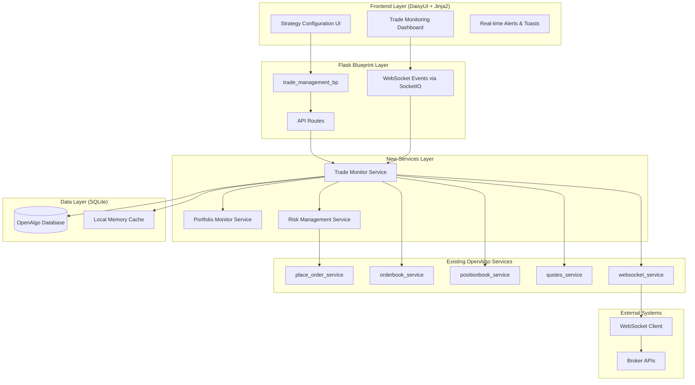
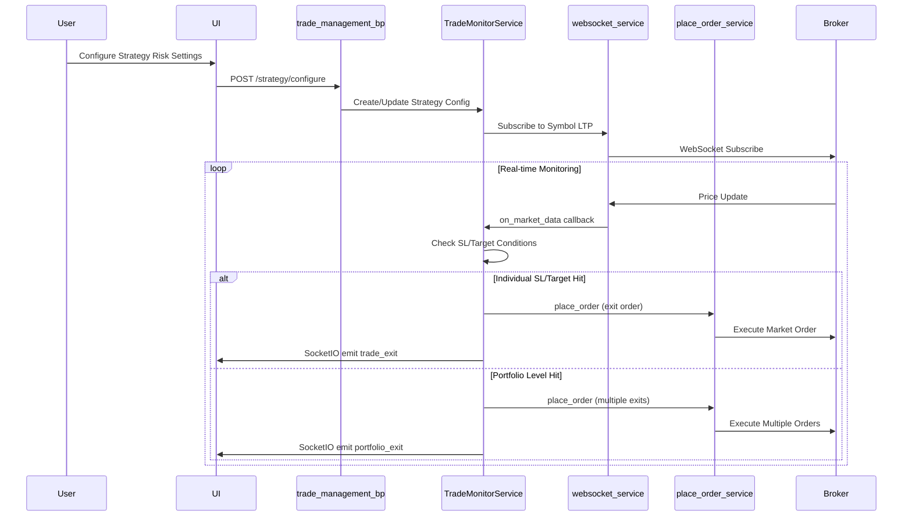

# Enhanced Trade Management Tool - Design Document

## Overview

The Enhanced Trade Management Tool will transform OpenAlgo into a professional-grade trading platform with comprehensive risk management capabilities. The system implements a dual-level risk management approach:

1. **Individual Trade Level**: Each position has its own stop-loss, target, and trailing stop-loss
2. **Portfolio Level**: Strategy-wide risk controls that can close all positions simultaneously

The design leverages OpenAlgo's existing WebSocket infrastructure for real-time price monitoring and integrates seamlessly with the current order management system using the `placesmartorder` API for position exits.

## Architecture

### Integration with OpenAlgo Architecture

The Enhanced Trade Management Tool integrates seamlessly with OpenAlgo's existing single-user architecture:



### Component Interaction Flow



## Components and Interfaces

### 1. Database Schema

#### Active Trades Table
```sql
CREATE TABLE active_trades (
    id INTEGER PRIMARY KEY AUTOINCREMENT,
    user_id VARCHAR(50) NOT NULL,
    strategy_id INTEGER,
    order_id VARCHAR(100) NOT NULL,
    symbol VARCHAR(50) NOT NULL,
    exchange VARCHAR(10) NOT NULL,
    product_type VARCHAR(10) NOT NULL,
    trade_type VARCHAR(10) NOT NULL,  -- 'LONG' or 'SHORT'
    entry_price DECIMAL(10, 2),
    quantity INTEGER NOT NULL,
    stop_loss DECIMAL(10, 2),
    target DECIMAL(10, 2),
    trailing_stop_loss BOOLEAN DEFAULT FALSE,
    trailing_stop_value DECIMAL(10, 2),
    trailing_stop_type VARCHAR(10),  -- 'POINTS' or 'PERCENT'
    current_trailing_sl DECIMAL(10, 2),
    highest_price DECIMAL(10, 2),  -- For LONG trades
    lowest_price DECIMAL(10, 2),   -- For SHORT trades
    current_ltp DECIMAL(10, 2),
    last_sync TIMESTAMP,
    websocket_subscribed BOOLEAN DEFAULT FALSE,
    status VARCHAR(20) DEFAULT 'ACTIVE',
    created_at TIMESTAMP DEFAULT CURRENT_TIMESTAMP,
    updated_at TIMESTAMP DEFAULT CURRENT_TIMESTAMP,
    closed_at TIMESTAMP,
    exit_price DECIMAL(10, 2),
    exit_order_id VARCHAR(100),
    pnl DECIMAL(10, 2),
    FOREIGN KEY (strategy_id) REFERENCES strategies(id) ON DELETE SET NULL
);
```

#### Enhanced Strategies Table
```sql
-- Add columns to existing strategies table
ALTER TABLE strategies ADD COLUMN enable_sl BOOLEAN DEFAULT FALSE;
ALTER TABLE strategies ADD COLUMN sl_type VARCHAR(10);  -- 'PERCENT' or 'POINTS'
ALTER TABLE strategies ADD COLUMN sl_value DECIMAL(10, 2);
ALTER TABLE strategies ADD COLUMN enable_target BOOLEAN DEFAULT FALSE;
ALTER TABLE strategies ADD COLUMN target_type VARCHAR(10);
ALTER TABLE strategies ADD COLUMN target_value DECIMAL(10, 2);
ALTER TABLE strategies ADD COLUMN enable_trailing_sl BOOLEAN DEFAULT FALSE;
ALTER TABLE strategies ADD COLUMN trailing_sl_type VARCHAR(10);
ALTER TABLE strategies ADD COLUMN trailing_sl_value DECIMAL(10, 2);

-- Portfolio level risk management
ALTER TABLE strategies ADD COLUMN allocated_funds DECIMAL(15, 2) DEFAULT 0;
ALTER TABLE strategies ADD COLUMN position_size_type VARCHAR(20);  -- 'FIXED_QUANTITY', 'FIXED_VALUE', 'PERCENT_ALLOCATION'
ALTER TABLE strategies ADD COLUMN position_size_value DECIMAL(15, 2);
ALTER TABLE strategies ADD COLUMN max_open_positions INTEGER DEFAULT 5;
ALTER TABLE strategies ADD COLUMN daily_loss_limit DECIMAL(15, 2);

-- Portfolio risk controls
ALTER TABLE strategies ADD COLUMN enable_portfolio_sl BOOLEAN DEFAULT FALSE;
ALTER TABLE strategies ADD COLUMN portfolio_sl_type VARCHAR(10);  -- 'AMOUNT' or 'PERCENT'
ALTER TABLE strategies ADD COLUMN portfolio_sl_value DECIMAL(15, 2);
ALTER TABLE strategies ADD COLUMN enable_portfolio_target BOOLEAN DEFAULT FALSE;
ALTER TABLE strategies ADD COLUMN portfolio_target_type VARCHAR(10);
ALTER TABLE strategies ADD COLUMN portfolio_target_value DECIMAL(15, 2);
ALTER TABLE strategies ADD COLUMN enable_portfolio_trailing_sl BOOLEAN DEFAULT FALSE;
ALTER TABLE strategies ADD COLUMN portfolio_trailing_type VARCHAR(10);
ALTER TABLE strategies ADD COLUMN portfolio_trailing_value DECIMAL(15, 2);
ALTER TABLE strategies ADD COLUMN portfolio_highest_pnl DECIMAL(15, 2) DEFAULT 0;
ALTER TABLE strategies ADD COLUMN portfolio_current_trailing_sl DECIMAL(15, 2);
```

### 2. Trade Monitor Service

#### Core Service Class
```python
class TradeMonitorService:
    def __init__(self):
        self.active_trades = {}  # Local in-memory cache
        self.strategy_cache = {}  # Strategy configuration cache
        self.websocket_client = None
        self.running = False
        self.last_db_sync = time.time()
        self.db_sync_interval = 30  # Sync to DB every 30 seconds
        
    def start_monitoring(self):
        """Start the trade monitoring service"""
        self.recover_active_trades()
        self.setup_websocket_connection()
        self.start_periodic_db_sync()
        self.running = True
        
    def on_ltp_update(self, symbol, exchange, ltp):
        """Process LTP updates for active trades"""
        active_trades = self.get_trades_for_symbol(symbol, exchange)
        strategies_to_check = set()
        
        for trade in active_trades:
            # Individual trade monitoring
            if self.check_individual_exit_conditions(trade, ltp):
                self.execute_individual_exit(trade)
            else:
                strategies_to_check.add(trade.strategy_id)
        
        # Portfolio level monitoring
        for strategy_id in strategies_to_check:
            self.check_portfolio_conditions(strategy_id)
```

#### Individual Trade Monitoring
```python
def check_individual_exit_conditions(self, trade, current_ltp):
    """Check if individual trade should be exited"""
    # Stop Loss Check
    if trade.stop_loss and self.is_sl_triggered(trade, current_ltp):
        return 'STOP_LOSS'
    
    # Target Check
    if trade.target and self.is_target_triggered(trade, current_ltp):
        return 'TARGET'
    
    # Update trailing stop loss
    if trade.trailing_stop_loss:
        self.update_trailing_sl(trade, current_ltp)
        if self.is_trailing_sl_triggered(trade, current_ltp):
            return 'TRAILING_SL'
    
    return None

def update_trailing_sl(self, trade, current_ltp):
    """Update trailing stop loss based on price movement"""
    if trade.trade_type == 'LONG':
        if current_ltp > trade.highest_price:
            trade.highest_price = current_ltp
            
            if trade.trailing_stop_type == 'POINTS':
                new_sl = current_ltp - trade.trailing_stop_value
            else:  # PERCENT
                new_sl = current_ltp * (1 - trade.trailing_stop_value/100)
            
            if new_sl > trade.current_trailing_sl:
                trade.current_trailing_sl = new_sl
                trade.stop_loss = new_sl
                self.update_trade_in_db(trade)
```

#### Portfolio Level Monitoring
```python
def check_portfolio_conditions(self, strategy_id):
    """Check portfolio-level exit conditions"""
    strategy = self.get_strategy(strategy_id)
    portfolio_pnl = self.calculate_portfolio_pnl(strategy_id)
    
    # Portfolio Stop Loss
    if strategy.enable_portfolio_sl:
        sl_amount = self.calculate_portfolio_sl_amount(strategy)
        if portfolio_pnl <= -sl_amount:
            self.execute_portfolio_exit(strategy_id, 'PORTFOLIO_SL')
            return
    
    # Portfolio Target
    if strategy.enable_portfolio_target:
        target_amount = self.calculate_portfolio_target_amount(strategy)
        if portfolio_pnl >= target_amount:
            self.execute_portfolio_exit(strategy_id, 'PORTFOLIO_TARGET')
            return
    
    # Portfolio Trailing SL
    if strategy.enable_portfolio_trailing_sl:
        self.update_portfolio_trailing_sl(strategy_id, portfolio_pnl)
```

### 3. WebSocket Integration

#### Enhanced WebSocket Service
```python
class EnhancedWebSocketService:
    def __init__(self, trade_monitor):
        self.trade_monitor = trade_monitor
        self.subscribed_symbols = set()
        
    def subscribe_for_trade(self, symbol, exchange):
        """Subscribe to symbol for trade monitoring"""
        symbol_key = f"{exchange}:{symbol}"
        if symbol_key not in self.subscribed_symbols:
            self.websocket_client.subscribe([{
                'symbol': symbol,
                'exchange': exchange
            }], 'LTP')
            self.subscribed_symbols.add(symbol_key)
    
    def on_market_data(self, data):
        """Handle incoming market data"""
        if data.get('type') == 'market_data' and data.get('mode') == 1:  # LTP
            symbol = data['data']['symbol']
            exchange = data['data']['exchange']
            ltp = data['data']['ltp']
            
            # Forward to trade monitor
            self.trade_monitor.on_ltp_update(symbol, exchange, ltp)
```

### 4. Smart Order Integration

#### Exit Order Execution
```python
class TradeExitService:
    def execute_trade_exit(self, trade, exit_type):
        """Execute exit order for individual trade"""
        # Determine action based on trade type
        action = 'SELL' if trade.trade_type == 'LONG' else 'BUY'
        
        # Use placesmartorder for guaranteed position closure
        exit_payload = {
            'apikey': self.get_user_api_key(trade.user_id),
            'symbol': trade.symbol,
            'exchange': trade.exchange,
            'action': action,
            'quantity': '0',  # Smart order handles position size
            'position_size': '0',  # Complete position exit
            'product': trade.product_type,
            'pricetype': 'MARKET',
            'price': '0',
            'trigger_price': '0',
            'disclosed_quantity': '0',
            'strategy': f"{trade.strategy_name}_EXIT_{exit_type}"
        }
        
        # Execute via existing smart order service
        success, response, code = place_smart_order_service(exit_payload)
        
        if success:
            self.update_trade_exit_status(trade, response['orderid'], exit_type)
        
        return success, response
```

### 5. REST API Endpoints

#### Trade Management APIs
```python
# POST /api/v1/createtrade
@api.route('/createtrade', methods=['POST'])
def create_trade_monitoring():
    """Enable monitoring for a completed order"""
    
# POST /api/v1/activetrades  
@api.route('/activetrades', methods=['POST'])
def get_active_trades():
    """Get all active trades for user"""
    
# POST /api/v1/updatetrade
@api.route('/updatetrade', methods=['POST']) 
def update_trade_levels():
    """Update SL/Target levels for active trade"""
    
# POST /api/v1/exittrade
@api.route('/exittrade', methods=['POST'])
def manual_exit_trade():
    """Manually exit a specific trade"""
```

## Data Models

### Trade Model
```python
@dataclass
class ActiveTrade:
    id: int
    user_id: str
    strategy_id: int
    order_id: str
    symbol: str
    exchange: str
    product_type: str
    trade_type: str  # LONG/SHORT
    entry_price: float
    quantity: int
    stop_loss: Optional[float]
    target: Optional[float]
    trailing_stop_loss: bool
    trailing_stop_value: Optional[float]
    trailing_stop_type: Optional[str]
    current_trailing_sl: Optional[float]
    highest_price: Optional[float]
    lowest_price: Optional[float]
    current_ltp: Optional[float]
    status: str
    created_at: datetime
    updated_at: datetime
```

### Strategy Risk Configuration
```python
@dataclass
class StrategyRiskConfig:
    # Individual trade settings
    enable_sl: bool
    sl_type: str  # PERCENT/POINTS
    sl_value: float
    enable_target: bool
    target_type: str
    target_value: float
    enable_trailing_sl: bool
    trailing_sl_type: str
    trailing_sl_value: float
    
    # Portfolio settings
    allocated_funds: float
    position_size_type: str  # FIXED_QUANTITY/FIXED_VALUE/PERCENT_ALLOCATION
    position_size_value: float
    max_open_positions: int
    daily_loss_limit: float
    
    # Portfolio risk controls
    enable_portfolio_sl: bool
    portfolio_sl_type: str  # AMOUNT/PERCENT
    portfolio_sl_value: float
    enable_portfolio_target: bool
    portfolio_target_type: str
    portfolio_target_value: float
    enable_portfolio_trailing_sl: bool
    portfolio_trailing_type: str
    portfolio_trailing_value: float
```

## Error Handling

### Recovery Mechanisms

#### 1. Application Restart Recovery (CTRL+C, Server Restart, Crash)
```python
class TradeMonitorService:
    def __init__(self):
        self.shutdown_handlers = []
        self.recovery_mode = False
        
    def start_monitoring(self):
        """Start with full recovery process"""
        # Register signal handlers for graceful shutdown
        signal.signal(signal.SIGINT, self.graceful_shutdown)  # CTRL+C
        signal.signal(signal.SIGTERM, self.graceful_shutdown)  # Server shutdown
        
        # Recover from previous session
        self.recover_active_trades_from_db()
        self.restore_websocket_subscriptions()
        self.validate_trade_states()
        
        # Start monitoring
        self.setup_websocket_connection()
        self.start_periodic_db_sync()
        self.running = True
        
    def graceful_shutdown(self, signum, frame):
        """Handle CTRL+C and shutdown signals"""
        logger.info(f"Received signal {signum}, initiating graceful shutdown...")
        
        # Immediately sync all dirty trades to database
        self.emergency_db_sync()
        
        # Update all active trades with last known state
        self.persist_current_state()
        
        # Close WebSocket connections cleanly
        self.cleanup_websocket_connections()
        
        # Set shutdown flag
        self.running = False
        
        logger.info("Graceful shutdown completed")
        sys.exit(0)
        
    def recover_active_trades_from_db(self):
        """Recover all active trades from database on startup"""
        try:
            # Load all active trades from database
            active_trades = self.db.get_active_trades()
            
            for trade_data in active_trades:
                # Reconstruct trade objects in memory
                trade = ActiveTrade.from_db_row(trade_data)
                self.active_trades[trade.id] = trade
                
                # Validate trade is still valid (position still exists)
                if self.validate_trade_position(trade):
                    logger.info(f"Recovered active trade: {trade.symbol} - {trade.order_id}")
                else:
                    # Mark as closed if position no longer exists
                    self.close_invalid_trade(trade)
                    
            logger.info(f"Recovered {len(self.active_trades)} active trades")
            
        except Exception as e:
            logger.error(f"Error recovering trades: {e}")
            # Continue with empty state rather than crash
            self.active_trades = {}
            
    def restore_websocket_subscriptions(self):
        """Restore WebSocket subscriptions for all active trades"""
        symbols_to_subscribe = set()
        
        for trade in self.active_trades.values():
            symbol_key = f"{trade.exchange}:{trade.symbol}"
            symbols_to_subscribe.add(symbol_key)
            
        # Batch subscribe to all required symbols
        if symbols_to_subscribe:
            self.batch_subscribe_symbols(symbols_to_subscribe)
            
    def validate_trade_states(self):
        """Validate all recovered trades against broker positions"""
        for trade_id, trade in list(self.active_trades.items()):
            try:
                # Check if position still exists with broker
                broker_position = self.get_broker_position(trade.symbol, trade.exchange)
                
                if not broker_position or broker_position.quantity == 0:
                    # Position was closed while app was down
                    logger.warning(f"Trade {trade_id} position no longer exists, marking as closed")
                    self.close_trade_externally(trade)
                    
                elif broker_position.quantity != trade.quantity:
                    # Partial exit occurred while app was down
                    logger.warning(f"Trade {trade_id} quantity mismatch, updating from {trade.quantity} to {broker_position.quantity}")
                    trade.quantity = broker_position.quantity
                    self.update_trade_in_db(trade)
                    
            except Exception as e:
                logger.error(f"Error validating trade {trade_id}: {e}")
                # Keep trade active but log the issue
                
    def emergency_db_sync(self):
        """Emergency sync of all trade states to database"""
        try:
            for trade_id in self.dirty_trades:
                if trade_id in self.active_trades:
                    self.sync_trade_to_db(self.active_trades[trade_id])
            
            # Also sync strategy states
            for strategy_id, strategy in self.strategy_cache.items():
                self.sync_strategy_to_db(strategy)
                
            self.dirty_trades.clear()
            logger.info("Emergency database sync completed")
            
        except Exception as e:
            logger.error(f"Emergency sync failed: {e}")
```

#### 2. Persistent State Management
```python
class PersistentStateManager:
    def __init__(self, db_connection):
        self.db = db_connection
        self.state_file = "trade_monitor_state.json"
        
    def save_runtime_state(self):
        """Save current runtime state to both DB and file"""
        state = {
            'timestamp': time.time(),
            'active_trades': {
                trade_id: trade.to_dict() 
                for trade_id, trade in self.active_trades.items()
            },
            'strategy_cache': {
                strategy_id: strategy.to_dict()
                for strategy_id, strategy in self.strategy_cache.items()
            },
            'websocket_subscriptions': list(self.subscribed_symbols),
            'last_price_updates': self.last_price_cache
        }
        
        # Save to file for immediate recovery
        try:
            with open(self.state_file, 'w') as f:
                json.dump(state, f, indent=2)
        except Exception as e:
            logger.error(f"Failed to save state file: {e}")
            
        # Save to database for persistent recovery
        try:
            self.save_state_to_db(state)
        except Exception as e:
            logger.error(f"Failed to save state to DB: {e}")
            
    def load_runtime_state(self):
        """Load runtime state from file or DB"""
        # Try file first (faster)
        if os.path.exists(self.state_file):
            try:
                with open(self.state_file, 'r') as f:
                    state = json.load(f)
                    
                # Validate state is recent (within last hour)
                if time.time() - state.get('timestamp', 0) < 3600:
                    return state
                    
            except Exception as e:
                logger.error(f"Failed to load state file: {e}")
                
        # Fallback to database
        return self.load_state_from_db()
```

#### 3. WebSocket Reconnection with State Preservation
```python
class RobustWebSocketService:
    def __init__(self, trade_monitor):
        self.trade_monitor = trade_monitor
        self.reconnect_attempts = 0
        self.max_reconnect_attempts = 10
        self.reconnect_delay = 5  # seconds
        
    def handle_connection_loss(self):
        """Handle WebSocket disconnection during monitoring"""
        logger.warning("WebSocket connection lost, attempting reconnection...")
        
        while self.reconnect_attempts < self.max_reconnect_attempts:
            try:
                time.sleep(self.reconnect_delay)
                
                # Attempt reconnection
                self.websocket_client.connect()
                
                # Restore all subscriptions
                self.restore_subscriptions()
                
                # Verify connection with test message
                if self.verify_connection():
                    logger.info("WebSocket reconnection successful")
                    self.reconnect_attempts = 0
                    return True
                    
            except Exception as e:
                self.reconnect_attempts += 1
                logger.error(f"Reconnection attempt {self.reconnect_attempts} failed: {e}")
                
        # If all reconnection attempts fail, switch to polling mode
        logger.error("WebSocket reconnection failed, switching to polling mode")
        self.switch_to_polling_mode()
        
    def switch_to_polling_mode(self):
        """Fallback to polling quotes when WebSocket fails"""
        self.polling_mode = True
        self.start_quote_polling()
        
    def start_quote_polling(self):
        """Poll quotes for active symbols when WebSocket is unavailable"""
        def poll_quotes():
            while self.polling_mode and self.trade_monitor.running:
                try:
                    for symbol_key in self.subscribed_symbols:
                        exchange, symbol = symbol_key.split(':')
                        
                        # Get quote using existing quotes_service
                        success, quote_data, _ = get_quotes(symbol, exchange)
                        
                        if success and 'data' in quote_data:
                            ltp = quote_data['data'].get('ltp')
                            if ltp:
                                self.trade_monitor.on_ltp_update(symbol, exchange, ltp)
                                
                    time.sleep(1)  # Poll every second
                    
                except Exception as e:
                    logger.error(f"Quote polling error: {e}")
                    time.sleep(5)  # Wait longer on error
                    
        # Start polling in background thread
        polling_thread = threading.Thread(target=poll_quotes, daemon=True)
        polling_thread.start()
```

#### 4. Database Failure Handling
```python
class DatabaseFailureHandler:
    def __init__(self, trade_monitor):
        self.trade_monitor = trade_monitor
        self.db_available = True
        self.pending_writes = []
        
    def handle_db_failure(self, operation, data, error):
        """Handle database operation failures"""
        logger.error(f"Database operation failed: {operation} - {error}")
        
        # Mark database as unavailable
        self.db_available = False
        
        # Queue the operation for retry
        self.pending_writes.append({
            'operation': operation,
            'data': data,
            'timestamp': time.time(),
            'retry_count': 0
        })
        
        # Continue monitoring in memory-only mode
        logger.warning("Continuing trade monitoring in memory-only mode")
        
        # Start database recovery attempts
        self.start_db_recovery()
        
    def start_db_recovery(self):
        """Attempt to recover database connection"""
        def recovery_loop():
            while not self.db_available:
                try:
                    # Test database connection
                    self.test_db_connection()
                    
                    # If successful, replay pending writes
                    self.replay_pending_writes()
                    
                    self.db_available = True
                    logger.info("Database connection recovered")
                    
                except Exception as e:
                    logger.error(f"Database recovery attempt failed: {e}")
                    time.sleep(30)  # Wait 30 seconds before retry
                    
        recovery_thread = threading.Thread(target=recovery_loop, daemon=True)
        recovery_thread.start()
        
    def replay_pending_writes(self):
        """Replay all pending database writes"""
        for write_op in self.pending_writes:
            try:
                self.execute_db_operation(write_op['operation'], write_op['data'])
            except Exception as e:
                logger.error(f"Failed to replay operation: {e}")
                
        self.pending_writes.clear()
```

#### 5. Application Startup Validation
```python
class StartupValidator:
    def __init__(self, trade_monitor):
        self.trade_monitor = trade_monitor
        
    def validate_system_state(self):
        """Comprehensive system validation on startup"""
        validation_results = {
            'database': self.validate_database(),
            'websocket': self.validate_websocket(),
            'broker_connection': self.validate_broker_connection(),
            'active_trades': self.validate_active_trades(),
            'strategy_configs': self.validate_strategy_configs()
        }
        
        # Log validation results
        for component, result in validation_results.items():
            if result['status'] == 'ok':
                logger.info(f"{component} validation: OK")
            else:
                logger.error(f"{component} validation: FAILED - {result['error']}")
                
        return all(r['status'] == 'ok' for r in validation_results.values())
        
    def validate_active_trades(self):
        """Validate all active trades against broker positions"""
        try:
            discrepancies = []
            
            for trade in self.trade_monitor.active_trades.values():
                broker_position = self.get_broker_position(trade)
                
                if not broker_position:
                    discrepancies.append(f"Trade {trade.id} has no corresponding broker position")
                elif broker_position.quantity != trade.quantity:
                    discrepancies.append(f"Trade {trade.id} quantity mismatch: DB={trade.quantity}, Broker={broker_position.quantity}")
                    
            if discrepancies:
                return {'status': 'warning', 'discrepancies': discrepancies}
            else:
                return {'status': 'ok'}
                
        except Exception as e:
            return {'status': 'error', 'error': str(e)}
```

### Interruption Handling Scenarios

#### 1. CTRL+C (SIGINT) Handling
```python
def handle_ctrl_c(self, signum, frame):
    """Handle CTRL+C gracefully"""
    print("\n🛑 CTRL+C detected - Initiating graceful shutdown...")
    
    # Immediate actions (within 5 seconds)
    self.emergency_db_sync()  # Sync all trade states
    self.persist_current_state()  # Save runtime state
    self.log_shutdown_summary()  # Log current positions
    
    print("✅ Trade states saved. Trades will resume monitoring on restart.")
    sys.exit(0)
```

#### 2. Server Restart/Crash Recovery
```python
def startup_recovery_sequence(self):
    """Complete recovery sequence on application startup"""
    logger.info("🔄 Starting trade monitoring recovery...")
    
    # Step 1: Validate system components
    if not self.validate_system_state():
        logger.error("❌ System validation failed - manual intervention required")
        return False
        
    # Step 2: Recover active trades from database
    recovered_trades = self.recover_active_trades_from_db()
    logger.info(f"📊 Recovered {len(recovered_trades)} active trades")
    
    # Step 3: Validate trades against broker positions
    validated_trades = self.validate_recovered_trades(recovered_trades)
    logger.info(f"✅ Validated {len(validated_trades)} trades")
    
    # Step 4: Restore WebSocket subscriptions
    self.restore_websocket_subscriptions()
    logger.info("🔌 WebSocket subscriptions restored")
    
    # Step 5: Resume monitoring
    self.start_monitoring()
    logger.info("🚀 Trade monitoring resumed successfully")
    
    return True
```

#### 3. Network Disconnection Handling
```python
def handle_network_disconnection(self):
    """Handle network disconnections during trading hours"""
    logger.warning("🌐 Network disconnection detected")
    
    # Switch to offline mode
    self.offline_mode = True
    
    # Continue monitoring with last known prices
    self.continue_offline_monitoring()
    
    # Attempt reconnection in background
    self.start_reconnection_attempts()
    
    # Alert user about network issues
    self.send_network_alert()
```

#### 4. Database Lock/Corruption Recovery
```python
def handle_database_issues(self):
    """Handle database lock or corruption"""
    logger.error("💾 Database issues detected")
    
    # Try to repair database
    if self.attempt_database_repair():
        logger.info("✅ Database repaired successfully")
        return True
        
    # Fallback to backup database
    if self.restore_from_backup():
        logger.info("📁 Restored from backup database")
        return True
        
    # Last resort: continue in memory-only mode
    logger.warning("⚠️ Continuing in memory-only mode")
    self.memory_only_mode = True
    return False
```

### Error Scenarios
```python
class TradeMonitoringError(Exception):
    """Base exception for trade monitoring errors"""
    pass

class WebSocketConnectionError(TradeMonitoringError):
    """WebSocket connection failed"""
    pass

class OrderExecutionError(TradeMonitoringError):
    """Failed to execute exit order"""
    pass

class DatabaseSyncError(TradeMonitoringError):
    """Failed to sync trade state to database"""
    pass

class SystemRecoveryError(TradeMonitoringError):
    """Failed to recover system state after restart"""
    pass

class NetworkDisconnectionError(TradeMonitoringError):
    """Network connection lost during trading"""
    pass
```

### Recovery Testing Scenarios
```python
class RecoveryTester:
    """Test various recovery scenarios"""
    
    def test_ctrl_c_recovery(self):
        """Test CTRL+C during active monitoring"""
        # Start monitoring with active trades
        # Send SIGINT signal
        # Restart application
        # Verify all trades recovered correctly
        
    def test_crash_recovery(self):
        """Test recovery after unexpected crash"""
        # Simulate crash during price update processing
        # Restart application
        # Verify no trade states lost
        
    def test_network_recovery(self):
        """Test network disconnection recovery"""
        # Disconnect network during monitoring
        # Reconnect after some time
        # Verify monitoring resumes correctly
        
    def test_database_recovery(self):
        """Test database failure recovery"""
        # Simulate database lock/corruption
        # Verify memory-only mode works
        # Restore database and verify sync
```

## Testing Strategy

### Unit Tests
- Individual trade condition checking
- Portfolio P&L calculations
- Trailing stop-loss logic
- Position sizing calculations

### Integration Tests
- WebSocket message processing
- Database operations
- Smart order execution
- Recovery scenarios

### Performance Tests
- High-frequency price update processing
- Multiple concurrent trades
- Memory usage under load
- Database query performance

### End-to-End Tests
- Complete trade lifecycle
- Multi-strategy portfolio management
- System restart recovery
- WebSocket reconnection scenarios

## Security Considerations

### Authentication & Authorization
- API key validation for all endpoints
- User isolation for trade data
- Session-based UI access control

### Data Protection
- Encrypted sensitive data storage
- Audit logging for all trade actions
- Rate limiting on API endpoints

### Risk Management
- Position size validation
- Maximum loss limits
- Daily trading limits
- Portfolio exposure controls

## Performance Optimization

### Local Caching Strategy
```python
class LocalTradeCache:
    def __init__(self, sync_interval=30):
        self.active_trades = {}  # trade_id -> ActiveTrade object
        self.strategy_configs = {}  # strategy_id -> StrategyRiskConfig
        self.symbol_subscriptions = {}  # symbol -> set of trade_ids
        self.last_sync = time.time()
        self.sync_interval = sync_interval
        self.dirty_trades = set()  # Track trades needing DB sync
        
    def get_trade(self, trade_id):
        """Get trade from cache, fallback to DB if not found"""
        if trade_id in self.active_trades:
            return self.active_trades[trade_id]
        return self.load_trade_from_db(trade_id)
    
    def update_trade(self, trade_id, updates):
        """Update trade in cache and mark for DB sync"""
        if trade_id in self.active_trades:
            self.active_trades[trade_id].update(updates)
            self.dirty_trades.add(trade_id)
            
    def periodic_sync(self):
        """Sync dirty trades to database"""
        if time.time() - self.last_sync > self.sync_interval:
            self.sync_to_database()
            self.last_sync = time.time()
```

### WebSocket Optimization
- Batch processing of price updates for same symbol
- Symbol subscription deduplication across trades
- Efficient message routing with local caching
- Connection pooling for WebSocket clients

### Database Optimization
- Indexed queries for active trades lookup
- Bulk update operations for trade state sync
- Prepared statements for frequent operations
- Connection pooling with SQLAlchemy
- Periodic batch writes to reduce I/O overhead

This design provides a comprehensive foundation for implementing the Enhanced Trade Management Tool while maintaining compatibility with OpenAlgo's existing architecture and ensuring scalability for future enhancements.