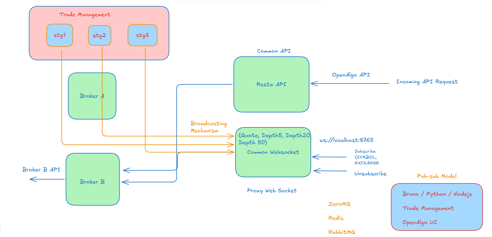

# OpenAlgo WebSocket Proxy Design

## 1. Architecture Overview



The system consists of the following components:

- **Broker WebSocket Clients**: Connect to broker APIs (Angel, etc.)
- **ZeroMQ Pub/Sub Layer**: Efficient message broadcasting
- **Common WebSocket Proxy**: Single endpoint for all clients
- **Client Applications**: Trade Management, UI, Strategies

## 2. Component Design

### 2.1 Broker WebSocket Client

Connects to broker-specific WebSocket APIs (e.g., Angel) and forwards market data to the ZeroMQ publisher.

```python
class BrokerWebSocketClient:
    def __init__(self, broker_name, credentials):
        self.broker_name = broker_name
        self.credentials = credentials
        self.zmq_publisher = ZeroMQPublisher()
        self.connection = None
        self.reconnect_attempts = 0
        self.max_reconnect_attempts = 10
        self.reconnect_delay = 2  # seconds
        
    async def connect(self):
        # Broker-specific connection logic
        
    async def heartbeat_loop(self):
        while True:
            if self.connection and self.connection.open:
                await self.send_heartbeat()
            await asyncio.sleep(30)  # 30-second heartbeat
            
    async def handle_message(self, message):
        # Process message and publish to ZeroMQ
        topic = f"{message['symbol']}.{message['exchange']}"
        self.zmq_publisher.publish(topic, message)
        
    async def reconnect(self):
        if self.reconnect_attempts < self.max_reconnect_attempts:
            self.reconnect_attempts += 1
            await asyncio.sleep(self.reconnect_delay * self.reconnect_attempts)
            try:
                await self.connect()
                self.reconnect_attempts = 0
            except Exception as e:
                logger.error(f"Reconnection attempt {self.reconnect_attempts} failed: {e}")
                await self.reconnect()
```

### 2.2 ZeroMQ Pub/Sub Layer

Efficiently broadcasts market data from broker WebSocket clients to all interested consumers.

```python
class ZeroMQPublisher:
    def __init__(self, bind_address="tcp://*:5555"):
        self.context = zmq.Context()
        self.socket = self.context.socket(zmq.PUB)
        self.socket.bind(bind_address)
        
    def publish(self, topic, message):
        self.socket.send_multipart([
            topic.encode('utf-8'),
            json.dumps(message).encode('utf-8')
        ])
        
class ZeroMQSubscriber:
    def __init__(self, connect_address="tcp://localhost:5555"):
        self.context = zmq.Context()
        self.socket = self.context.socket(zmq.SUB)
        self.socket.connect(connect_address)
        self.callbacks = {}
        
    def subscribe(self, topic, callback):
        self.socket.setsockopt_string(zmq.SUBSCRIBE, topic)
        self.callbacks[topic] = callback
        
    async def listen(self):
        while True:
            topic, message = await self.socket.recv_multipart()
            topic = topic.decode('utf-8')
            message = json.loads(message.decode('utf-8'))
            
            if topic in self.callbacks:
                await self.callbacks[topic](message)
```

### 2.3 Common WebSocket Proxy

Provides a unified WebSocket endpoint for all clients, handling subscriptions and delivering market data.

```python
class WebSocketProxy:
    def __init__(self, host="localhost", port=8765):
        self.host = host
        self.port = port
        self.clients = {}  # {client_id: {subscriptions: set(), websocket: WebSocketClientProtocol}}
        self.zmq_subscriber = ZeroMQSubscriber()
        self.client_counter = 0
        self.ping_interval = 30  # seconds
        
    async def handle_client(self, websocket, path):
        client_id = self.client_counter
        self.client_counter += 1
        self.clients[client_id] = {"subscriptions": set(), "websocket": websocket}
        
        try:
            # Start ping/pong for this client
            ping_task = asyncio.create_task(self.ping_client(client_id))
            
            async for message in websocket:
                await self.process_client_message(client_id, message)
                
        except websockets.exceptions.ConnectionClosed:
            logger.info(f"Client {client_id} disconnected")
        finally:
            if client_id in self.clients:
                del self.clients[client_id]
            ping_task.cancel()
            
    async def ping_client(self, client_id):
        while client_id in self.clients:
            try:
                websocket = self.clients[client_id]["websocket"]
                pong_waiter = await websocket.ping()
                await asyncio.wait_for(pong_waiter, timeout=10)
            except (asyncio.TimeoutError, websockets.exceptions.ConnectionClosed):
                logger.warning(f"Client {client_id} ping timeout")
                if client_id in self.clients:
                    del self.clients[client_id]
                break
            await asyncio.sleep(self.ping_interval)
            
    async def process_client_message(self, client_id, message):
        data = json.loads(message)
        action = data.get("action")
        
        if action == "subscribe":
            symbol = data.get("symbol")
            exchange = data.get("exchange")
            if symbol and exchange:
                topic = f"{symbol}.{exchange}"
                self.clients[client_id]["subscriptions"].add(topic)
                self.zmq_subscriber.subscribe(topic, 
                    lambda msg: self.broadcast_to_subscribers(topic, msg))
                await self.send_to_client(client_id, {
                    "type": "subscription",
                    "status": "success",
                    "topic": topic
                })
                
        elif action == "unsubscribe":
            symbol = data.get("symbol")
            exchange = data.get("exchange")
            if symbol and exchange:
                topic = f"{symbol}.{exchange}"
                if topic in self.clients[client_id]["subscriptions"]:
                    self.clients[client_id]["subscriptions"].remove(topic)
                    
    async def broadcast_to_subscribers(self, topic, message):
        for client_id, client_data in self.clients.items():
            if topic in client_data["subscriptions"]:
                await self.send_to_client(client_id, {
                    "type": "market_data",
                    "topic": topic,
                    "data": message
                })
                
    async def send_to_client(self, client_id, message):
        if client_id in self.clients:
            try:
                await self.clients[client_id]["websocket"].send(json.dumps(message))
            except websockets.exceptions.ConnectionClosed:
                logger.warning(f"Failed to send to client {client_id}, connection closed")
                if client_id in self.clients:
                    del self.clients[client_id]
                    
    async def start(self):
        server = await websockets.serve(
            self.handle_client, 
            self.host, 
            self.port,
            ping_interval=None  # We handle ping/pong manually
        )
        await server.wait_closed()
```

## 3. Error Handling & Reliability Features

### 3.1 Heartbeat Mechanism

- **Broker Connection**: 30-second heartbeat to broker WebSocket
- **Client Connection**: 30-second ping/pong with 10-second timeout
- **Automatic Reconnection**: Exponential backoff for failed connections

### 3.2 Error Handling

- **Connection Errors**: Automatic reconnection with backoff
- **Message Parsing Errors**: Graceful handling without crashing
- **Client Disconnections**: Clean resource cleanup
- **Rate Limiting**: Throttling for broker connections

### 3.3 Logging & Monitoring

- Comprehensive logging of connection events
- Metrics collection for:
  - Connection status
  - Message throughput
  - Subscription counts
  - Error rates

## 4. Client Protocol

### 4.1 Connection

```
ws://localhost:8765
```

### 4.2 Subscription

```json
{
  "action": "subscribe",
  "symbol": "RELIANCE",
  "exchange": "NSE"
}
```

### 4.3 Unsubscription

```json
{
  "action": "unsubscribe",
  "symbol": "RELIANCE",
  "exchange": "NSE"
}
```

### 4.4 Market Data Message

```json
{
  "type": "market_data",
  "topic": "RELIANCE.NSE",
  "data": {
    "symbol": "RELIANCE",
    "exchange": "NSE",
    "ltp": 2500.50,
    "change": 1.5,
    "volume": 1000000,
    "depth": {
      "buy": [
        {"price": 2500.25, "quantity": 100, "orders": 5},
        {"price": 2500.00, "quantity": 250, "orders": 12}
      ],
      "sell": [
        {"price": 2500.75, "quantity": 150, "orders": 7},
        {"price": 2501.00, "quantity": 300, "orders": 15}
      ]
    },
    "timestamp": "2025-04-16T10:30:45.123Z"
  }
}
```

## 5. Implementation Plan

1. **Phase 1**: Implement Angel broker WebSocket client
2. **Phase 2**: Implement ZeroMQ pub/sub layer
3. **Phase 3**: Implement Common WebSocket proxy
4. **Phase 4**: Integrate with Trade Management system
5. **Phase 5**: Add monitoring and alerting

## 6. Deployment Considerations

- **Containerization**: Docker containers for each component
- **Scaling**: Horizontal scaling for WebSocket proxy
- **High Availability**: Multiple instances with load balancing
- **Monitoring**: Prometheus + Grafana dashboards

## 7. Security Considerations

- **Authentication**: JWT-based authentication for WebSocket clients
- **Authorization**: Role-based access control for market data
- **Data Protection**: TLS encryption for all connections
- **Rate Limiting**: Prevent abuse of the WebSocket API

## 8. References

- [Angel WebSocket API Documentation](https://smartapi.angelbroking.com/docs/WebSocket2)
- [ZeroMQ Messaging Patterns](https://zguide.zeromq.org/docs/chapter2/)
- [WebSockets Protocol RFC6455](https://tools.ietf.org/html/rfc6455)
