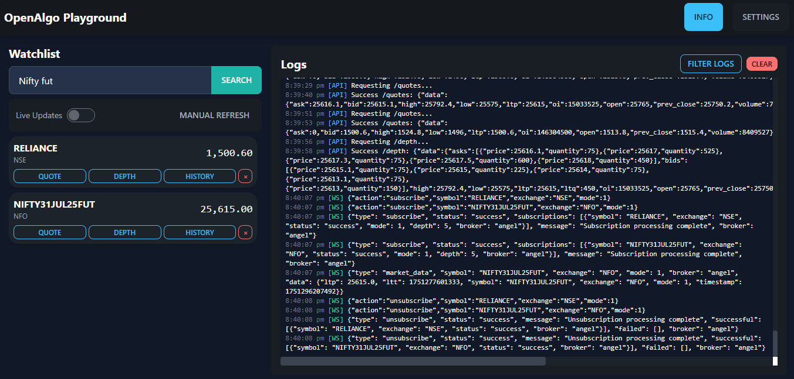

# OpenAlgo Playground

⚠️ **SECURITY WARNING: FOR DEVELOPMENT USE ONLY** ⚠️

**This playground is intended for development and testing purposes only. NEVER deploy this on production servers or expose it to the internet.**

Welcome to the OpenAlgo Playground! This is a rich, interactive browser-based client designed for developers and users to test, explore, and debug the OpenAlgo platform's features in real time.

The Playground provides a complete UI to interact with most of the core functionalities, including the REST API and the WebSocket data streams, without writing a single line of code.




## Security Considerations

### 🚨 CRITICAL SECURITY WARNINGS

1. **DEVELOPMENT ONLY**: This playground is for development environments only
2. **CORS Disabled**: Requires `CORS_ENABLED = 'FALSE'` which disables security protections
3. **API Key Exposure**: API keys are stored in browser localStorage (unencrypted)
4. **No Authentication**: Anyone with access to the page can use it
5. **Local Network Only**: Should only be accessible from localhost/development networks

### 🔒 Production Security Requirements

If you must use this in a more secure environment:
- Use HTTPS only
- Implement proper authentication
- Add rate limiting
- Use environment-specific API keys
- Restrict network access
- Enable CORS with specific origins
- Never expose to public internet

## Features

- **Connection Management:** Configure your API Key and server URLs to connect to your local OpenAlgo instance.
- **Real-time Watchlist:** Search for any symbol across exchanges and add it to a persistent watchlist.
- **Dual Operating Modes:**
    - **Live Mode (Toggle ON):** Uses **WebSockets** for real-time data on the watchlist (LTP) and in the data panels (Quote, Depth).
    - **Manual Mode (Toggle OFF):** Uses **REST API calls** to fetch data on demand when you open a panel or click "Manual Refresh".
- **Detailed Data Panels:**
    - **Quote:** A comprehensive view of the full quote packet (OHLC, Volume, Bid/Ask, etc.).
    - **Depth:** A professional market depth panel inspired by modern trading terminals.
    - **History:** A tool to fetch and view historical OHLCV data for any symbol.
- **WebSocket Inspector:** Monitor real-time WebSocket message flow with filtering and export capabilities.
- **Advanced Live Logs:**
    - See all API requests and WebSocket messages (both sent and received) as they happen.
    - Use the dynamic filtering system to drill down into specific logs for easy debugging.

## How to Use

### 1. Setup

The Playground is a self-contained feature. To use it, simply open the `index.html` in your browser

### 2. Configuration

**⚠️ SECURITY CRITICAL:** For the Playground to communicate with the Flask backend from your browser, you must disable CORS enforcement in your OpenAlgo environment.

**WARNING: This setting disables important security protections and should NEVER be used on production servers.**

In your project's **`.env`** file, make sure you have the following line:

```env
CORS_ENABLED = 'FALSE'
```

**Important Notes:**
- This setting disables Cross-Origin Resource Sharing (CORS) protection
- Only use this in isolated development environments
- Never use this setting on servers accessible from the internet
- Revert this setting when done with playground testing

### 3. Running the Playground

1.  Start the main OpenAlgo application by running `python app.py`.
2.  Open `index.html` in your web browser.
    

## UI Walkthrough

#### Settings & Info
-   **Info:** Click the "Info" button for important setup instructions (like the CORS setting).
-   **Settings:** Configure your `Host Server`, `WebSocket Server`, and `API Key`. Click **Connect** to establish a WebSocket connection. The status will update from "Disconnected" to "Connected".

#### The Watchlist
-   Use the search bar to find symbols (e.g., "RELIANCE", "NIFTY JUL FUT").
-   Click **Add** to move a symbol to your watchlist.
-   The **Live Updates** toggle switches between WebSocket mode and API mode.
-   **Manual Refresh** will fetch the latest LTP for all watchlist items using the `/quotes` API.

#### Data Panels (Quote, Depth, History)
-   Clicking any of these buttons will open a panel with detailed information for that symbol.
-   If **Live Updates** is ON, the panel will subscribe to the relevant WebSocket mode (`mode 2` for Quote, `mode 3` for Depth) and update in real time.
-   If **Live Updates** is OFF, the panel will make a one-time API call to `/quotes` or `/depth` to display the most recent data.
-   `History` will fetch and display the historical data as per the user Inputs.

#### The Log Viewer
-   This panel shows all network activity generated by the Playground.
-   Use the **Filter Logs** dropdown to narrow down the view. The filters are dynamic; selecting a high-level filter (like "Recv") will populate the next dropdown with only the available message types from the received logs.
-   Click **Apply** to filter and **Reset** to clear all filters.

## Security Best Practices

### For Development Use:
1. **Isolate Environment**: Use only on isolated development machines
2. **Firewall Rules**: Block external access to development servers
3. **Temporary Keys**: Use development-only API keys
4. **Clean Up**: Remove/disable playground files when done

### Network Security:
- Access only via `localhost` or `127.0.0.1`
- Use VPN for remote development access
- Never expose port 5000 to public internet
- Monitor access logs for unauthorized usage

### Data Protection:
- Use test data only, never real trading accounts
- Clear browser data after testing
- Avoid using production API keys
- Monitor API usage for anomalies

## Removed Features (Security)

The following features have been removed for security reasons:
- **Message Composer**: Prevented arbitrary WebSocket command injection
- **Statistics Panel**: Removed detailed system metrics exposure
- **Ping Functionality**: Eliminated potential for connection probing
- **External CDN**: Removed external JavaScript dependencies

## Contributing

This Playground is a living feature. If you have ideas for improvements or find a bug, feel free to open an issue or submit a pull request to the main [OpenAlgo repository](https://github.com/marketcalls/openalgo).

**Security-related contributions are especially welcome!**
